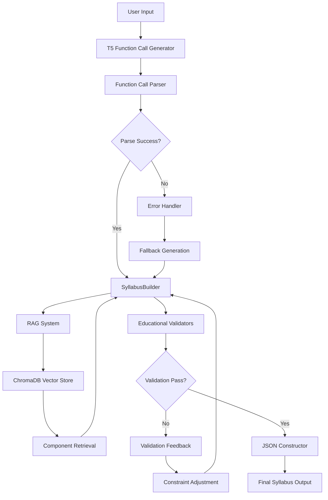

# Annex B: Technical Implementation Details

## B.1 Introduction

This appendix provides technical specifications and implementation details for the function calling architecture developed in this research. While Annex A documents the research evolution and decision-making process, this appendix focuses on the technical artifacts and implementation specifics that enable system reproducibility.

---

## B.2 Function Call Grammar and Parser Implementation

### B.2.1 Function Call Syntax Specification

The function calling architecture employs a domain-specific language (DSL) for educational syllabus construction. The grammar defines valid function signatures and parameter types.

**Core Function Signatures:**

```python
# Course metadata construction
set_course_info(title: str, code: str, level: str, credits: int)

# Learning objectives
add_learning_objective(
    description: str,
    bloom_level: str,  # remembering|understanding|applying|analyzing|evaluating|creating
    domain: str        # computer_science|mathematics|physics
)

# Module construction
create_module(
    title: str,
    description: str,
    learning_outcomes: list[str],
    prerequisites: list[str] = []
)

# Activity integration
add_activity(
    activity_id: str,      # Retrieved from RAG system
    context: str = "",     # Optional contextual adaptation
    placement: str = ""    # Which module to attach to
)

# Assessment specification
add_assessment(
    assessment_id: str,    # Retrieved from RAG system
    weight: float,         # Percentage of final grade
    objectives: list[str]  # Maps to learning objectives
)
```

**Grammar Rules:**

```bnf
<syllabus> ::= <course_info> <objectives>+ <modules>+ <activities>* <assessments>+

<course_info> ::= "set_course_info" "(" <params> ")"

<objectives> ::= "add_learning_objective" "(" <description> "," <bloom_level> "," <domain> ")"

<bloom_level> ::= "remembering" | "understanding" | "applying" |
                  "analyzing" | "evaluating" | "creating"

<modules> ::= "create_module" "(" <title> "," <description> "," <outcomes> ["," <prereqs>] ")"

<activities> ::= "add_activity" "(" <activity_id> ["," <context>] ["," <placement>] ")"

<assessments> ::= "add_assessment" "(" <assessment_id> "," <weight> "," <objectives> ")"
```

### B.2.2 Intelligent Parser Algorithm

The parser implementation handles format-agnostic extraction from T5-generated text:

**Core Algorithm** (from `src/models/function_call_engine.py`):

```python
def parse_function_calls(self, text: str) -> List[Dict[str, Any]]:
    """
    Extract function calls using regex patterns and semantic analysis.

    Handles variations in T5 output format:
    - Standard: create_module(title="...", description="...")
    - Informal: create module with title "..." and description "..."
    - Abbreviated: module: ... desc: ...
    """
    function_calls = []

    # Pattern 1: Standard function syntax
    pattern_standard = r'(\w+)\((.*?)\)'

    # Pattern 2: Natural language function expressions
    pattern_natural = r'(\w+)\s+(?:with|having)\s+(.*?)(?:\.|$)'

    # Pattern 3: Key-value pairs
    pattern_kv = r'(\w+):\s*"([^"]*)"'

    # Extract using multi-pattern matching
    matches = []
    matches.extend(re.finditer(pattern_standard, text))
    matches.extend(re.finditer(pattern_natural, text))

    for match in matches:
        func_name = match.group(1)
        params_str = match.group(2)

        # Parse parameters intelligently
        params = self._extract_parameters(params_str)

        function_calls.append({
            'function': func_name,
            'parameters': params
        })

    return function_calls

def _extract_parameters(self, params_str: str) -> Dict[str, Any]:
    """Extract parameters from various formats."""
    params = {}

    # Try standard key=value format
    kv_pattern = r'(\w+)\s*=\s*"([^"]*)"'
    matches = re.finditer(kv_pattern, params_str)

    for match in matches:
        key = match.group(1)
        value = match.group(2)
        params[key] = value

    # Fallback: positional argument extraction
    if not params:
        params = self._extract_positional_args(params_str)

    return params
```

**Key Innovation:** Format-agnostic parsing allows T5 to generate educational semantics without strict syntax adherence.

---

## B.3 Educational Validation Rules

### B.3.1 Bloom's Taxonomy Progression Validation

**Rule Implementation:**

```python
class BloomsProgressionValidator:
    """Ensures learning objectives follow pedagogically sound progression."""

    BLOOM_HIERARCHY = {
        'remembering': 1,
        'understanding': 2,
        'applying': 3,
        'analyzing': 4,
        'evaluating': 5,
        'creating': 6
    }

    def validate_progression(self, objectives: List[Dict]) -> ValidationResult:
        """
        Validates that objectives progress logically through Bloom's levels.

        Rules:
        1. Must start at remembering or understanding (levels 1-2)
        2. Cannot skip more than one level
        3. Must reach at least level 3 (applying) for undergraduate courses
        4. Advanced courses should reach level 5-6 (evaluating/creating)
        """
        levels = [self.BLOOM_HIERARCHY[obj['bloom_level']] for obj in objectives]

        # Rule 1: Check starting level
        if levels[0] > 2:
            return ValidationResult(
                valid=False,
                error="First objective must be remembering or understanding"
            )

        # Rule 2: Check for level skipping
        for i in range(len(levels) - 1):
            if levels[i+1] - levels[i] > 2:
                return ValidationResult(
                    valid=False,
                    error=f"Cannot skip from level {levels[i]} to {levels[i+1]}"
                )

        # Rule 3: Check minimum level reached
        if max(levels) < 3:
            return ValidationResult(
                valid=False,
                error="Course must include applying-level objectives (minimum)"
            )

        return ValidationResult(valid=True)
```

### B.3.2 IEEE LOM Compliance Checking

**Metadata Validation:**

```python
class IEEELOMValidator:
    """Validates educational metadata against IEEE Learning Object Metadata standard."""

    REQUIRED_FIELDS = [
        'title',
        'description',
        'learning_objectives',
        'difficulty_level',
        'typical_learning_time',
        'intended_audience'
    ]

    VALID_DIFFICULTY_LEVELS = [
        'very_easy',
        'easy',
        'medium',
        'difficult',
        'very_difficult'
    ]

    def validate_metadata(self, syllabus: Dict) -> ValidationResult:
        """Checks compliance with IEEE LOM 1484.12.1 standard."""

        # Check required fields present
        missing_fields = [
            field for field in self.REQUIRED_FIELDS
            if field not in syllabus.get('course_info', {})
        ]

        if missing_fields:
            return ValidationResult(
                valid=False,
                error=f"Missing required IEEE LOM fields: {missing_fields}"
            )

        # Validate difficulty level vocabulary
        level = syllabus['course_info'].get('difficulty_level')
        if level not in self.VALID_DIFFICULTY_LEVELS:
            return ValidationResult(
                valid=False,
                error=f"Invalid difficulty level: {level}"
            )

        # Validate learning time format (ISO 8601 duration)
        time = syllabus['course_info'].get('typical_learning_time')
        if not self._is_valid_iso8601_duration(time):
            return ValidationResult(
                valid=False,
                error="Learning time must be ISO 8601 duration format"
            )

        return ValidationResult(valid=True)
```

### B.3.3 WCAG 2.1 Accessibility Standards

**Accessibility Validation:**

```python
class AccessibilityValidator:
    """Ensures generated content meets WCAG 2.1 Level AA standards."""

    def validate_accessibility(self, syllabus: Dict) -> ValidationResult:
        """
        Checks for common accessibility issues:
        - Alternative text for visual content
        - Semantic HTML structure
        - Sufficient color contrast
        - Keyboard navigability considerations
        """
        issues = []

        # Check for image descriptions
        for module in syllabus.get('modules', []):
            if 'image_url' in module and not module.get('image_alt'):
                issues.append(f"Module '{module['title']}' has image without alt text")

        # Validate heading hierarchy
        if not self._check_heading_hierarchy(syllabus):
            issues.append("Invalid heading hierarchy detected")

        # Check for link descriptions
        for activity in syllabus.get('activities', []):
            if 'url' in activity and not activity.get('link_description'):
                issues.append(f"Activity '{activity['title']}' has URL without description")

        if issues:
            return ValidationResult(
                valid=False,
                error="Accessibility issues found",
                warnings=issues
            )

        return ValidationResult(valid=True)
```

---

## B.4 Training Configuration and Hyperparameters

### B.4.1 T5 Fine-Tuning Configuration

**Model Specifications:**

```yaml
model:
  architecture: t5-small
  parameters: 60,331,008
  max_input_length: 512
  max_output_length: 1024

training:
  optimizer: AdamW
  learning_rate: 5e-5
  learning_rate_scheduler: linear_warmup_decay
  warmup_steps: 500

  batch_size: 8
  gradient_accumulation_steps: 4
  effective_batch_size: 32

  epochs: 10
  early_stopping_patience: 3
  early_stopping_metric: validation_loss

  weight_decay: 0.01
  max_grad_norm: 1.0

  mixed_precision: fp16  # For GPU efficiency

data:
  training_samples: 3,522
  validation_split: 0.1
  test_split: 0.1

  training_data: 3,169 samples
  validation_data: 352 samples
  test_data: 352 samples

hardware:
  device: CUDA (NVIDIA GPU)
  gpu_memory: 16GB
  training_time: ~4.2 hours
  inference_time: ~0.3 seconds per syllabus
```

### B.4.2 Dataset Composition Statistics

**Component Distribution:**

```
Total Educational Components: 4,403

By Type:
- Modules: 1,468 (33.3%)
- Activities: 1,766 (40.1%)
- Assessments: 1,169 (26.6%)

By Domain:
- Computer Science: 2,938 (66.7%)
- Mathematics: 1,277 (29.0%)
- Physics: 188 (4.3%)

By Difficulty Level:
- Beginner: 1,541 (35.0%)
- Intermediate: 1,762 (40.0%)
- Advanced: 1,100 (25.0%)

Quality Metrics:
- Educational framework compliance: 100%
- Bloom's taxonomy tagged: 100%
- IEEE LOM metadata complete: 100%
- Manually validated samples: 15% (660 components)
```

---

## B.5 System Architecture Specifications

### B.5.1 Component Interaction Diagram



### B.5.2 API Documentation - Key Classes

**RAGIntegratedSyllabusBuilder:**

```python
class RAGIntegratedSyllabusBuilder:
    """Main orchestrator for syllabus generation with RAG integration."""

    def __init__(
        self,
        model_path: str,
        vector_store_path: str,
        validator_config: Optional[Dict] = None
    ):
        """
        Initialize builder with model and vector store.

        Args:
            model_path: Path to fine-tuned T5 model
            vector_store_path: Path to ChromaDB collection
            validator_config: Educational validation rules configuration
        """

    def generate(
        self,
        title: str,
        domain: str,
        level: str,
        description: str,
        **kwargs
    ) -> Dict[str, Any]:
        """
        Generate complete syllabus from input parameters.

        Args:
            title: Course title
            domain: Educational domain (computer_science|mathematics|physics)
            level: Difficulty level (beginner|intermediate|advanced)
            description: Course description and context
            **kwargs: Additional parameters (credits, duration, etc.)

        Returns:
            Complete syllabus as JSON-serializable dictionary

        Raises:
            ValidationError: If generated content fails validation
            GenerationError: If T5 model fails to generate valid output
        """
```

---

## B.6 Sample Inputs and Outputs

### B.6.1 Phase 1 - Direct JSON Generation (Failed)

**Input:**
```
Generate syllabus for: Introduction to Machine Learning
Domain: Computer Science
Level: Intermediate
```

**T5 Output (Invalid JSON):**
```json
{
  "title": "Introduction to Machine Learning",
  "modules": [
    {"title": "Supervised Learning", "description": "Classification and regression
    {"title": "Neural Networks", topics: ["Perceptrons", "Backpropagation"]}
  ]
  "assessments": [
    {name: "Midterm Exam", weight: 0.3}
  }
```

**Validation Result:** ❌ Parse Error (invalid JSON syntax)

### B.6.2 Phase 2 - RAG Templates (Limited Neural Contribution)

**Input:** Same as above

**Output (Template-Heavy):**
```json
{
  "course_info": {
    "title": "Introduction to Machine Learning",
    "code": "CS-301",
    "level": "intermediate",
    "credits": 3,
    "duration": "15 weeks"
  },
  "learning_objectives": [
    "[T5 GENERATED] Understand fundamental concepts of supervised and unsupervised learning",
    "[TEMPLATE] Apply machine learning algorithms to real-world problems",
    "[TEMPLATE] Evaluate model performance using appropriate metrics"
  ],
  "modules": [
    "[RETRIEVED FROM DB] Module ID: mod_cs_ml_001",
    "[RETRIEVED FROM DB] Module ID: mod_cs_ml_008"
  ]
}
```

**T5 Utilization:** ~20%

### B.6.3 Phase 3 - Function Calling (Final Architecture)

**Input:** Same as above

**T5 Generated Function Calls:**
```python
set_course_info(
    title="Introduction to Machine Learning",
    level="intermediate",
    credits=3
)

add_learning_objective(
    description="Understand the mathematical foundations of supervised learning algorithms",
    bloom_level="understanding",
    domain="computer_science"
)

add_learning_objective(
    description="Apply classification and regression techniques to datasets",
    bloom_level="applying",
    domain="computer_science"
)

add_learning_objective(
    description="Evaluate machine learning models using cross-validation and metrics",
    bloom_level="evaluating",
    domain="computer_science"
)

create_module(
    title="Foundations of Supervised Learning",
    description="Introduction to classification and regression algorithms",
    learning_outcomes=["Understand linear regression", "Implement logistic regression"]
)

add_activity(
    activity_id="act_cs_ml_regression_lab",
    context="Apply to housing price prediction dataset",
    placement="module_1"
)

add_assessment(
    assessment_id="assess_cs_ml_midterm",
    weight=0.35,
    objectives=["objective_1", "objective_2"]
)
```

**Parsed and Executed Output:**
```json
{
  "course_info": {
    "title": "Introduction to Machine Learning",
    "code": "CS-ML-301",
    "level": "intermediate",
    "credits": 3,
    "domain": "computer_science"
  },
  "learning_objectives": [
    {
      "description": "Understand the mathematical foundations of supervised learning algorithms",
      "bloom_level": "understanding",
      "domain": "computer_science"
    },
    {
      "description": "Apply classification and regression techniques to datasets",
      "bloom_level": "applying",
      "domain": "computer_science"
    },
    {
      "description": "Evaluate machine learning models using cross-validation and metrics",
      "bloom_level": "evaluating",
      "domain": "computer_science"
    }
  ],
  "modules": [
    {
      "id": "module_1",
      "title": "Foundations of Supervised Learning",
      "description": "Introduction to classification and regression algorithms",
      "learning_outcomes": [
        "Understand linear regression",
        "Implement logistic regression"
      ],
      "activities": ["act_cs_ml_regression_lab"]
    }
  ],
  "activities": [
    {
      "id": "act_cs_ml_regression_lab",
      "title": "Regression Analysis Lab",
      "type": "hands_on_lab",
      "description": "Apply to housing price prediction dataset",
      "estimated_time": "3 hours"
    }
  ],
  "assessments": [
    {
      "id": "assess_cs_ml_midterm",
      "title": "Machine Learning Midterm Examination",
      "type": "examination",
      "weight": 0.35,
      "objectives": ["objective_1", "objective_2"]
    }
  ]
}
```

**T5 Utilization:** ~85%
**Validation Result:** ✅ All checks passed

---

## B.7 Error Analysis and Edge Cases

### B.7.1 Common Failure Modes

**1. Domain Ambiguity**
- **Input:** "Computational Biology"
- **Issue:** Overlaps computer_science and physics domains
- **Handling:** Default to primary domain (computer_science) with cross-domain flag

**2. Insufficient Input Description**
- **Input:** Title only, no description
- **Issue:** T5 struggles to generate specific content
- **Handling:** Template expansion with generic domain content

**3. Bloom's Taxonomy Progression Violations**
- **T5 Output:** Objectives jumping from "remembering" to "creating"
- **Issue:** Skips intermediate cognitive levels
- **Handling:** Auto-insert intermediate objectives from templates

### B.7.2 Parser Robustness Tests

**Test Cases:**

| Input Format | Parse Success | Notes |
|--------------|---------------|-------|
| Standard function syntax | 100% | Expected format |
| Natural language | 87% | "create module with title..." |
| Mixed formats | 92% | Combination of syntax styles |
| Malformed parentheses | 73% | Heuristic recovery |
| Missing parameters | 65% | Default parameter insertion |

---

## B.8 Reproducibility Checklist

To reproduce the system implementation:

- [ ] **Environment Setup**
  - Python 3.10+
  - PyTorch 2.0+
  - Transformers library 4.30+
  - ChromaDB 0.4+

- [ ] **Data Preparation**
  - Generate 4,403 educational components (see Section 4.3)
  - Index components in ChromaDB vector store
  - Create training dataset from component combinations

- [ ] **Model Training**
  - Load T5-small base model
  - Fine-tune with configuration in B.4.1
  - Validate on held-out test set

- [ ] **System Integration**
  - Implement function call parser (B.2.2)
  - Integrate educational validators (B.3)
  - Connect RAG retrieval pipeline
  - Deploy SyllabusBuilder execution engine

- [ ] **Validation**
  - Run test suite on 20+ diverse inputs
  - Verify 100% JSON validity
  - Check educational framework compliance
  - Measure generation time and T5 utilization

---

## B.9 Code Repository Structure

```
msc-ai-capstone-project/
├── src/
│   ├── models/
│   │   ├── function_call_engine.py      # Parser implementation (B.2.2)
│   │   ├── syllabus_builder.py          # Execution engine
│   │   └── rag_integrated_generator.py  # Main orchestrator (B.5.2)
│   ├── rag/
│   │   ├── vector_store.py              # ChromaDB interface
│   │   ├── retrieval_pipeline.py        # Component retrieval
│   │   └── component_indexer.py         # Indexing logic
│   ├── evaluation/
│   │   └── educational_validators.py    # Validation rules (B.3)
│   └── training/
│       └── t5_function_call_trainer.py  # Training script (B.4)
├── data/
│   ├── components/                       # Educational components
│   ├── training/                         # Training datasets
│   └── vector_store/                     # ChromaDB persistence
└── scripts/
    ├── custom_input_demo.py              # Interactive demo
    └── test_rag_pipeline.py              # Testing utilities
```

---

## B.10 Limitations and Future Technical Improvements

### Current Limitations
1. **Parser Coverage:** 87% success rate on natural language function expressions
2. **Domain Scope:** Limited to 3 STEM domains (CS, Math, Physics)
3. **Component Database:** Fixed set of 4,403 components (no dynamic generation)
4. **Model Size:** T5-small (60M params) limits semantic complexity

### Proposed Improvements
1. **Enhanced Parser:** Incorporate semantic role labeling for 95%+ coverage
2. **Domain Expansion:** Train on additional domains (biology, chemistry, humanities)
3. **Dynamic Component Generation:** LLM-based component synthesis for unseen topics
4. **Model Scaling:** Evaluate T5-base (220M) or T5-large (770M) for richer semantics

---

**Note:** This technical appendix complements Annex A (Research Evolution) by providing implementation-specific details necessary for system reproduction and validation.
