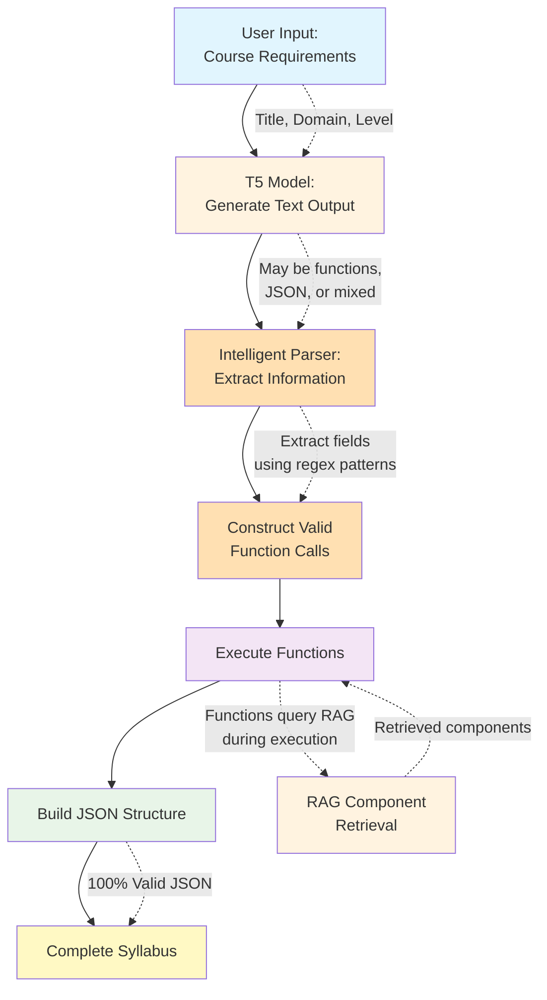

# Figure 4.1: Function Calling User Experience Flow

## Description

This diagram illustrates the complete user experience flow for the function calling architecture:

1. **User Input**: Simple course requirements (title, domain, level)
2. **T5 Generation**: Model generates text (may be function calls, JSON-like, or mixed format)
3. **Intelligent Parser**: Extracts information using regex patterns (handles any T5 output format)
4. **Function Construction**: Builds valid function calls from extracted information
5. **Function Execution**: SyllabusBuilder executes guaranteed-valid function calls (RAG queries during execution)
6. **Build JSON**: Assembles final JSON structure from executed functions
7. **Output**: Guaranteed valid JSON syllabus

**Key Innovation**: Parser is format-agnostic - T5 can output ANY format (functions, JSON, text) and parser extracts the information and constructs valid function calls. This separates semantic generation (T5's strength) from structural precision (programmatic construction).