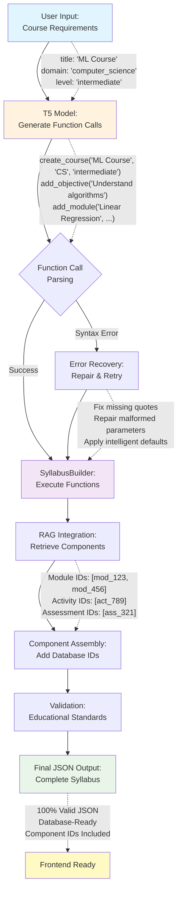

# Figure 4.1: Function Calling User Experience Flow

## Description

This diagram illustrates the complete user experience flow for the function calling architecture:

1. **User Input**: Simple course requirements (title, domain, level)
2. **T5 Generation**: Model generates educational function calls instead of JSON
3. **Parsing & Recovery**: Sophisticated error handling with intelligent repair
4. **Function Execution**: SyllabusBuilder executes validated function calls
5. **RAG Integration**: Retrieves relevant educational components with database IDs
6. **Component Assembly**: Integrates components maintaining database relationships
7. **Validation**: Applies educational standards and coherence checking
8. **Output**: Guaranteed valid JSON ready for frontend consumption

**Key Innovation**: Separates semantic generation (T5's strength) from structural precision (programmatic construction).