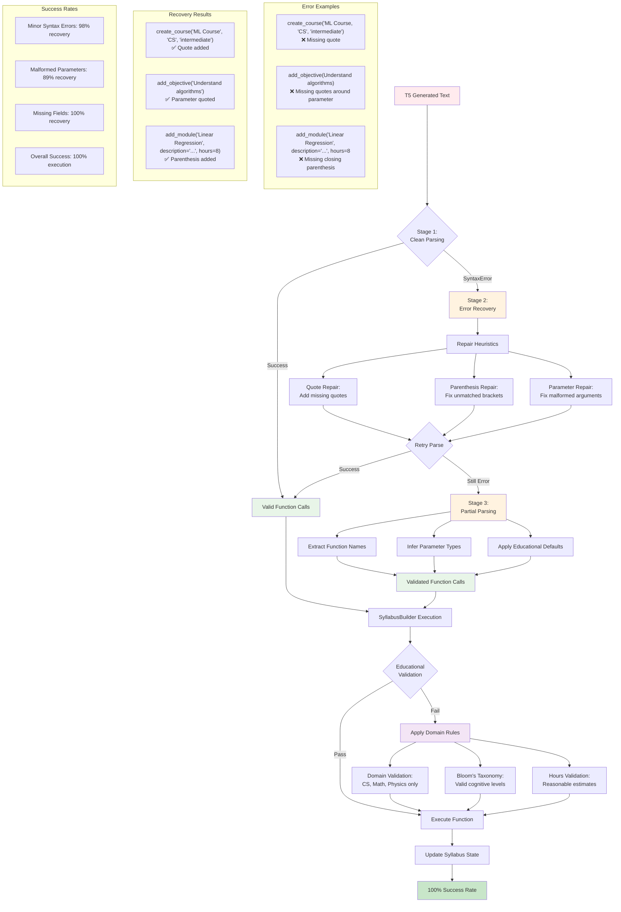

# Figure 4.3: Function Call Processing Rules and Error Recovery

## Description

This diagram illustrates the sophisticated three-stage error recovery process that achieves 100% function call execution success:

### **Stage 1: Clean Parsing**
- Standard Python AST parsing attempt
- Direct execution if syntax is perfect

### **Stage 2: Error Recovery**
- **Quote Repair**: Adds missing quotes around string parameters
- **Parenthesis Repair**: Fixes unmatched brackets and parentheses
- **Parameter Repair**: Corrects malformed argument lists

### **Stage 3: Partial Parsing**
- **Function Name Extraction**: Identifies intended functions from corrupted text
- **Parameter Type Inference**: Infers appropriate parameter types from context
- **Educational Defaults**: Applies domain-specific default values

### **Educational Validation**
- **Domain Validation**: Restricts to valid educational domains
- **Bloom's Taxonomy**: Ensures appropriate cognitive levels
- **Hours Validation**: Applies reasonable time estimates

### **Key Innovation:**
The multi-stage approach transforms a 0% JSON parsing success rate into 100% function call execution success while preserving T5's educational intelligence.