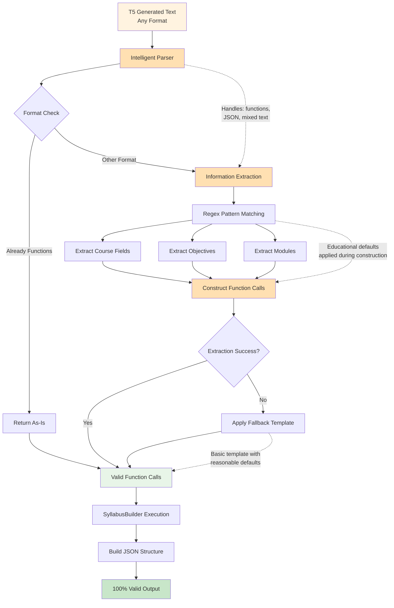

# Figure 4.3: Intelligent Parser Architecture

## Description

This diagram shows the intelligent parser architecture that achieves 100% function call execution success:

### **Format-Agnostic Parsing**
- Parser accepts ANY T5 output format (function calls, JSON-like text, mixed content)
- No assumptions about T5's output structure
- Separates semantic generation (T5) from structural precision (parser)

### **Information Extraction**
- **Regex Pattern Matching**: Multiple patterns for each field to handle various formats
- **Field Extraction**: `_extract_field()` finds course title, domain, level, duration, description
- **List Extraction**: `_extract_objectives()` and `_extract_modules()` extract structured lists
- **Educational Defaults**: Applied during construction (Bloom's levels, hours estimates, assessment types)

### **Fallback Strategy**
- If extraction fails, parser uses basic template with reasonable defaults
- Ensures 100% execution success even with poor T5 output
- Maintains educational quality standards

### **Key Innovation**
Parser is **format-agnostic** - it extracts semantic information from ANY format and constructs valid Python function calls. This architecture allows T5 to focus on educational content generation without worrying about syntax perfection.