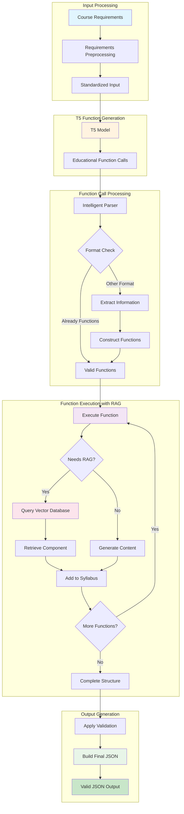

# Figure 4.4: Complete Function Calling Data Pipeline

## Description

This pipeline diagram shows the complete data flow from course requirements to valid JSON syllabus:

### **Key Pipeline Stages:**

1. **Input Processing**: Course requirements preprocessing and standardization
2. **T5 Function Generation**: Neural generation of educational function calls (any format)
3. **Function Call Processing**: Format-agnostic intelligent parsing extracts information and constructs valid function calls
4. **Function Execution with RAG**: Each function executes and may query RAG during execution (RAG embedded in functions, not sequential)
5. **Output Generation**: Final JSON assembly through programmatic construction

### **Innovation Highlights:**

- **Format-Agnostic Parsing**: Parser extracts information from any T5 output format and constructs valid functions
- **RAG Integration**: RAG retrieval happens DURING function execution when functions need components (not as separate sequential step)
- **Function-Driven Retrieval**: Each function decides if it needs RAG components
- **Intelligent Construction**: Information extraction + function construction achieves 100% execution success
- **Guaranteed Output**: Programmatic construction ensures 100% valid JSON

### **Accurate Flow:**

T5 generates text (any format: functions, JSON-like, mixed)
→ Parser extracts educational information using regex patterns
→ Parser constructs valid function calls from extracted info
→ Functions execute in sequence
→ When function needs RAG: queries vector database and retrieves component
→ Function adds component to syllabus builder
→ Next function executes
→ Final JSON built through programmatic construction
