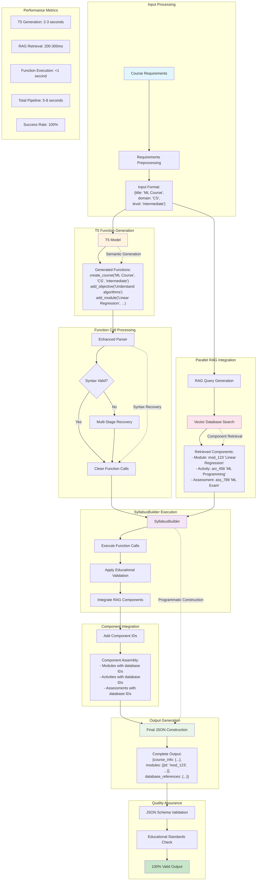

# Figure 4.4: Complete Function Calling Data Pipeline

## Description

This comprehensive pipeline diagram shows the complete data flow from user requirements to final JSON output:

### **Key Pipeline Stages:**

1. **Input Processing**: Course requirements preprocessing and standardization
2. **T5 Function Generation**: Neural generation of educational function calls
3. **Function Call Processing**: Multi-stage parsing with sophisticated error recovery
4. **Parallel RAG Integration**: Simultaneous component retrieval from vector database
5. **SyllabusBuilder Execution**: Programmatic construction with educational validation
6. **Component Integration**: Database ID integration for component linking
7. **Output Generation**: Final JSON assembly with guaranteed validity
8. **Quality Assurance**: Schema and educational standards validation

### **Innovation Highlights:**

- **Parallel Processing**: RAG retrieval happens simultaneously with function processing
- **Error Recovery**: Multi-stage parsing achieves 100% execution success
- **Database Integration**: Components include actual database IDs for frontend linking
- **Educational Validation**: Built-in pedagogical standards checking
- **Guaranteed Output**: Programmatic construction ensures 100% valid JSON

### **Performance Characteristics:**

- **Total Pipeline Time**: 5-8 seconds for complete syllabus
- **Success Rate**: 100% valid JSON generation
- **Component Integration**: Seamless database ID inclusion
- **Educational Quality**: Automated standards compliance validation