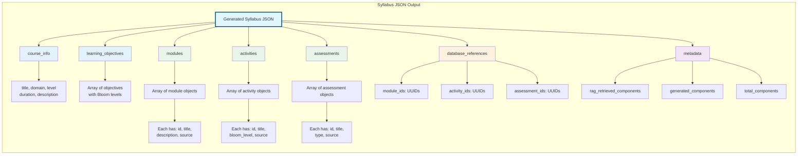

# Figure 4.5: RAG-Integrated Output Structure



## Description

This diagram shows the actual JSON output structure generated by the RAG-integrated function calling system:

### **Core Syllabus Structure:**

The output JSON contains seven main sections that mirror the function calls executed during generation:

1. **`course_info`**: Basic course metadata extracted by parser from T5 output (title, domain, level, duration, description)
2. **`learning_objectives`**: Array of learning objective objects extracted from T5 output, each with text and Bloom's taxonomy level
3. **`modules`**: Array of module objects, either RAG-retrieved with database IDs or fallback generated content
4. **`activities`**: Array of activity objects with database IDs (if RAG-retrieved) and educational metadata
5. **`assessments`**: Array of assessment objects with database IDs (if RAG-retrieved) and type classification
6. **`database_references`**: Aggregated arrays of component IDs for efficient frontend database queries
7. **`metadata`**: Generation statistics tracking RAG-retrieved vs generated component counts

### **Component Source Tracking:**

Each module, activity, and assessment object includes a `source` field indicating its origin:
- **`"source": "rag_retrieved"`**: Component retrieved from vector database with actual database ID
- **`"source": "generated"`**: Fallback content created when RAG unavailable or found no matches (id = null)

This dual-source approach ensures 100% generation success while maximizing reuse of existing educational components.

### **Database Integration:**

The `database_references` object provides organized arrays of component IDs:
```json
{
  "module_ids": ["uuid-1", "uuid-2"],
  "activity_ids": ["uuid-3", "uuid-4"],
  "assessment_ids": ["uuid-5"]
}
```

This structure enables efficient frontend queries for component details, live updates when components change, and component reusability across multiple syllabi.

### **Metadata Tracking:**

The metadata section provides generation statistics:
- `rag_retrieved_components`: Count of components successfully retrieved from vector database
- `generated_components`: Count of fallback components created (when RAG unavailable/no matches)
- `total_components`: Overall component count for the syllabus

This transparency enables users to understand content provenance and system performance for each generated syllabus.