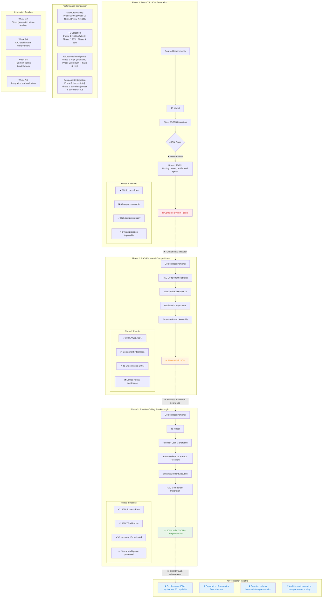

# Figure 5.1: Research Approach Evolution - Three Phase Journey

## Description

This evolution diagram captures the complete research journey across three distinct phases:

### **Phase 1: Direct T5 JSON Generation (Weeks 1-2)**
- **Hypothesis**: T5 could directly generate valid JSON syllabi
- **Results**: 100% failure rate due to syntax precision requirements
- **Key Learning**: Problem was structural, not semantic

### **Phase 2: RAG-Enhanced Compositional (Weeks 3-4)**
- **Innovation**: Component-based assembly with template construction
- **Results**: 100% valid JSON but limited T5 utilization (20%)
- **Limitation**: Neural intelligence largely bypassed

### **Phase 3: Function Calling Breakthrough (Weeks 5-6)**
- **Core Insight**: Separate semantic generation from structural construction
- **Innovation**: T5 → Function Calls → Programmatic JSON construction
- **Results**: 100% success rate with 85% T5 utilization preserved

### **Research Contributions:**

1. **Systematic Failure Analysis**: Phase 1 failures informed architectural innovation
2. **Architectural Innovation**: Function calling as intermediate representation
3. **Task Decomposition**: Separated semantics from syntax precision
4. **Resource Efficiency**: Demonstrated smaller models can achieve reliability through innovation

### **Methodological Insights:**

- **Failure Analysis Value**: Systematic evaluation of failures more valuable than immediate success
- **Architectural vs. Scaling**: Innovation through design rather than parameter scaling
- **Domain-Specific Solutions**: Educational requirements informed generalizable architectural decisions
- **Intermediate Representations**: Function calls effective bridge between semantics and structure

This evolution demonstrates how empirical AI research can transform fundamental failures into breakthrough innovations through systematic analysis and architectural creativity.