# Educational Syllabus Generation Data Model - Visual Diagrams

## Overview
This document provides visual representations of the data model using Mermaid diagrams.

## 1. Template-Based User Experience Flow

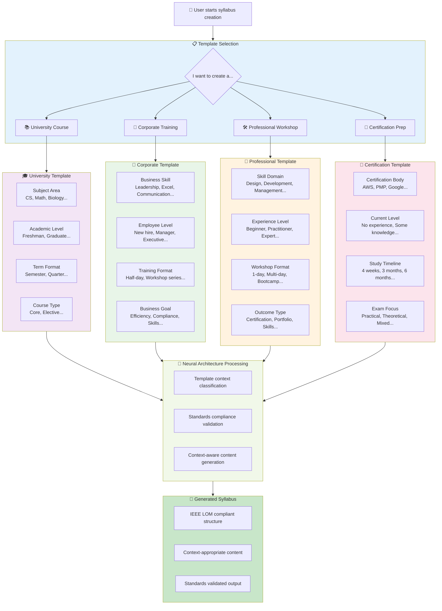

### Template Examples:

**University Template (4 clicks):**
1. "📚 University Course" → 2. "Computer Science" → 3. "Undergraduate" → 4. "Machine Learning"

**Corporate Template (4 clicks):**
1. "🏢 Corporate Training" → 2. "Technical Skills" → 3. "Intermediate Level" → 4. "Data Analysis with Excel"

**Result: Complete syllabus generated from minimal, context-appropriate inputs!**

## 2. Template-Specific Input Models

### 2a. Core Template Classes

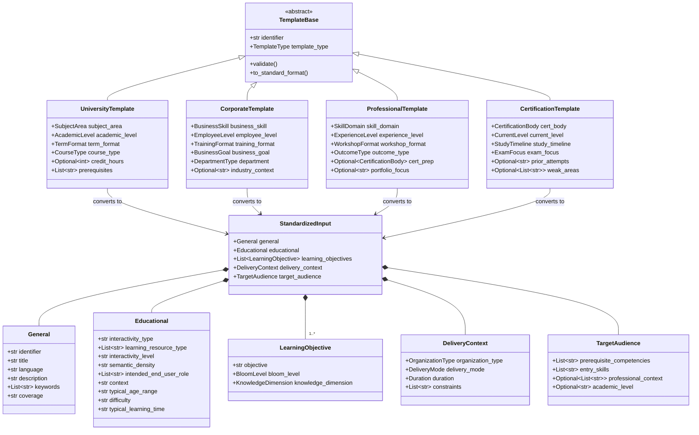

### 2b. Supporting Data Types

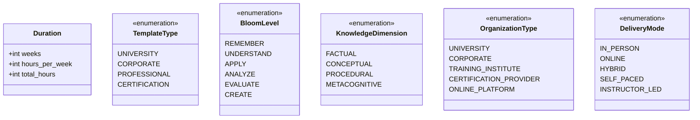

### 2c. Template-Specific Enumerations

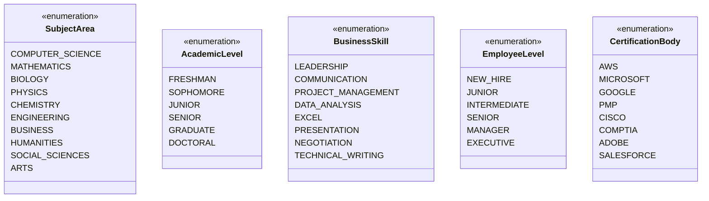

## 3. Context-Specific Processing Rules

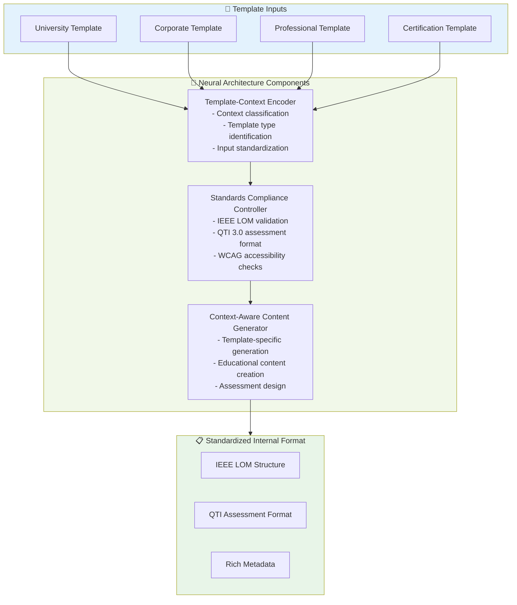

## 4. Template-Based Input Flow

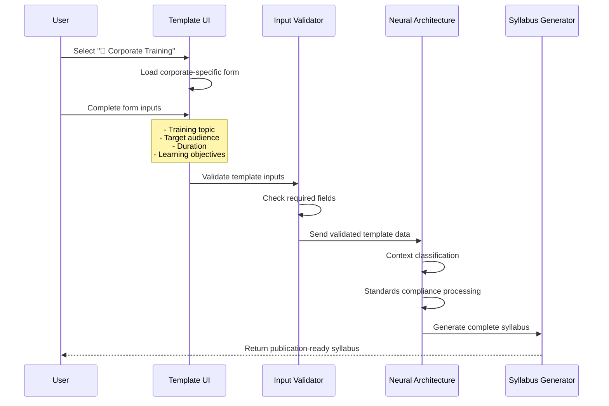

## 5. Original Input Data Model Structure
        +General general
        +Educational educational
        +List~LearningObjective~ learning_objectives
        +DeliveryContext delivery_context
        +TargetAudience target_audience
    }

    class General {
        +str identifier
        +str title
        +str language
        +str description
        +List~str~ keywords
        +str coverage
    }

    class Educational {
        +str interactivity_type
        +List~str~ learning_resource_type
        +str interactivity_level
        +str semantic_density
        +List~str~ intended_end_user_role
        +str context
        +str typical_age_range
        +str difficulty
        +str typical_learning_time
    }

    class LearningObjective {
        +str objective
        +BloomLevel bloom_level
        +KnowledgeDimension knowledge_dimension
    }

    class DeliveryContext {
        +OrganizationType organization_type
        +DeliveryMode delivery_mode
        +Duration duration
        +List~str~ constraints
    }

    class TargetAudience {
        +List~str~ prerequisite_competencies
        +List~str~ entry_skills
        +Optional~List~str~~ professional_context
        +Optional~str~ academic_level
    }

    EducationalProgramInput *-- General
    EducationalProgramInput *-- Educational
    EducationalProgramInput *-- "1..*" LearningObjective
    EducationalProgramInput *-- DeliveryContext
    EducationalProgramInput *-- TargetAudience
```

## 3. Output Data Model Structure

```mermaid
classDiagram
    class SyllabusOutput {
        +CourseInformation course_information
        +LearningDesign learning_design
        +List~ContentModule~ content_modules
        +AssessmentPlan assessment_plan
        +EducationalMetadata educational_metadata
        +ContextExtensions context_extensions
    }

    class CourseInformation {
        +str title
        +str identifier
        +str description
        +Optional~float~ credits
        +Duration duration
        +Optional~Schedule~ schedule
    }

    class LearningDesign {
        +List~LearningOutcome~ learning_outcomes
        +List~str~ prerequisite_knowledge
        +OrderedList~str~ learning_progression
    }

    class ContentModule {
        +str module_id
        +str title
        +Duration duration
        +List~str~ learning_objectives
        +List~Topic~ topics
        +List~Assessment~ assessments
    }

    class AssessmentPlan {
        +str assessment_strategy
        +List~Assessment~ assessments
        +GradingScheme grading_scheme
    }

    class EducationalMetadata {
        +Dict bloom_distribution
        +List~float~ cognitive_load_progression
        +AccessibilityCompliance accessibility_compliance
        +Interoperability interoperability
    }

    class AccessibilityCompliance {
        +WCAGLevel wcag_level
        +bool screen_reader_compatible
        +bool keyboard_navigation
        +bool color_contrast_compliant
        +bool alternative_text_provided
        +List~str~ accessibility_features
        +str compliance_notes
    }

    class WCAGLevel {
        <<enumeration>>
        A
        AA
        AAA
    }

    class Interoperability {
        +List~str~ supported_standards
        +bool scorm_compatible
        +bool xapi_compatible
        +bool qti_compatible
        +str export_formats
        +Dict metadata_mappings
    }

    class GradingScheme {
        +GradingType grading_type
        +List~GradeComponent~ grade_components
        +float passing_threshold
        +bool curved_grading
        +str grade_scale
        +Optional~str~ late_policy
        +Optional~str~ makeup_policy
    }

    class GradingType {
        <<enumeration>>
        POINTS_BASED
        PERCENTAGE_BASED
        LETTER_GRADES
        PASS_FAIL
        COMPETENCY_BASED
        WEIGHTED_CATEGORIES
    }

    class GradeComponent {
        +str component_name
        +float weight_percentage
        +int total_points
        +bool drop_lowest
        +str description
    }

    SyllabusOutput *-- CourseInformation
    SyllabusOutput *-- LearningDesign
    SyllabusOutput *-- "1..*" ContentModule
    SyllabusOutput *-- AssessmentPlan
    SyllabusOutput *-- EducationalMetadata
    SyllabusOutput *-- ContextExtensions
```

## 4. Learning Taxonomy Integration

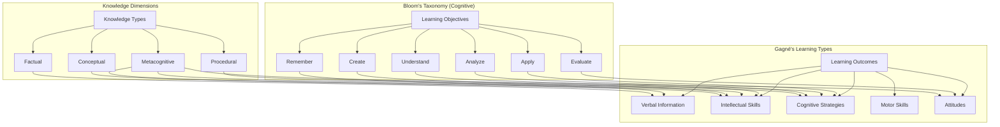

## 5. Standards Compliance Flow

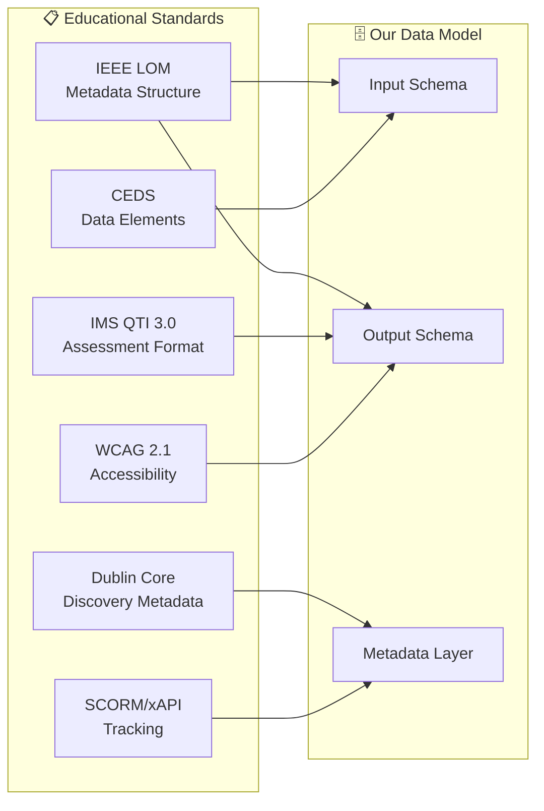

## 6. Context-Specific Extensions

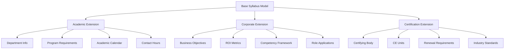

## 7. Assessment Model (QTI 3.0 Compliant)

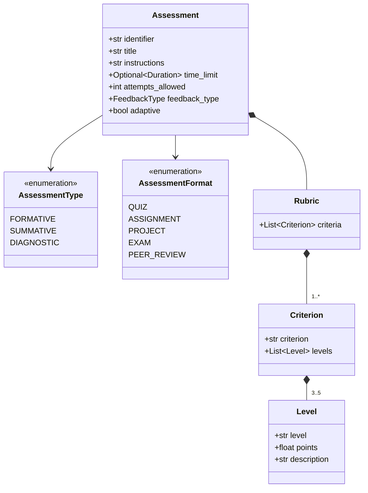

## 8. Data Processing Pipeline

**Validation Approach**: The system uses rule-based validators that apply established educational standards (IEEE LOM, Bloom's taxonomy, QTI 3.0, WCAG 2.1) rather than learned quality patterns. This ensures transparency, educational defensibility, and alignment with federal requirements for accountable AI systems in education.

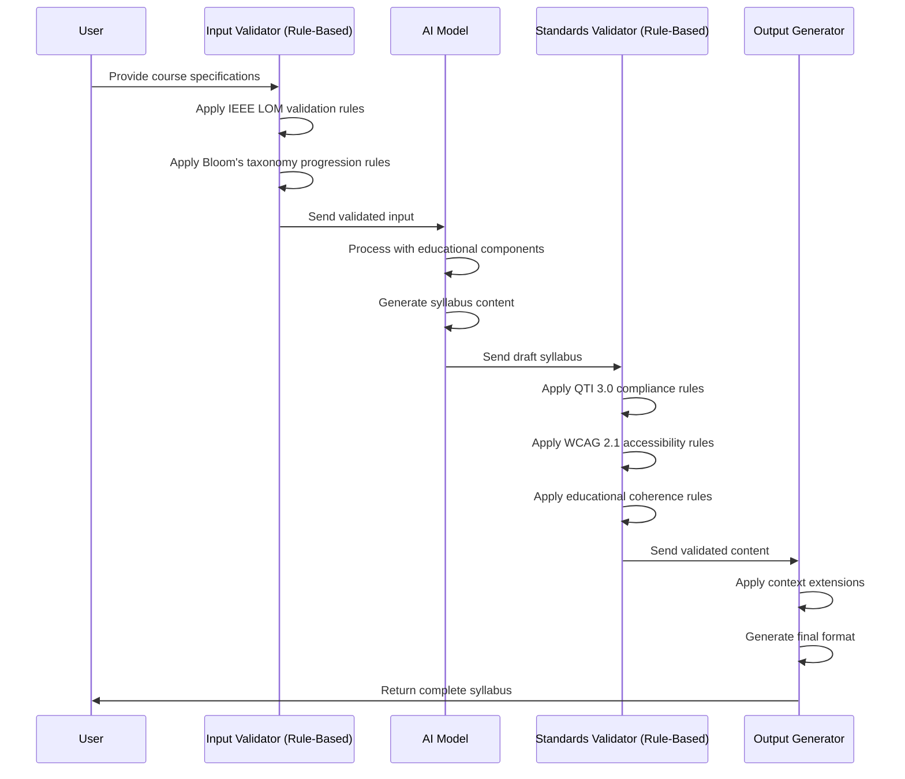
