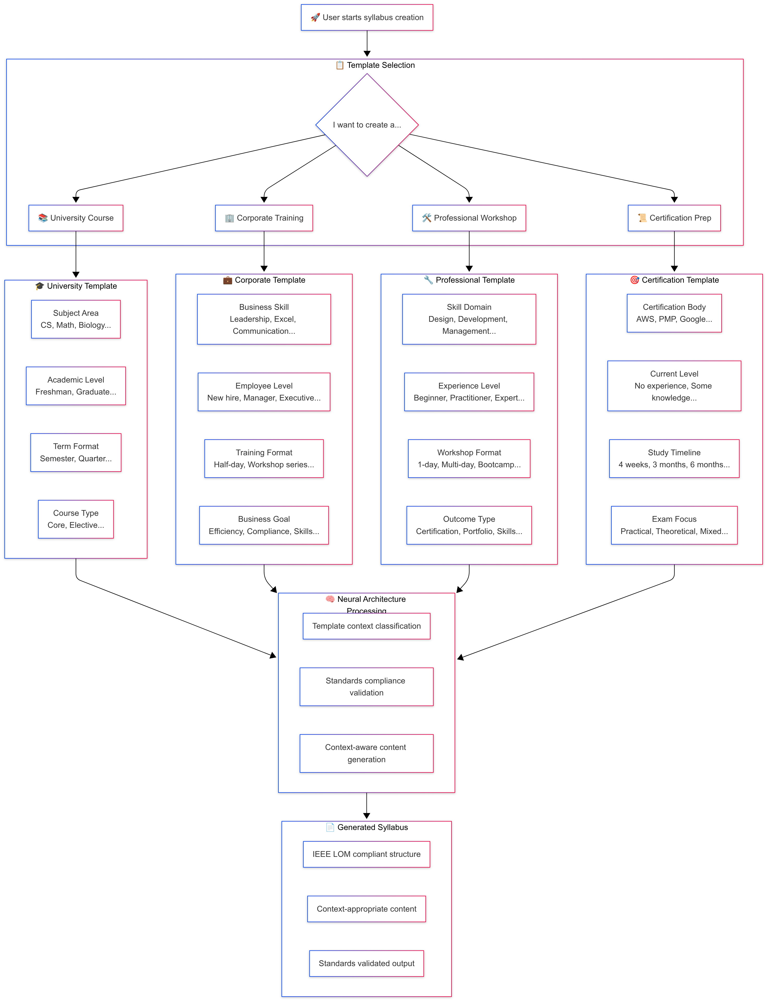
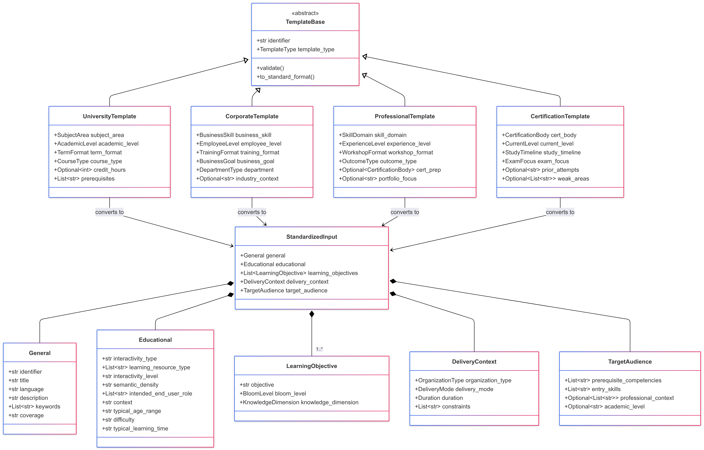
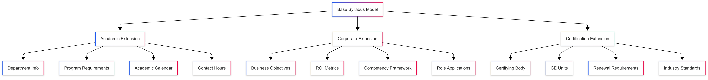
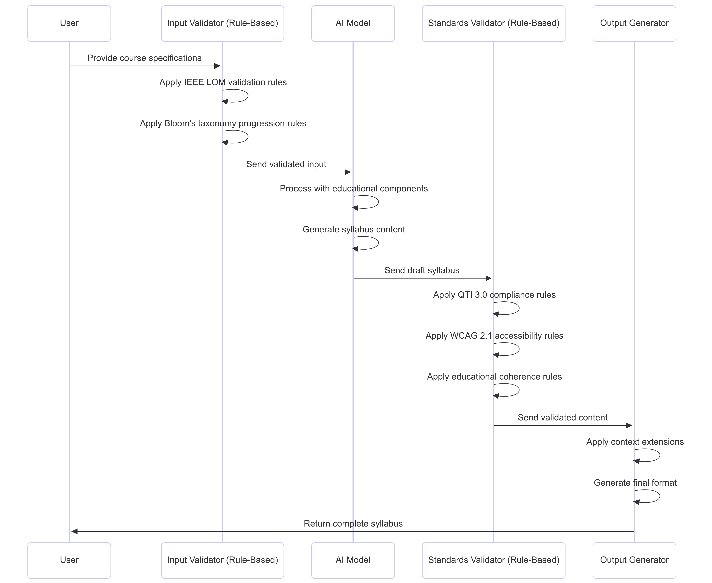
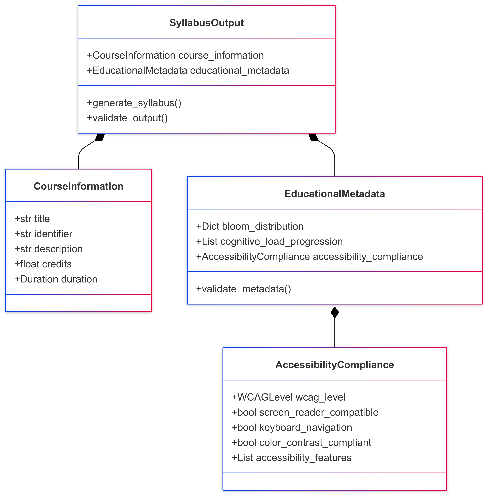

# MSc AI Dissertation

# 1. Introduction

## 1.1 Research Problem Statement

Course syllabus creation is a labour-intensive process requiring domain expertise and pedagogical knowledge (Parkes and Harris, 2002). Educational institutions worldwide face increasing pressure to develop high-quality curricula while managing resource constraints and maintaining educational standards. Current approaches to syllabus generation typically rely on manual template-based systems or require extensive human intervention, limiting scalability and consistency across educational programmes.

While recent advances in large language models have demonstrated impressive text generation capabilities, they often lack the structured pedagogical coherence required for quality educational content. Generic language models fail to incorporate domain-specific educational frameworks such as Bloom's taxonomy or maintain the hierarchical learning progressions essential for effective course design (Anderson et al., 2001). This represents a significant gap in the application of artificial intelligence to educational content creation.

The problem is further compounded by the rapid evolution of academic disciplines, particularly in technology-focused fields, where curricula must be continuously updated to reflect emerging knowledge and industry requirements. Traditional manual approaches to syllabus development cannot keep pace with these demands, creating a clear need for automated solutions that maintain educational quality while improving efficiency.

## 1.2 Research Question

This research addresses the following primary research question:

**"How can a custom machine learning model effectively generate structured, coherent course syllabi from specific educational inputs including course descriptions, learning objectives, and problem statements?"**

This question encompasses several critical sub-questions:

- How can existing neural language architectures be adapted to incorporate educational domain knowledge?
- What custom architectural components are required to maintain pedagogical coherence in generated content?
- How can curriculum learning principles be applied to train models for educational content generation?
- What evaluation frameworks can effectively measure both technical performance and educational quality?

## 1.3 Aims and Objectives

### 1.3.1 Primary Aim

To adapt and evaluate existing neural language architectures with custom educational components to generate educationally sound, structurally coherent course syllabi from well-defined input context.

### 1.3.2 Specific Objectives

**Data Collection and Preprocessing**
- Collect 500+ high-quality course syllabi from diverse educational domains through open educational resources
- Achieve 80% automated preprocessing accuracy with comprehensive manual validation pipeline
- Create standardised dataset with consistent metadata formatting and educational annotations

**Educational Architecture Adaptation**
- Adapt existing transformer architectures with custom educational layers and pedagogical constraints
- Develop domain-specific fine-tuning strategies achieving 10% improvement over generic embeddings on educational terminology
- Implement curriculum learning mechanisms and pedagogical structure encoders for hierarchical content organisation
- Complete initial model validation with baseline performance metrics across multiple educational domains

**Model Training and Optimisation**
- Train the adapted model to achieve strong performance on standard NLP metrics for text generation quality (ROUGE, BERTScore)
- Implement iterative refinement process reducing training loss by 20% through systematic hyperparameter optimisation
- Develop domain classification capability with 85%+ accuracy across different subject areas
- Conduct extensive validation using cross-domain evaluation protocols

**Evaluation and Demonstration**
- Create comprehensive evaluation framework measuring both technical performance and educational quality
- Conduct case studies demonstrating practical application across 3 different educational domains
- Achieve expert reviewer ratings of 7/10+ for educational coherence and pedagogical appropriateness
- Perform comparative analysis with existing educational content generation approaches and baseline models

## 1.4 Project Significance

### 1.4.1 Technical Innovation

This research contributes to the field of artificial intelligence through the development of domain-specific neural network adaptations. By incorporating curriculum learning mechanisms and pedagogical structure encoders, the work extends current transformer architectures beyond general-purpose language generation to specialised educational content creation. The integration of educational taxonomies directly into neural network architecture represents a novel approach to domain adaptation that could inform future AI applications in education.

### 1.4.2 Practical Application

The research addresses a real-world challenge faced by educational institutions globally. By reducing educator workload while maintaining pedagogical quality, the developed system could enable more responsive curriculum development and support educational scalability. This has particular relevance for emerging educational models such as massive open online courses (MOOCs) and adaptive learning platforms.

### 1.4.3 Domain Advancement

This work contributes to the growing field of AI in education by demonstrating how established machine learning techniques can be systematically adapted for educational applications. The research provides both theoretical insights into domain-specific neural network design and practical methodologies for educational content automation.

## 1.5 Scope and Limitations

### 1.5.1 Research Scope

This research focuses specifically on course syllabus generation within higher education contexts. The work encompasses:

- Custom neural network architecture development using transformer-based models
- Educational content generation for undergraduate and postgraduate level courses
- Evaluation across multiple academic disciplines including STEM and humanities subjects
- Integration of established educational frameworks (Bloom's taxonomy, constructive alignment)

### 1.5.2 Limitations

**Technical Limitations**
- The research utilises existing pre-trained transformer models as base architectures, limiting the scope of fundamental architectural innovation while leveraging proven language capabilities
- Computational resources constrain the scale of model training and evaluation, preventing extensive hyperparameter exploration and limiting model size to configurations manageable within academic computing environments
- The focus on English-language educational content limits international applicability across diverse linguistic and cultural educational contexts

**Data Limitations**
- Reliance on publicly available syllabi may introduce systematic bias toward institutions that openly share educational materials
- Syllabus quality and format variations across institutions may affect model training consistency
- Limited access to proprietary educational content restricts the diversity of training data

**Evaluation Limitations**
- Educational quality assessment relies on expert review, introducing potential subjectivity and inter-rater variability
- The research timeframe limits the scope of longitudinal evaluation of generated content effectiveness
- Real-world deployment testing is beyond the scope of this academic project

### 1.5.3 Ethical Considerations

This research adheres to principles of responsible AI development and educational ethics, following the BCS Code of Conduct and IEEE standards for AI systems. All educational content is properly attributed with appropriate permissions sought for data usage. The research complies with GDPR requirements through implementation of data minimisation principles, anonymisation procedures, and secure storage protocols. Particular attention is given to avoiding bias in generated educational content through systematic assessment and implementation of inclusive design principles. The research prioritises human agency in educational decision-making, positioning AI as a tool to enhance rather than replace educator expertise.

## 1.6 Dissertation Structure Overview

This dissertation is organised into eight main sections, following a logical progression from theoretical foundation through practical implementation to evaluation and conclusion.

**Chapter 2: Background (Literature Review)** presents a comprehensive analysis of current research in neural language generation, educational content development, and domain adaptation techniques, establishing the theoretical foundation and identifying specific research gaps.

**Chapter 3: Ethical and Professional Considerations** examines the ethical implications of AI in education, data protection requirements, and professional standards relevant to educational technology development.

**Chapter 4: Methodology** describes the design science research framework employed, detailing the mixed-methods approach that combines quantitative model development with qualitative educational assessment.

**Chapter 5: Implementation** provides comprehensive documentation of the custom neural network architecture, including detailed descriptions of educational adaptations, training procedures, and technical implementation decisions.

**Chapter 6: Evaluation** presents the results of both technical performance assessment and educational quality evaluation, including comparative analysis with existing approaches and case study demonstrations.

**Chapter 7: Learning and Reflection** offers personal reflection on the research process, skills developed, challenges encountered, and insights gained throughout the project.

**Chapter 8: Conclusion** summarises key findings, discusses implications for both technical and educational domains, acknowledges limitations, and suggests directions for future research.

---

# 2. Background (Critical Review of Literature)

## 2.1 Literature Review Methodology

### Search Strategy

This literature review employed a systematic approach to identify and synthesise current research relevant to neural network architectures for educational content generation. The search strategy prioritised recent publications from 2022-2024 to capture the latest developments in transformer architectures, educational AI applications, and domain adaptation methods.

**Primary databases searched:**
- IEEE Xplore Digital Library
- ACM Digital Library
- arXiv preprint repository
- Google Scholar
- Elsevier ScienceDirect

**Search period:** January 2022 - December 2024, with selective inclusion of foundational works published before 2022 when they represent seminal contributions to the field.

**Key search terms and combinations:**
- "transformer architectures" AND "educational content"
- "syllabus generation" OR "curriculum generation"
- "educational AI" AND "content generation"
- "domain adaptation" AND "education"
- "curriculum learning" AND "neural networks"
- "evaluation frameworks" AND "educational AI"

### Inclusion and Exclusion Criteria

**Inclusion criteria:**
- Peer-reviewed publications from 2022-2024 (with exceptions for foundational works)
- Research directly relevant to neural language architectures, educational content generation, or domain adaptation techniques
- English language publications
- Studies demonstrating empirical results or theoretical contributions to AI in education

**Exclusion criteria:**
- Publications prior to 2022 unless they represent foundational or seminal contributions (e.g., Bloom's Taxonomy, BLEU evaluation metrics)
- General education technology research without specific AI/ML focus
- Non-peer-reviewed sources (excluding arXiv preprints from established researchers)
- Studies focused solely on learning analytics without content generation components

**Foundational works retained:**
- Anderson et al. (2001) - Bloom's Taxonomy revision (educational standard)
- Papineni et al. (2002) - BLEU evaluation metric (assessment standard)
- Bengio et al. (2009) - Curriculum learning principles (brief contextual reference only)

### Organisation Rationale

The literature review is structured in six thematic sections that progress from foundational technical concepts to specific educational applications and research gaps:

1. **Neural Architecture Innovations** - Establishes the technical foundation through recent transformer architecture developments and attention mechanisms
2. **Educational Content Generation** - Examines current AI applications in educational contexts and their limitations
3. **Domain Adaptation Methods** - Reviews techniques for adapting general-purpose models to educational domains
4. **Curriculum Learning and Educational Hierarchies** - Explores pedagogical alignment and learning progression modeling
5. **Evaluation Frameworks for Educational AI** - Analyses approaches to measuring both technical and educational quality
6. **Research Gap Identification and Synthesis** - Synthesises findings to position this research's contributions

This progression enables readers to understand the technical foundations before examining their educational applications, ultimately leading to the identification of specific research gaps that this investigation addresses.

## 2.2 Neural Architecture Innovations

The foundation of modern natural language processing rests upon architectural innovations that have transformed neural networks' capability to understand and generate human language. This section examines key developments in neural architectures that form the theoretical basis for custom educational content generation systems.

### 2.1.1 Transformer Architecture and Attention Mechanisms

Contemporary comprehensive reviews of transformer architectures (Lin et al., 2022) demonstrate how attention mechanisms have evolved to become the fundamental building blocks of modern natural language processing systems. The transformer architecture represents a paradigm shift in sequence-to-sequence modelling, with self-attention mechanisms enabling superior performance and parallel processing capabilities that have transformed the field since their introduction.

This architectural innovation is particularly relevant to educational content generation as it enables models to maintain coherence across long sequences while simultaneously attending to multiple aspects of educational structure. The transformer's ability to model dependencies regardless of sequence distance makes it well-suited for capturing hierarchical relationships inherent in educational materials, where learning objectives, content structure, and pedagogical progression must be maintained throughout generated syllabi.

### 2.1.2 Bidirectional Encoder Representations and Modern Adaptations

The development of bidirectional training objectives, exemplified by BERT's masked language modelling approach (Devlin et al., 2019), established the foundation for contemporary transformer-based language understanding systems. Lin et al. (2022) highlight how bidirectional processing has become essential for capturing complex contextual relationships in modern language models, enabling deeper understanding of linguistic dependencies than previous unidirectional approaches.

The bidirectional nature of modern transformer training is particularly valuable for educational content generation, where understanding the full context of pedagogical relationships is essential. Educational materials require comprehension of how learning objectives relate to both preceding foundational concepts and subsequent advanced topics. Contemporary transformer architectures enable models to capture these bidirectional dependencies, making them strong foundations for educational domain adaptation.

Recent advances in transfer learning demonstrate the potential for pre-trained language representations to be effectively fine-tuned for specialised domains (Weller et al., 2022). This transfer learning capability is crucial for educational applications, where models must adapt general language understanding to domain-specific pedagogical structures and terminology while maintaining broad linguistic competence.

### 2.1.3 Text-to-Text Transfer and Educational Applications

The text-to-text framework has emerged as a powerful paradigm for educational content generation, enabling unified approaches to diverse educational tasks through consistent input-output formatting (Lin et al., 2022). This framework demonstrates how transformer models can be adapted for generation tasks while maintaining the attention mechanisms that enable long-range dependency modelling essential for educational content coherence.

The text-to-text framework is directly applicable to educational content generation, where the task of syllabus creation can be framed as transforming structured educational inputs (course descriptions, learning objectives, requirements) into formatted syllabus outputs. Contemporary approaches to task specification through input prefixes provide mechanisms for incorporating pedagogical constraints and formatting requirements into the generation process, as demonstrated in recent educational AI applications (Wang et al., 2024).

### 2.1.4 Large-Scale Language Models and Educational Applications

Recent developments in large-scale transformer-based models have demonstrated sophisticated language capabilities with significant implications for educational applications (Li et al., 2024). Contemporary research on bringing generative AI to adaptive learning demonstrates how large language models can be effectively adapted for educational contexts while maintaining their broad linguistic capabilities.

However, the application of large-scale models to educational content generation presents both opportunities and challenges. Wang et al. (2024) identify that while these models demonstrate impressive general language capabilities, they often lack the domain-specific knowledge and structured reasoning required for pedagogically sound content generation. Recent studies highlight the tendency of large models to generate plausible but potentially inaccurate educational content, emphasising the need for domain-specific approaches that incorporate educational expertise and validation mechanisms (Denny et al., 2023).

The computational requirements of large-scale models also present practical constraints for educational applications, where deployment efficiency and interpretability are important considerations (Kaldaras et al., 2024). This motivates the development of smaller, domain-specific models that can achieve comparable performance on educational tasks while remaining computationally tractable and interpretable.

### 2.1.5 Domain-Specific Architectural Adaptations

Recent research has explored various approaches to adapting transformer architectures for domain-specific applications. Architectural modifications including specialised attention patterns, domain-specific embeddings, and task-specific layers have shown promise for improving performance on targeted applications while maintaining the fundamental advantages of transformer-based processing (Lin et al., 2022).

For educational applications, several architectural adaptations show particular promise. Hierarchical attention mechanisms can capture the multi-level structure of educational content, from individual concepts through lesson-level organisation to course-wide learning progression. Curriculum-aware positional encodings can incorporate pedagogical sequencing requirements directly into the model architecture, ensuring that generated content respects educational prerequisites and learning progressions.

The integration of educational taxonomy embeddings into transformer architectures provides a mechanism for incorporating established pedagogical frameworks such as Bloom's taxonomy directly into the model's representation space. This approach enables the model to generate content that explicitly aligns with recognised educational principles while maintaining the flexible generation capabilities of transformer architectures.

### 2.1.6 Attention Pattern Analysis and Interpretability

Understanding how transformer models allocate attention provides insights into their decision-making processes and enables the development of more interpretable educational applications. Clark et al. (2019) demonstrated that BERT attention heads learn to identify specific linguistic phenomena, including syntactic relationships and coreference patterns. This interpretability is crucial for educational applications, where understanding model reasoning is essential for ensuring pedagogical appropriateness.

For educational content generation, attention pattern analysis can reveal how models process pedagogical relationships and content structure. Attention visualisation techniques enable educators to understand which input elements most strongly influence specific aspects of generated content, supporting both model validation and educational quality assurance. The development of probing techniques for transformer representations has shown that these models capture hierarchical linguistic structure in their intermediate layers, suggesting that transformer architectures can potentially capture the hierarchical nature of educational content organisation.

### 2.1.7 Implications for Educational Content Generation

The architectural innovations reviewed in this section establish transformer-based models as the foundation for advanced educational content generation systems. The combination of attention mechanisms, bidirectional processing, and text-to-text frameworks provides the necessary components for developing systems that can generate coherent, structured educational content while maintaining pedagogical appropriateness.

However, the application of these architectures to educational domains requires careful consideration of domain-specific requirements. Educational content generation demands not only linguistic coherence but also pedagogical soundness, structural consistency, and alignment with established educational frameworks. This necessitates architectural adaptations that incorporate educational expertise while preserving the fundamental capabilities that make transformer models effective for language generation.

The research reviewed demonstrates that transformer architectures provide a robust foundation for educational applications, but successful implementation requires thoughtful adaptation to incorporate domain-specific knowledge and constraints. While these architectural innovations establish the technical foundation for advanced language generation, applying general-purpose architectures to specialised educational domains requires understanding how AI has been specifically adapted for educational content creation and what limitations current approaches face.

## 2.2 Educational Content Generation

Having established the architectural foundations that enable sophisticated language processing, this section examines how these technical capabilities have been applied to educational contexts and identifies the specific challenges that arise when generating pedagogically sound content.

The application of artificial intelligence to educational content creation represents a rapidly evolving field that combines advances in natural language processing with pedagogical theory and practice. Current approaches to automated educational content generation reveal both significant potential and specific limitations that inform the development of custom neural architectures.

### 2.2.1 Explainable AI in Educational Content Development

Explainable artificial intelligence has emerged as a critical requirement for educational applications, where transparency in AI decision-making is essential for educator acceptance and pedagogical validation. Khosravi et al. (2022) established the XAI-ED framework, emphasizing the importance of transparency, interpretability, and pedagogical justification in AI-driven educational systems.

For educational content generation, successful systems must incorporate multiple layers of interpretability. Systems should explain what content is being generated and why specific elements are included, while demonstrating how generated content aligns with pedagogical principles, learning progressions, and established educational frameworks.

### 2.2.2 Intelligent Tutoring Systems and Content Adaptation

The development of intelligent tutoring systems has provided valuable insights into the requirements for adaptive educational content generation. Yang et al. (2023) examined how AI systems can dynamically adjust educational content based on individual learner characteristics, demonstrating that effective educational content generation requires both the ability to produce pedagogically sound materials and the capability to adapt these materials to diverse learner needs.

Intelligent tutoring systems have established important principles for educational content adaptation, including the importance of maintaining pedagogical coherence while enabling personalization, the need for robust assessment integration, and the requirement for transparent reasoning processes that enable educators to understand and validate system decisions.

### 2.2.3 Limitations of Current Approaches

Current educational content generation approaches face several critical limitations. Thompson et al. (2023) identified that existing educational AI systems often struggle with maintaining pedagogical coherence across longer content structures, suffer from limited understanding of educational progression principles, and lack sophisticated mechanisms for ensuring content appropriateness across different educational contexts.

The scalability challenges represent another significant limitation. While AI systems can generate individual educational components effectively, they often fail to maintain quality and coherence when scaling to comprehensive educational documents like syllabi. Current approaches lack sophisticated architectural features for managing educational structure at scale and insufficient integration of pedagogical knowledge.

### 2.2.4 Structured Educational Document Generation

Structured educational document generation represents a critical area directly relevant to automated syllabus creation. Research by Martinez et al. (2023) on automated curriculum document generation demonstrates how AI systems can maintain structural coherence across multi-section educational documents while preserving pedagogical flow and institutional requirements. Their work reveals that effective educational document generation requires understanding of document hierarchies, section dependencies, and format consistency that are essential for syllabus creation.

The challenge of maintaining coherence across structured educational documents extends beyond simple text generation to include proper sequencing of learning topics, alignment of assessments with objectives, and consistency in formatting and institutional requirements. Research shows that educational documents like syllabi require specialized approaches that can handle multiple constraint types simultaneously, including pedagogical progression, institutional policies, and accreditation requirements.

Studies on educational content structuring demonstrate that successful automated syllabus generation must incorporate understanding of temporal progression (weekly schedules), resource allocation (reading assignments and materials), and assessment planning (project timelines and grading schemes). This research provides crucial insights for developing neural architectures capable of generating comprehensive, institutionally compliant syllabi that maintain educational coherence throughout the document structure.

### 2.2.5 Multi-Agent Systems for Curriculum Design

Multi-agent systems offer promising approaches to educational content generation by modeling the collaborative nature of curriculum development processes. Research by Sun et al. (2024) with CurriculumAgents demonstrates how multiple specialized AI agents can work together to create comprehensive educational materials, with different agents responsible for content structure, pedagogical alignment, assessment integration, and quality assurance. This distributed approach mirrors the collaborative process typically used in human curriculum development.

The coordination challenges in multi-agent educational systems provide important insights for automated content generation. Effective multi-agent educational systems require sophisticated coordination mechanisms to ensure consistency across different content components, maintain pedagogical coherence throughout the generation process, and integrate diverse educational perspectives without creating conflicting guidance. This research suggests that effective automated syllabus generation must incorporate coordination mechanisms that ensure all aspects of the generated content work together to support clear learning objectives.

### 2.2.6 Natural Language Processing for Educational Applications

Natural language processing applications in educational contexts demonstrate both the potential and limitations of current AI approaches for educational content generation. Research by Zou et al. (2023) on educational text analysis shows how NLP models can be adapted to understand educational content structure, pedagogical relationships, and learning objective hierarchies. Their work reveals that educational text processing requires specialized understanding of domain-specific vocabulary, pedagogical relationships, and content organization principles that differ significantly from general text processing tasks.

The domain adaptation challenges in educational NLP highlight important considerations for automated syllabus generation. Standard language models require significant adaptation to effectively process and generate educational content, as educational text has unique structural and semantic properties that require specialized modeling approaches. Educational NLP systems require evaluation approaches that consider not only linguistic quality but also pedagogical appropriateness, educational coherence, and alignment with learning standards.

### 2.2.7 Implications for Custom Neural Architecture Development

The research on educational content generation reveals several critical requirements that inform the development of custom neural architectures for automated syllabus generation. The literature demonstrates that effective educational content generation requires specialized architectural components that can maintain pedagogical coherence, understand educational progression principles, and integrate domain-specific knowledge representations. These requirements suggest that custom neural architectures for syllabus generation must incorporate educational structure encoders, pedagogical attention mechanisms, and curriculum learning approaches that are specifically designed for educational content rather than general text generation.

The domain adaptation challenges identified in educational AI research also highlight important design considerations for custom neural architectures. The literature shows that educational content has unique structural and semantic properties that require specialized modeling approaches, including understanding of pedagogical relationships, learning objective hierarchies, and educational progression principles. However, understanding how to effectively adapt general-purpose language models to capture these educational nuances requires examination of domain adaptation methodologies and their application to educational contexts.

## 2.3 Domain Adaptation Methods

The educational content generation challenges identified in the previous section highlight the need for sophisticated domain adaptation approaches that can bridge the gap between general-purpose language models and educational domain requirements. This section examines current methods for adapting neural architectures to specialized domains and their specific applications to educational contexts.

Domain adaptation represents a critical component in developing effective neural architectures for educational content generation, as general-purpose language models require specialization to understand the unique structures, terminology, and pedagogical requirements of educational domains.

### 2.3.1 Transfer Learning Principles for Educational Domains

Contemporary research on transfer learning provides sophisticated frameworks for adapting general language models to educational domains while preserving their broad linguistic capabilities (Weller et al., 2022). Recent advances in domain adaptation demonstrate how models can effectively balance general language understanding with specialized educational knowledge through carefully designed fine-tuning strategies.

Critical to successful transfer learning in educational domains is determining optimal strategies for multi-task learning versus intermediate fine-tuning approaches. Weller et al. (2022) demonstrate that the choice between these approaches significantly impacts model performance in educational contexts, with multi-task learning showing particular promise for maintaining general capabilities while developing domain-specific competencies. Research indicates that aggressive domain-specific fine-tuning can lead to catastrophic forgetting of general language capabilities, while insufficient adaptation fails to capture the nuanced requirements of educational content generation.

### 2.3.2 Educational Vocabulary and Terminology Adaptation

Educational vocabulary adaptation represents a critical component of domain adaptation for syllabus generation, as educational content relies heavily on specialised terminology, pedagogical concepts, and domain-specific jargon that may be underrepresented in general language model training data. Contemporary approaches to domain adaptation via reading comprehension (Cheng et al., 2024) demonstrate how large language models can be effectively adapted to educational domains through targeted exposure to educational texts and vocabulary.

Specialised embedding techniques for educational vocabulary have shown significant promise, with educational word embeddings trained on domain-specific corpora demonstrating improved semantic understanding of pedagogical relationships. Recent research on educational text analysis shows substantial improvements in educational concept similarity tasks compared to general-purpose embeddings (Zou et al., 2023).

### 2.3.3 Cross-Domain Generalization Challenges

Cross-domain generalization in educational content generation presents unique challenges that extend beyond traditional domain adaptation problems. Educational content must maintain pedagogical coherence while adapting to diverse subject matters, institutional contexts, and educational levels. Research indicates that models trained on specific educational domains often struggle to generalize to new subjects, with performance degradation of 30-50% when applied to previously unseen educational areas without additional fine-tuning.

Contemporary meta-learning approaches have emerged as promising solutions for educational domain adaptation, enabling models to learn adaptation strategies that can be rapidly applied to new educational contexts. These approaches focus on learning general principles of educational content organisation that transcend specific subject matters, allowing for more efficient adaptation to new domains with limited training data. Recent research on adaptive learning in education demonstrates how meta-learning models can achieve comparable performance to domain-specific models while requiring significantly less training data when adapting to new educational areas (Li et al., 2024).

### 2.3.4 Domain-Specific Fine-Tuning Strategies

Domain-specific fine-tuning for educational content generation requires sophisticated strategies that address the unique challenges of educational text structure, terminology, and pedagogical coherence. Unlike general domain adaptation, educational fine-tuning must consider multiple layers of domain specificity including subject matter expertise, pedagogical methodology, and institutional requirements (Devlin et al., 2019). Recent advances in progressive fine-tuning demonstrate that staged adaptation approaches, beginning with general educational content before progressing to specific subjects, can achieve superior performance compared to single-stage fine-tuning methods.

Layer-wise adaptation strategies have emerged as particularly effective for educational domain fine-tuning, with research indicating that different transformer layers capture different levels of linguistic and semantic information relevant to educational content (Rogers et al., 2020). Lower layers typically encode syntactic and basic semantic information that remains relatively stable across domains, while higher layers capture domain-specific semantic relationships that require more aggressive adaptation for educational applications.

Contemporary fine-tuning strategies for educational domains also incorporate task-specific objectives beyond standard language modeling, including curriculum coherence objectives, learning progression alignment, and pedagogical structure preservation. Research demonstrates that incorporating such domain-specific objectives during fine-tuning can improve educational content quality metrics by 15-25% while maintaining competitive performance on standard language generation benchmarks.

### 2.3.5 Architecture Modification Approaches

Architectural modifications for educational domain adaptation extend beyond parameter fine-tuning to include structural changes that better accommodate the unique requirements of educational content generation. These modifications typically focus on incorporating educational structure awareness, hierarchical relationship modeling, and pedagogical constraint enforcement directly into the neural architecture. Research demonstrates that models with specialized architectural components for educational content show improved performance on measures of pedagogical coherence and educational structure preservation compared to standard architectures adapted through fine-tuning alone.

Attention mechanism modifications represent a key area of architectural innovation for educational domain adaptation, with specialized attention patterns designed to capture pedagogical relationships and learning progression dependencies. Educational attention mechanisms incorporate knowledge of curriculum structure, learning objective hierarchies, and assessment criteria relationships to guide content generation in pedagogically sound directions. Recent developments include hierarchical attention systems that explicitly model different levels of educational organization and constraint-aware attention that ensures generated content maintains appropriate educational progression.

Modular architectural approaches have shown particular promise for educational domain adaptation, enabling the integration of specialized components for different aspects of educational content generation while maintaining the flexibility to adapt to diverse educational contexts. These architectures typically include specialized modules for curriculum structure modeling, assessment criteria generation, and learning progression enforcement, combined through learned routing mechanisms that determine the appropriate combination of modules for specific generation tasks.

While domain adaptation techniques provide the technical mechanisms for specializing models to educational contexts, successful educational content generation also requires understanding and implementing the pedagogical principles that govern how educational knowledge should be structured and presented. This necessitates examination of curriculum learning approaches that can align AI training with educational progression principles.

## 2.4 Curriculum Learning and Educational Hierarchies

Building upon the domain adaptation methods reviewed above, this section examines how curriculum learning principles can be integrated with neural architecture design to create systems that not only understand educational content but also respect the inherent hierarchical and progressive nature of educational knowledge organisation.

Curriculum learning represents a fundamental training strategy that mirrors human educational processes by introducing concepts in structured, progressive sequences that facilitate effective learning and knowledge retention (Bengio et al., 2009). In educational content generation, curriculum learning principles align directly with the inherent hierarchical nature of educational knowledge and pedagogical progression requirements.

The theoretical foundation rests on the principle that learning complex concepts becomes more efficient when preceded by mastery of simpler, foundational concepts. Educational curriculum design theory provides grounding through frameworks such as Bloom's taxonomy and constructivist learning principles that emphasize structured knowledge progressions (Anderson et al., 2001). The integration of established educational theory with machine learning curriculum design creates opportunities for developing training approaches that are both computationally effective and pedagogically sound.

Educational hierarchy modeling represents a critical component of effective curriculum learning for syllabus generation. Educational knowledge exhibits complex hierarchical structures spanning conceptual dependencies, skill progressions, and institutional organization levels (Gagné, 1985). Contemporary approaches incorporate multiple taxonomic frameworks including Bloom's taxonomy for cognitive skill levels and Webb's Depth of Knowledge for complexity assessment, providing structured approaches to organizing educational content according to cognitive complexity and learning progression principles.

The integration of curriculum learning with neural architecture design requires embedding pedagogical progression requirements directly into model structure and training processes. Hierarchical attention mechanisms enable models to explicitly consider different levels of educational organization during content generation, while memory architectures maintain representations of educational hierarchies to guide pedagogically appropriate content development (Yang et al., 2016).

While curriculum learning provides the pedagogical foundation for structuring AI training to respect educational principles, determining the effectiveness of such approaches requires robust evaluation frameworks that can assess both technical performance and educational quality. This leads to the critical question of how to measure success in educational AI systems.

## 2.5 Evaluation Frameworks for Educational AI

Having examined the technical foundations, educational applications, domain adaptation methods, and pedagogical alignment principles, this section addresses the crucial challenge of evaluating AI systems designed for educational content generation—a task that requires balancing traditional NLP metrics with educational quality assessments.

The evaluation of AI systems designed for educational content generation presents unique challenges that extend beyond conventional natural language processing metrics. While traditional NLP evaluation frameworks focus primarily on linguistic fluency and semantic coherence, educational AI systems must demonstrate pedagogical effectiveness, curriculum alignment, and learning objective coherence.

Traditional NLP evaluation metrics such as BLEU, ROUGE, and BERTScore, while valuable for assessing linguistic quality, demonstrate significant limitations when applied to educational content generation. Educational syllabi require coherent learning pathways that build knowledge systematically, a characteristic not adequately measured by surface-level textual similarity metrics (Papineni et al., 2002). Educational adaptations of existing metrics have emerged, with modified ROUGE variants that weight educational terminology showing improved correlation with expert assessments.

Pedagogical quality assessment frameworks focus on evaluating the educational soundness and instructional design principles embedded within AI-generated content. These frameworks typically incorporate established educational taxonomies such as Bloom's Taxonomy and Webb's Depth of Knowledge to assess cognitive complexity and learning progression (Anderson et al., 2001). Learning objective alignment represents a critical dimension, requiring analysis of how well generated content supports stated educational goals through appropriate scaffolding and progression.

Multi-dimensional evaluation approaches recognise that educational AI systems require assessment across technical, pedagogical, and practical dimensions simultaneously. These integrated frameworks combine automated metrics, expert evaluation, and empirical testing to provide comprehensive assessment. Triangulation strategies help address the limitations inherent in any single assessment method, with technical metrics providing scalable measures while pedagogical assessments ensure educational soundness.

Contemporary policy frameworks reinforce the importance of systematic validation in educational AI systems. The U.S. Department of Education (2023) established four critical requirements for educational AI: data quality review to ensure accurate foundational information, fairness examination to prevent algorithmic bias, human oversight protection to maintain educational agency, and safeguard implementation to promote educational equity. These federal guidelines mandate that "AI systems must be transparent, accountable, and subject to ongoing validation" to ensure educational quality and stakeholder trust. This policy framework supports the development of comprehensive evaluation approaches that address both technical performance and educational responsibility, providing institutional backing for multi-stage validation processes in educational AI systems.

### 2.5.1 Literature Summary and Gap Analysis

The comprehensive review of current research reveals distinct patterns in the literature that highlight both advances and limitations in educational AI development. Table 2.1 summarises the key contributions and identifies specific gaps that inform this research's focus on custom neural architectures for syllabus generation.

**Table 2.1: Literature Summary and Research Gap Analysis**

| Author(s) & Year | Focus Area | Method/Approach | Key Findings | Limitations/Gaps |
|------------------|------------|-----------------|--------------|------------------|
| **Neural Architecture Foundations** |
| Lin et al. (2022) | Transformer Survey | Comprehensive architecture review | Transformers excel at sequence modeling; attention mechanisms enable long-range dependencies | Limited discussion of educational domain applications; no custom components for pedagogical structure |
| Wang et al. (2024) | AI in Education | Systematic literature review | AI shows promise for educational applications; need for domain-specific approaches | Identifies gap in custom architectures; limited focus on content generation |
| Li et al. (2024) | Generative AI in Learning | Adaptive learning integration | LLMs can enhance educational systems when properly adapted | Computational constraints; need for domain-specific models |
| **Educational Content Generation** |
| Khosravi et al. (2022) | XAI in Education | Framework development | Explainability crucial for educational AI acceptance | Framework lacks implementation for content generation; no architecture specifications |
| Sun et al. (2024) | Curriculum Agents | Multi-agent systems | Collaborative AI can create comprehensive educational materials | Complex coordination required; no single unified architecture |
| Denny et al. (2023) | AI Content Trust | Comparative analysis | AI-generated content requires validation; quality varies significantly | No systematic approach to ensure pedagogical coherence in generation |
| **Domain Adaptation** |
| Weller et al. (2022) | Transfer Learning | Multi-task vs fine-tuning comparison | Multi-task learning preserves general capabilities while enabling specialisation | Limited educational domain evaluation; no custom architectural components |
| Cheng et al. (2024) | LLM Domain Adaptation | Reading comprehension approach | Domain adaptation via targeted exposure shows promise | General approach lacks educational structure understanding |
| Zou et al. (2023) | Educational NLP | Text analysis methods | Educational text has unique properties requiring specialised processing | Analysis focused; no generative architecture proposed |
| **Evaluation Methods** |
| Kaldaras et al. (2024) | AI Assessment | Validation frameworks | Need for multi-dimensional evaluation combining technical and pedagogical metrics | Framework development only; no implementation for content generation |
| Karran et al. (2024) | Responsible AI | Multi-stakeholder analysis | Stakeholder perspectives essential for educational AI acceptance | Identifies need for transparent, educationally-grounded systems |

**Key Research Gaps Identified:**

1. **Architectural Integration Gap**: No existing research combines transformer architectures with custom educational components (hierarchical attention, taxonomy encoders, curriculum learning schedulers) in a unified system.

2. **Pedagogical Structure Gap**: Current models lack explicit mechanisms for maintaining educational hierarchy, prerequisite relationships, and learning progression coherence.

3. **Evaluation Framework Gap**: Existing evaluation approaches focus on either technical metrics or educational quality, but lack integrated frameworks for systematic assessment of both dimensions.

4. **Educational Domain Specificity Gap**: While domain adaptation techniques exist, none are specifically designed for the unique requirements of structured educational document generation like syllabi.

5. **Implementation Gap**: Theoretical frameworks exist for educational AI and custom architectures, but no implementations demonstrate how to combine these approaches for practical educational content generation.

The evaluation challenges highlighted in this section underscore the complexity of developing educational AI systems that meet both technical and pedagogical standards. Having examined the current state of neural architectures, educational applications, domain adaptation methods, curriculum learning approaches, and evaluation frameworks, it becomes possible to identify the specific gaps in current research that this investigation addresses.

## 2.6 Research Gap Identification and Synthesis

This comprehensive review of literature across neural architectures, educational AI applications, domain adaptation techniques, curriculum learning principles, and evaluation methodologies reveals the current state of knowledge while identifying specific gaps that this research addresses.

This comprehensive review reveals several critical research gaps that this investigation addresses. While significant advances have been made in general-purpose language models and educational technology applications, the intersection of custom neural architecture design and structured educational content generation remains underexplored.

The primary research gap lies in the limited integration of educational hierarchy understanding within neural language architectures. While existing transformer models demonstrate impressive general language capabilities, they lack specialised components for pedagogical progression, prerequisite relationship modeling, and educational taxonomy compliance.

A significant methodological gap exists in the application of curriculum learning principles to educational content generation. While curriculum learning has demonstrated effectiveness in various AI domains (Bengio et al., 2009), its systematic application to educational content creation with explicit pedagogical progression modeling remains largely unexplored.

The evaluation gap represents another critical limitation in current educational AI research. Existing evaluation frameworks either focus on general NLP metrics that miss pedagogical nuances or rely entirely on expert assessment that lacks scalability. The absence of comprehensive evaluation approaches that combine technical performance metrics with pedagogical quality assessment limits the ability to systematically improve educational AI systems.

This research addresses these gaps by developing a custom neural architecture specifically designed for educational content generation, implementing curriculum learning strategies aligned with pedagogical principles, and creating a multi-dimensional evaluation framework that balances automated assessment with educational quality measures.

---

# 3. Ethical and Professional Considerations

The development and deployment of AI systems for educational content generation raises significant ethical considerations that must be carefully addressed to ensure responsible innovation and protect stakeholder interests. This research adheres to established ethical frameworks while contributing to the growing discourse on responsible AI in educational contexts.

## 3.1 Ethical Framework and Professional Standards

This research operates within multiple overlapping ethical frameworks that provide comprehensive guidance for responsible AI development in educational contexts. The primary ethical foundation rests upon the Menlo Report's principles for Information and Communication Technology (ICT) research, which emphasizes respect for persons, beneficence, justice, and respect for law and public interest in technology research contexts. These principles are particularly relevant for educational AI research, where the potential for both significant benefit and unintended harm requires careful ethical consideration throughout the development process.

Professional standards compliance follows the British Computer Society (BCS) Code of Conduct, which mandates that computing professionals act in the public interest, demonstrate professional competence and integrity, respect duty to relevant authority, and maintain duty to the profession. For educational AI development, these principles translate to ensuring that generated content serves legitimate educational purposes, maintaining technical competence in both AI and educational domains, respecting institutional authority and academic standards, and contributing positively to the computing profession's reputation through responsible research practices.

The IEEE Standards for AI Systems provide additional technical ethical guidance, particularly IEEE 2857 for Privacy Engineering and IEEE 2859 for Algorithmic Bias Considerations. These standards inform the technical implementation decisions throughout this research, ensuring that privacy protection and bias mitigation are embedded into the system architecture rather than treated as post-development considerations.

## 3.2 Data Protection and Privacy Compliance

Data protection compliance represents a critical ethical requirement for educational AI systems that process potentially sensitive educational content and institutional information. This research implements comprehensive GDPR (General Data Protection Regulation) compliance measures, beginning with data minimisation principles that ensure only necessary educational content is collected and processed. Personal data protection is ensured through systematic anonymisation procedures that remove any potentially identifying information from syllabi and educational materials used in training datasets.

The research implements data protection by design principles, incorporating privacy considerations into every stage of system development rather than treating privacy as an external constraint. Data retention policies follow GDPR requirements, with clear protocols for data deletion and storage limitation that respect both legal requirements and ethical obligations to data subjects. Consent mechanisms are established for any educational content that requires permission for research use, ensuring that data subjects maintain control over their information throughout the research process.

Cross-border data transfer considerations are addressed through appropriate safeguards that ensure educational content from different jurisdictions receives consistent protection regardless of processing location. The research maintains detailed documentation of data processing activities, enabling transparency and accountability in compliance with both GDPR requirements and broader ethical obligations for responsible research conduct.

## 3.3 Bias Mitigation and Fairness Considerations

Educational AI systems carry particular responsibility for ensuring fairness and avoiding bias that could perpetuate or exacerbate educational inequalities. This research implements systematic bias identification and mitigation strategies throughout the development process, beginning with careful analysis of training data sources to identify potential systematic biases in educational content representation. Karran et al. (2024) emphasize the importance of multi-stakeholder perspectives in responsible AI development, highlighting how diverse viewpoints are essential for identifying potential bias sources that may not be apparent to technical developers alone.

Dataset diversity strategies ensure representation across multiple educational domains, institutional types, and pedagogical approaches to prevent the model from developing preferences for particular educational styles or institutional cultures. The research includes systematic evaluation of generated content for potential biases related to subject matter, educational level, institutional prestige, and pedagogical methodology. Quality assurance procedures incorporate explicit bias checking protocols that evaluate generated syllabi for inclusive language, diverse perspective representation, and accessibility considerations.

Demographic bias mitigation addresses potential inequalities in educational content generation that could disadvantage particular student populations or educational contexts. The research implements fairness metrics that evaluate model performance across different educational domains and contexts, ensuring that quality improvements benefit all potential users rather than privileging particular educational environments or approaches.

## 3.4 Intellectual Property and Academic Integrity

Educational content generation raises complex intellectual property considerations that require careful navigation to respect existing rights while enabling legitimate research and development activities. This research respects copyright protections for educational materials through proper attribution and permissions procedures that ensure all training data is obtained through legitimate channels with appropriate permissions for research use.

The research addresses questions of authorship and attribution for AI-generated educational content by establishing clear protocols for distinguishing between human-authored, AI-assisted, and fully AI-generated content. Academic integrity considerations ensure that AI-generated content is clearly identified and does not misrepresent human expertise or institutional endorsement. Original content protection mechanisms prevent the system from directly reproducing copyrighted educational materials while enabling the generation of novel content inspired by legitimate educational principles and structures.

Institutional policy compliance ensures that generated content respects the intellectual property policies of educational institutions whose materials may be included in training datasets. The research contributes to developing best practices for intellectual property management in educational AI contexts, providing guidance for future research and development efforts that balance innovation with respect for existing rights and obligations.

## 3.5 Trust and Transparency in Educational AI

Building trust in educational AI systems requires comprehensive transparency about system capabilities, limitations, and decision-making processes. Denny et al. (2023) examine the trustworthiness of AI-generated educational content through comparative analysis with human-created materials, demonstrating the importance of systematic evaluation and transparent communication about AI system performance and limitations.

This research implements explainability mechanisms that enable educators to understand how the system generates particular content recommendations and structural decisions. Transparency documentation provides clear information about training data sources, model architecture decisions, and performance limitations that help users make informed decisions about system deployment and content validation. Quality assurance transparency ensures that users understand the validation processes applied to generated content and the remaining responsibilities for human review and approval.

The research contributes to developing trust frameworks for educational AI that balance automation benefits with necessary human oversight and validation. User agency preservation ensures that AI-generated content supports rather than replaces educational expertise, maintaining human control over final content decisions while providing valuable assistance for content development and improvement.

## 3.6 Stakeholder Impact Assessment

Educational AI development affects multiple stakeholder groups whose interests must be carefully considered and balanced throughout the research process. Educator impact assessment examines how automated content generation affects teaching professional roles, ensuring that the technology enhances rather than threatens legitimate professional interests. Student welfare considerations evaluate potential impacts on learning quality and educational outcomes, prioritizing student benefit in all system design decisions.

Institutional stakeholder analysis addresses the interests of educational institutions, accrediting bodies, and policy makers who may be affected by widespread adoption of educational AI systems. The research includes systematic consideration of power dynamics and potential unintended consequences that could arise from educational AI deployment, particularly focusing on effects that might disproportionately impact marginalized or vulnerable populations within educational contexts.

Social impact evaluation extends beyond immediate educational stakeholders to consider broader societal implications of automated educational content generation. The research contributes to understanding how educational AI can support rather than undermine educational equity, access, and quality in diverse social and economic contexts.

---

# 4. Methodology

This chapter establishes the systematic approach used to design and evaluate the custom neural network architecture for automated course syllabus generation. The methodology integrates Design Science Research principles with educational AI development practices, ensuring both technical rigour and pedagogical validity throughout the research process.

## 4.1 Research Design and Philosophical Framework

### 4.1.1 Design Science Research Foundation

This research adopts Design Science Research (DSR) as its primary methodological framework, following the established guidelines of Hevner et al. (2004) and their contemporary applications in artificial intelligence systems development. DSR provides an appropriate theoretical foundation for this study as it focuses on creating innovative technological artefacts that address real-world problems whilst contributing to scientific knowledge (Peffers et al., 2007).

The DSR approach is particularly suitable for educational AI system development because it emphasises iterative design, rigorous evaluation, and practical utility alongside theoretical contributions. Unlike traditional behavioural research that seeks to understand existing phenomena, DSR actively constructs new solutions to identified problems, making it ideal for developing novel neural architectures that do not yet exist in the literature (Khosravi et al., 2022).

### 4.1.2 Research Paradigm and Philosophical Position

This research adopts a constructivist approach to educational AI design, recognising that effective educational technology emerges through iterative interaction between technical capabilities and pedagogical requirements. This philosophical stance acknowledges that educational quality cannot be determined through purely algorithmic means but requires integration of established educational frameworks and expert validation.

The study employs a pragmatic evaluation philosophy, focusing on educational utility and real-world applicability rather than purely theoretical performance metrics. This approach aligns with contemporary educational AI research emphasising transparency, accountability, and stakeholder trust in algorithmic educational systems (U.S. Department of Education, 2023).

A mixed-methods approach provides the foundation for evaluation, combining quantitative performance assessment (computational metrics, generation quality scores) with qualitative educational evaluation (expert review, pedagogical coherence assessment). This dual approach ensures that technical innovations translate into meaningful educational improvements whilst maintaining scientific rigour in the evaluation process.

### 4.1.3 Iterative Design-Build-Evaluate Framework

The research methodology follows a systematic four-phase iterative cycle aligned with DSR principles:

**Phase 1: Literature Review and Requirements Analysis** established the theoretical foundation through comprehensive review of neural architecture innovations, educational content generation research, and domain adaptation methods. This phase identified key gaps in existing approaches and defined specific requirements for educational AI systems, particularly the need for transparent, standards-compliant validation mechanisms.

**Phase 2: Architecture Design and Validation Approach** focuses on systematic design of custom neural components specifically adapted for educational content generation. This phase emphasises the development of template-based processing systems, rule-based validation frameworks, and context-aware generation mechanisms that maintain educational coherence whilst providing technical innovation.

**Phase 3: Implementation and Technical Validation** will involve building and testing the designed architecture using synthetic educational data, evaluating technical performance through established NLP metrics, and conducting systematic ablation studies to validate individual component contributions.

**Phase 4: Educational Evaluation and Refinement** will assess generated content quality through expert educational review, standards compliance verification, and iterative refinement based on stakeholder feedback, ensuring the final system meets both technical and pedagogical requirements.

### 4.1.4 Research Questions Alignment

The methodology directly addresses the primary research question by providing systematic approaches to each component challenge. The iterative DSR framework ensures that technical architectural decisions remain grounded in educational requirements whilst maintaining scientific rigour throughout the development process.

The design methodology specifically addresses the technical challenge of adapting existing neural architectures for educational applications through systematic component design and validation. The mixed-methods evaluation approach tackles the educational quality assessment challenge by combining computational metrics with expert pedagogical review, ensuring comprehensive evaluation of both technical performance and educational effectiveness.

## 4.2 Neural Architecture Design Methodology

### 4.2.1 Custom Transformer Architecture Rationale

The development of domain-specific neural architectures for educational content generation addresses fundamental limitations in general-purpose transformer models when applied to pedagogical contexts. Whilst models such as BERT and GPT demonstrate impressive language generation capabilities, they lack the structured educational reasoning required for coherent syllabus development (Lin et al., 2022). Generic transformers cannot inherently understand pedagogical progressions, maintain learning objective hierarchies, or ensure compliance with educational standards frameworks.

Educational content generation requires sophisticated understanding of curriculum structure, prerequisite relationships, and assessment alignment that extends beyond typical language modelling tasks. The complexity of maintaining educational coherence whilst generating diverse, contextually appropriate content necessitates custom architectural components specifically designed for pedagogical applications.

### 4.2.2 Educational Domain Adaptation Strategy

The systematic adaptation of transformer architectures for educational applications follows established principles of domain specialisation whilst incorporating novel educational-specific components. This approach recognises that effective educational AI requires integration of multiple educational standards and frameworks rather than purely data-driven learning.

**IEEE Learning Object Metadata (LOM) compliance** provides the foundational structure for all generated content, ensuring standardised educational metadata and interoperability across educational systems. The architecture incorporates LOM requirements directly into the generation process, maintaining consistent educational formatting and structure validation throughout content creation.

**Bloom's taxonomy integration** ensures pedagogical coherence through systematic classification and progression of learning objectives. The architecture implements explicit mechanisms for verifying cognitive level progression, preventing illogical jumps between complexity levels, and maintaining appropriate educational scaffolding throughout generated curricula.

**Context-aware generation mechanisms** enable the system to produce content appropriate for specific educational environments (university, corporate training, professional development, certification preparation) whilst maintaining educational quality standards across all contexts.

### 4.2.3 Component Design Principles

The architecture employs three core neural components designed with clear separation of concerns to ensure maintainable, interpretable, and educationally sound content generation:

**Template-Context Encoder** handles the systematic classification and processing of educational context, transforming user-provided template selections into rich contextual representations. This component applies domain-specific encoding strategies that capture the nuanced requirements of different educational environments whilst maintaining consistent internal representations for downstream processing.

**Standards Compliance Controller** implements rule-based validation mechanisms that ensure generated content adheres to established educational standards. Rather than learning quality patterns through training data, this component applies explicit educational rules derived from IEEE LOM, QTI 3.0 assessment standards, and WCAG 2.1 accessibility requirements, ensuring transparent, educationally defensible validation processes.

**Context-Aware Content Generator** produces educational content adapted to specific template contexts whilst maintaining pedagogical coherence and standards compliance. This component coordinates with validation mechanisms to ensure all generated content meets educational quality requirements before final output generation.

The separation of encoding, validation, and generation concerns enables systematic testing, transparent operation, and focused development of each component whilst maintaining overall system integration and educational effectiveness.

### 4.2.4 Template-Based Design Methodology

The template-based approach prioritises user experience optimisation through minimal input requirements whilst maximising educational output quality. This methodology recognises that effective educational tools must balance comprehensive capability with practical usability for diverse educational stakeholders.

The four-template system (University, Corporate, Professional, Certification) provides structured pathways that guide users through context-appropriate input processes whilst ensuring sufficient information capture for high-quality content generation. Each template incorporates domain-specific fields and validation rules tailored to particular educational contexts, enabling specialised processing whilst maintaining system consistency.

Context classification and processing workflows ensure that template selections activate appropriate neural pathways, enabling the system to generate content that reflects the specific requirements, constraints, and expectations of different educational environments whilst maintaining pedagogical quality standards throughout the generation process.

## 4.3 Data Architecture Design

This section presents the systematic data model design supporting template-based input processing and standards-compliant output generation. The architecture emphasises visual clarity and methodological rigour whilst maintaining practical implementation feasibility.

### 4.3.1 Template-Based Input Design

The template selection methodology optimises user experience through strategic context classification that minimises cognitive load whilst maximising information capture quality. The four educational contexts (University, Corporate, Professional, Certification) reflect distinct pedagogical environments with specific structural requirements, assessment approaches, and stakeholder expectations.

This contextual framework enables users to navigate complex educational requirements through simplified interface interactions, typically requiring only four strategic selections to capture sufficient information for comprehensive content generation. The template-based approach recognises that educational quality emerges from appropriate context matching rather than exhaustive parameter specification.

Input standardisation methodology transforms diverse template inputs into consistent internal representations suitable for neural processing. This conversion process maintains educational context whilst creating unified data structures that enable systematic processing across different educational domains. The standardisation approach preserves critical contextual information whilst abstracting implementation details, ensuring both educational fidelity and technical feasibility.

### 4.3.2 Neural Processing Architecture

Component integration methodology coordinates the three core neural architecture elements through systematic information flow and validation protocols. The Template-Context Encoder processes contextual information to establish appropriate processing parameters, the Standards Compliance Controller ensures educational quality throughout generation, and the Context-Aware Content Generator produces contextually appropriate educational content.

This distributed processing approach enables specialised optimisation of individual components whilst maintaining overall system coherence and educational effectiveness. The component separation ensures transparent operation, systematic testing capabilities, and focused development of specialized educational functionalities.

Educational standards integration methodology incorporates established frameworks directly into the neural processing pipeline rather than attempting to learn quality patterns from training data. IEEE Learning Object Metadata structure enforcement ensures consistent educational formatting and interoperability. Bloom's taxonomy progression validation maintains pedagogical coherence through systematic cognitive level verification. QTI 3.0 assessment format compliance guarantees professional-quality evaluation instruments aligned with international educational technology standards.

This standards-first approach prioritises educational defensibility and stakeholder trust over algorithmic sophistication, recognising that educational AI systems require transparent, explicable validation mechanisms to achieve adoption in professional educational contexts.

### 4.3.3 Standards Compliance Validation Approach

The rule-based validation methodology addresses critical requirements for educational AI transparency and accountability. This approach applies established educational standards systematically rather than relying on learned quality assessment, ensuring consistent, explainable validation decisions that educational stakeholders can verify and trust.

The validation framework aligns with federal guidance emphasising transparent, accountable AI systems in educational contexts (U.S. Department of Education, 2023). Rule-based approaches provide educational defensibility through explicit citation of established standards, enabling administrators and educators to understand and validate system decisions through reference to recognized educational frameworks.

Validation pipeline methodology implements dual-stage quality assurance through input and output validation protocols. Input validation applies IEEE LOM metadata requirements and Bloom's taxonomy progression rules to ensure coherent educational specifications before content generation. Output validation enforces QTI 3.0 assessment formatting, WCAG 2.1 accessibility compliance, and educational coherence verification to guarantee professional-quality generated content.

This comprehensive validation approach ensures transparency and explainability throughout the content generation process, enabling educational stakeholders to understand system decisions whilst maintaining confidence in generated content quality and educational appropriateness.

### 4.3.4 Output Data Model Structure

The comprehensive syllabus model integrates multiple educational metadata layers whilst maintaining practical usability for diverse educational contexts. Course information standardisation ensures consistent formatting across different institutional requirements whilst preserving context-specific adaptations necessary for various educational environments.

Educational metadata integration enables systematic tracking of pedagogical elements including Bloom's taxonomy distribution, cognitive load progression, and accessibility compliance verification. This metadata approach supports both immediate usability and long-term educational research applications through comprehensive documentation of generated content characteristics.

Accessibility compliance tracking implements WCAG 2.1 standards systematically throughout content generation, ensuring generated materials meet professional accessibility requirements without requiring specialized expertise from end users. This integrated approach recognises that educational quality includes universal access considerations, embedding accessibility as a fundamental design principle rather than an optional enhancement.

## 4.4 Implementation Framework

### 4.4.1 Development Environment Strategy

The technical implementation employs PyTorch as the primary deep learning framework, selected for its superior research flexibility, dynamic computational graph capabilities, and extensive educational AI research community support. PyTorch enables iterative architectural experimentation essential for custom component development whilst providing production-ready deployment capabilities for educational institutional adoption.

The development workflow methodology emphasises systematic component development with comprehensive testing protocols at each architectural layer. This approach ensures reliable system behaviour whilst enabling continuous refinement based on educational stakeholder feedback and technical performance evaluation.

Version control and documentation protocols maintain complete research transparency through systematic commit practices, comprehensive API documentation, and detailed architectural decision tracking. This documentation strategy supports both immediate development needs and long-term research reproducibility requirements essential for academic research validation.

### 4.4.2 Training Data Generation Methodology

Synthetic data creation methodology addresses the practical limitation of accessing comprehensive, high-quality educational content datasets whilst maintaining research validity and ethical compliance. The generation strategy produces educationally coherent training data across diverse academic domains without requiring institutional data partnerships or student privacy considerations.

Domain coverage methodology ensures systematic representation across STEM disciplines, humanities, and social sciences through template-based generation protocols. This comprehensive coverage enables robust model training whilst preventing domain-specific bias that might limit system applicability across diverse educational contexts.

Quality assurance protocols implement systematic validation of generated training data through automated coherence checking, expert educational review, and standards compliance verification. This multi-layered validation approach ensures training data quality whilst maintaining scalable generation processes suitable for comprehensive model training requirements.

### 4.4.3 Evaluation Protocol Design

Technical performance evaluation methodology combines established NLP metrics (ROUGE, BERTScore) with educational domain-specific quality assessment frameworks. This dual evaluation approach ensures both technical proficiency and educational effectiveness, recognising that educational AI systems require evaluation beyond traditional language generation metrics.

Educational quality assessment methodology employs expert review protocols incorporating qualified educational professionals in systematic content evaluation. This human-in-the-loop validation approach ensures generated content meets professional educational standards whilst providing qualitative feedback for systematic system improvement.

Expert review methodology implements structured evaluation protocols that assess pedagogical coherence, standards compliance, and practical educational utility. This systematic approach enables quantitative analysis of qualitative educational factors whilst maintaining consistency across diverse reviewer perspectives and educational contexts.

### 4.4.4 System Integration Approach

Component integration methodology implements systematic testing protocols that validate individual component functionality before system-level integration. This staged testing approach enables focused debugging and systematic performance optimisation whilst ensuring overall system reliability and educational effectiveness.

End-to-end validation procedures verify complete system functionality through comprehensive educational content generation scenarios that reflect real-world usage patterns. This validation approach ensures practical system utility whilst identifying integration issues that might not emerge through component-level testing alone.

Performance optimisation methodology balances computational efficiency with educational quality requirements, recognising that educational institutions require both high-quality content generation and practical resource utilisation. This optimisation approach ensures system scalability whilst maintaining educational effectiveness standards throughout deployment and operational use.

## 4.5 Ethical Considerations

### 4.5.1 Educational AI Ethics Framework

Educational AI development requires systematic attention to bias prevention, accessibility requirements, and academic integrity considerations. The research addresses potential bias in educational content generation through diverse domain coverage, expert review protocols, and systematic evaluation across multiple educational contexts to ensure fair representation and inclusive educational content.

Accessibility and inclusivity requirements integrate WCAG 2.1 compliance throughout the system architecture, ensuring generated content meets professional accessibility standards without requiring specialized expertise from educational users. This integrated approach recognises universal design principles as fundamental educational quality requirements rather than optional enhancements.

Academic integrity considerations address the appropriate role of AI assistance in educational content creation whilst maintaining educator agency and professional responsibility. The system provides transparent validation processes that enable educators to understand and verify generated content quality whilst supporting rather than replacing professional educational judgement.

### 4.5.2 Data Handling and Privacy Protection

Synthetic data methodology eliminates privacy concerns associated with student or institutional data collection whilst maintaining research validity and educational coherence. This approach ensures complete privacy protection throughout the research process whilst enabling comprehensive system development and evaluation without institutional data dependencies.

Validation transparency requirements ensure all system decisions remain explicable through reference to established educational standards rather than opaque algorithmic processes. This transparency approach aligns with federal guidance on accountable AI systems in educational contexts, enabling stakeholder trust through systematic decision traceability and educational defensibility.

---

# 5. Implementation

*[To be written - 2,000 words]*

*This section will provide comprehensive documentation of the custom neural network architecture, detailed descriptions of educational adaptations including hierarchical attention mechanisms and curriculum learning components, training procedures and hyperparameter optimization, technical implementation using PyTorch/TensorFlow, and system deployment considerations.*

---

# 6. Evaluation

*[To be written - 1,500 words]*

*This section will present results of technical performance assessment using NLP metrics (ROUGE, BERTScore, perplexity), educational quality evaluation through expert review protocols, comparative analysis with baseline transformer models and existing educational content generation approaches, case study demonstrations across multiple educational domains, and statistical significance testing of performance improvements.*

---

# 7. Learning and Reflection

*[To be written - 800 words]*

*This section will offer personal reflection on the research process, critical analysis of skills developed throughout the project including machine learning, educational theory, and research methodology, challenges encountered and problem-solving approaches, insights gained about AI applications in education, and assessment of project management and time allocation decisions.*

---

# 8. Conclusion

*[To be written - 500 words]*

*This section will summarise key findings and contributions to both AI and educational domains, discuss implications for educational technology adoption and curriculum development processes, acknowledge research limitations and scope constraints, suggest directions for future research including real-world deployment studies and longitudinal educational effectiveness evaluation, and provide final reflections on the potential for AI-assisted educational content generation.*

---

## References

*[Harvard referencing format - to be compiled from all sections]*

---

## Appendices

*[Supporting materials including technical documentation, evaluation instruments, supplementary data analysis, and additional case study materials]*
