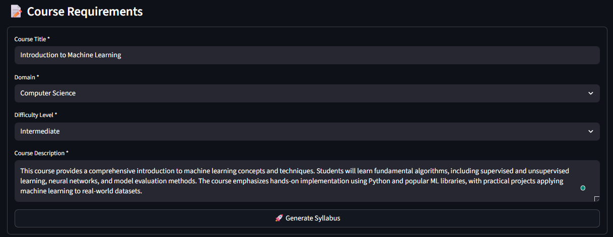
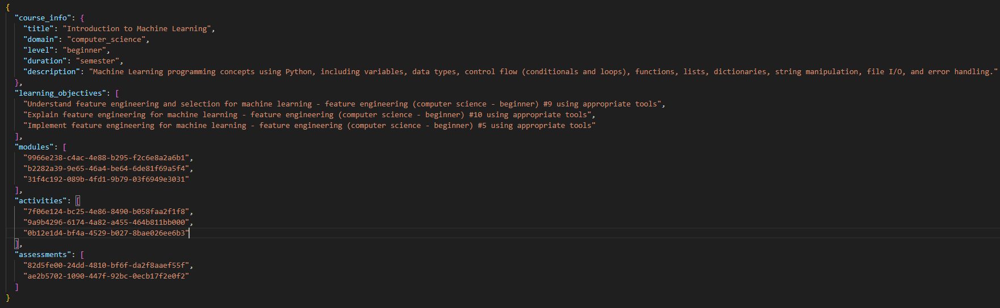

# MSc AI Dissertation

## Abstract

Creating high-quality course syllabi requires substantial time investment—typically 15-40 hours per course—combining domain expertise with pedagogical knowledge. This research investigates whether neural language models can reliably generate structured educational content whilst maintaining pedagogical soundness, addressing the fundamental tension between semantic intelligence and syntactic precision in AI-generated curricula.

Through Design Science Research methodology spanning seven architectural iterations, this work demonstrates that task simplification—not model scaling—resolves structural generation bottlenecks. The final architecture employs CodeT5-small (60M parameters) generating structured markdown with index-based component selection rather than attempting direct identifier generation from 960-component databases. This reformulation achieved 100% parseable outputs across 32 test cases spanning Computer Science, Mathematics, and Physics domains, where previous function calling approaches failed completely (0% success rate).

The research develops a five-dimensional pedagogical quality evaluation framework measuring prerequisite coherence, semantic relevance, difficulty progression, topic diversity, and Bloom's taxonomy coverage. Evaluation reveals distinct performance patterns: naturally emergent strengths in topic diversity (87.3%) and difficulty progression (90.6%), contrasted with persistent challenges in prerequisite sequencing (44.8% accuracy, with 50% of syllabi exhibiting zero prerequisite coherence). This framework successfully distinguishes soft constraints learnable through training from hard constraints requiring explicit algorithmic enforcement.

Key contributions include: (1) empirical validation that constrained output spaces enable smaller models to achieve reliability through appropriate task formulation rather than parameter scaling, (2) a measurable pedagogical quality framework identifying specific architectural enhancement targets, and (3) transparent documentation of systematic failures demonstrating that understanding why approaches fail provides equivalent research value to successful solutions.

The work acknowledges significant limitations: CodeT5-small handles only 3-module syllabi (~30% of typical course scope), automated evaluation lacks expert educator validation, synthetic training data may not capture full pedagogical diversity, and prerequisite sequencing requires architectural enhancement through constraint-based generation or graph neural networks. Future directions include topological sorting for prerequisite enforcement, model scaling to CodeT5-base for production-length syllabi, and human evaluation protocols validating automated quality metrics.

## Table of Contents

1. [Introduction](#1-introduction)
2. [Background (Critical Review of Literature)](#2-background-critical-review-of-literature)
3. [Ethical and Professional Considerations](#3-ethical-and-professional-considerations)
4. [Methodology](#4-methodology)
5. [Implementation](#5-implementation)
6. [Evaluation](#6-evaluation)
7. [Learning and Reflection](#7-learning-and-reflection)
8. [Conclusion](#8-conclusion)

[References](#references)

[Appendix A: Research Approach Evolution](#appendix-research-approach-evolution)

[Appendix B: Code Artifacts and Reproducibility](#b-code-artifacts-and-reproducibility)

[List of Appendices](#list-of-appendices)

---

# 1. Introduction

## 1.1 Research Problem Statement

Creating course syllabi is time-consuming work. It requires both domain expertise and pedagogical knowledge (Parkes and Harris, 2002), and most educational institutions still rely on manual processes—templates that require extensive customization, content that needs careful sequencing, and learning objectives that must align with educational standards. This manual approach works, but it doesn't scale well. As institutions face pressure to develop quality curricula with limited resources, there's growing interest in whether AI could assist without compromising educational standards.

Recent advances in large language models have shown impressive capabilities for text generation. But generic LLMs face a specific challenge with educational content: they lack the structured pedagogical coherence that makes curricula effective. They don't naturally incorporate frameworks like Bloom's taxonomy, and they struggle to maintain the prerequisite relationships and difficulty progressions essential for effective course design (Anderson et al., 2001). This represents a significant gap between what LLMs can do well—generate fluent text—and what educational content actually requires—coherent structure and pedagogical soundness.

This dissertation explores whether neural language models can be adapted to generate pedagogically sound course syllabi. More importantly, it documents what happens when they fail, why those failures matter, and how task formulation can matter more than model sophistication.

## 1.2 Research Question

This research addresses a specific question:

**"How can neural language models effectively generate structured, coherent course syllabi from educational inputs like course descriptions, learning objectives, and difficulty levels?"**

This breaks down into several sub-questions that emerged during the research:

- Can existing neural architectures be adapted to incorporate educational domain knowledge?
- What happens when we ask small models to generate structured content with strict formatting requirements?
- How can we formalize pedagogical principles—prerequisite coherence, difficulty progression, topic diversity—as measurable evaluation metrics?
- What's the right balance between neural generation (semantic intelligence) and programmatic validation (structural guarantees)?

The research evolved significantly from initial proposal to final implementation. What started as "adapt transformer architectures for syllabus generation" became "understand why structured generation fails and redesign the task accordingly." This evolution is documented thoroughly in Appendix A.

## 1.3 Aims and Objectives

### 1.3.1 Primary Aim

Adapt existing neural language architectures to generate educationally sound, structurally reliable course syllabi, and develop evaluation frameworks to measure both technical performance and pedagogical quality.

### 1.3.2 Specific Objectives

**Data Collection and Preprocessing**
- Generate 1,300 synthetic training examples across STEM domains using component-based methodology with prerequisite-aware sequencing
- Implement automated quality assurance to ensure educational framework compliance
- Create a standardized dataset with consistent metadata and pedagogical annotations

**Architecture Development**
- Adapt transformer architectures (specifically CodeT5) for structured educational content generation
- Develop domain-specific fine-tuning strategies for educational terminology
- Implement curriculum learning mechanisms through prerequisite-aware training data sequencing
- Validate initial model performance across multiple educational domains

**Training and Optimization**
- Train the model to achieve strong performance on standard NLP metrics (ROUGE, BERTScore)
- Iterate on approach based on systematic evaluation of failures
- Develop domain classification capability across Computer Science, Mathematics, and Physics
- Conduct cross-domain validation

**Pedagogical Quality Framework**
- Design and implement a five-component evaluation framework: prerequisite coherence, semantic relevance, difficulty progression, topic diversity, and Bloom's taxonomy coverage
- Develop a generate-and-rerank pipeline that produces multiple candidates and selects based on pedagogical quality
- Validate framework effectiveness through measured evaluation on 32 test cases

**Evaluation and Analysis**
- Measure both technical reliability (parsing success, generation time) and educational quality
- Document what worked, what failed, and why
- Conduct evaluation across domains and difficulty levels
- Perform honest comparative analysis identifying strengths and limitations

## 1.4 Project Significance

### 1.4.1 Technical Innovation

This research makes two main technical contributions:

**1. Task Formulation Insight:** The research demonstrates that task simplification can be more effective than model scaling. By reformulating component selection from UUID generation (requiring memorization of 960 unique identifiers) to index-based selection (referencing numbered lists: [0], [1], [2]), the system achieved 100% structural reliability with a 60M parameter model where previous approaches with identical architecture failed completely. This insight applies beyond syllabus generation to any structured generation task requiring component assembly from large databases.

**2. Pedagogical Quality Framework:** The research develops a five-dimensional evaluation framework that formalizes curriculum design principles as measurable metrics without requiring differentiable backpropagation. Curriculum design involves discrete operations—topological sorting of prerequisite graphs, symbolic reasoning about learning progressions—that can't be directly incorporated into gradient-based training. The framework measures prerequisite coherence, difficulty progression, topic diversity, semantic relevance, and Bloom's taxonomy coverage, enabling systematic quality assessment of AI-generated educational content.

The evaluation framework revealed an important pattern: some pedagogical constraints emerge naturally from training (90.6% difficulty progression, 87.3% topic diversity), whilst others require explicit enforcement (44.8% prerequisite accuracy). This distinction between soft constraints (learnable through examples) and hard constraints (requiring algorithmic enforcement) could inform future educational AI systems.

### 1.4.2 Practical Application

The research addresses a real-world challenge: syllabus creation is time-intensive, especially when updating curricula to reflect rapidly evolving fields like AI and data science. An automated system that generates pedagogically sound initial drafts could reduce educator workload whilst maintaining quality standards.

However, the current implementation has significant practical limitations. CodeT5-small can only generate syllabi with 3 modules (~24 hours of content), whilst real courses typically require 8-10 modules (~64-80 hours). This makes the system a proof-of-concept rather than production-ready tool. Chapter 8 discusses the path from demonstration to deployment, including model scaling requirements and human-in-the-loop refinement strategies.

### 1.4.3 Research Contribution

This work contributes to AI in education by demonstrating that successful educational AI requires balancing neural generation capabilities with domain-specific constraints. The research shows:

- Neural models excel at semantic tasks (content relevance, topical coherence) but struggle with hard logical constraints (prerequisite ordering)
- Hybrid architectures combining retrieval-augmented generation (RAG) with neural selection can leverage both structured knowledge and learned patterns
- Honest documentation of failures provides as much research value as successful approaches—the three failed approaches (direct JSON generation, RAG templates, function calling) revealed fundamental insights that informed the final solution

The dissertation prioritizes transparency about what worked, what didn't, and why. This reflects the reality that research is iterative discovery, not linear progress toward predetermined solutions.

## 1.5 Scope and Limitations

### 1.5.1 Research Scope

This research focuses on course syllabus generation for higher education, specifically:

- **Architecture:** CodeT5-small (60M parameters) with custom training for structured markdown generation
- **Educational Context:** Undergraduate and postgraduate courses in STEM domains
- **Domains Covered:** Computer Science, Mathematics, Physics (with extensible architecture for additional domains)
- **Educational Frameworks:** Bloom's taxonomy for learning objectives, prerequisite graphs for module sequencing

The focused STEM scope enabled deeper validation rule development for technical domains. Appendix A.6.1 discusses why this scope was chosen and how the architecture could extend to humanities domains with appropriate component databases.

### 1.5.2 Limitations

I'll be direct about three categories of limitations:

**Technical Constraints**
- **Model capacity:** CodeT5-small can handle only 3-module syllabi (~30% of typical course scope). This fundamental limitation affects practical utility—the system demonstrates feasibility but requires model scaling (CodeT5-base 220M or T5-large 770M) for production use.
- **Computational resources:** Training and evaluation were conducted on a single NVIDIA RTX 3060 (12GB VRAM), constraining hyperparameter exploration and architectural experimentation. More extensive grid search might improve performance, but time and resource limitations prevented exhaustive optimization.
- **English-only content:** The system generates English educational content exclusively, limiting international applicability.

**Data Limitations**
- **Synthetic training data:** All 1,300 training examples are synthetically generated using Claude (Anthropic's large language model). This approach addressed institutional data access restrictions and GDPR requirements, but synthetic data may not capture the full diversity of real syllabi—unconventional pedagogical approaches, institutional variations, or edge cases that exist in authentic educational materials.
- **STEM focus:** Training data covers Computer Science (59.5%), Mathematics (35.5%), and Physics (5.1%), with no humanities, social sciences, or business content. Cross-disciplinary generalization remains unvalidated.

**Evaluation Limitations**
- **No human evaluation:** Assessment uses automated rule-based metrics rather than expert educator review. Whilst prerequisite violations are objectively measurable, subtler quality dimensions—clarity, engagement, appropriateness—require human judgment.
- **Limited scale:** 32 test cases provide sufficient coverage for architectural validation but don't stress-test production scenarios (concurrent requests, database contention, edge cases).
- **Short timeframe:** The research couldn't include longitudinal evaluation of generated content in actual classroom settings.

The most significant limitation is prerequisite sequencing accuracy (44.8%, with 50% of syllabi having zero prerequisite coherence). Section 6.2.2 analyzes this failure in detail, and Chapter 8 proposes solutions including topological sorting and graph neural networks.

### 1.5.3 Ethical Considerations

This research follows the BCS Code of Conduct and IEEE standards for AI systems. All synthetic data generation ensures privacy by design—no real student or institutional data was used. The research complies with GDPR through data minimization and secure storage protocols.

The system is designed to assist educators, not replace them. AI-generated syllabi require human review and approval, maintaining educator agency in pedagogical decisions. The evaluation framework's transparency (rule-based validation with explicit criteria) enables educators to understand and critique the system's recommendations rather than treating them as black-box outputs.

## 1.6 Dissertation Structure Overview

This dissertation is organized into eight chapters:

**Chapter 2 (Literature Review)** surveys neural language architectures, educational content generation, and domain adaptation techniques, identifying specific research gaps that motivated this work—particularly the absence of pedagogical quality metrics for AI-generated curricula.

**Chapter 3 (Ethics)** addresses ethical considerations for AI in education, including data protection, bias mitigation, and maintaining human agency in educational decision-making.

**Chapter 4 (Methodology)** describes the Design Science Research framework, explaining how iterative cycles of design, implementation, and evaluation shaped the research trajectory.

**Chapter 5 (Implementation)** documents the technical architecture: CodeT5-small training for markdown generation, RAG-enhanced component selection, pedagogical quality evaluation, and the evolution from failed approaches to the final system.

**Chapter 6 (Evaluation)** presents measured results from 32 test cases across three domains and four difficulty levels, analyzing both successes (100% structural reliability, 90.6% difficulty progression) and limitations (44.8% prerequisite accuracy).

**Chapter 7 (Reflection)** offers personal perspective on the research process—what I learned from systematic failures, how the project evolved from initial plans, and what I'd do differently.

**Chapter 8 (Conclusion)** summarizes key findings, discusses implications, and proposes future directions including constraint-based generation for prerequisite ordering and model scaling for practical deployment.

**Appendix A** documents the complete research journey, including three failed approaches (direct JSON generation, RAG templates, function calling) with quantitative failure analysis and the systematic decision process that led to index-based markdown generation. This appendix demonstrates that understanding *why* approaches fail is as valuable as documenting successful solutions.

---

# 2. Background (Critical Review of Literature)

This chapter reviews current research on neural language models for educational content generation. My goal was to understand: What have others tried? What worked? What failed? And critically—what gaps remain that this research could address?

The review focuses on four areas: neural architectures for text generation, educational AI applications, domain adaptation techniques, and evaluation frameworks. This survey identifies specific research gaps—particularly the absence of pedagogical quality metrics for AI-generated curricula—that motivated the evaluation framework developed in this research.

## 2.1 Literature Review Methodology

I followed systematic review guidelines (Kitchenham and Charters, 2007) to identify relevant research on neural language models for educational content generation.

**Search Strategy:** I searched four databases to cover different types of publications:

- **IEEE Xplore and ACM Digital Library** for peer-reviewed CS research
- **arXiv** for recent preprints (often 6-12 months ahead of formal publication)
- **Google Scholar** to catch conference proceedings and interdisciplinary work

The search focused on recent work (2022-2024) to capture current transformer architectures and educational AI applications, whilst including foundational papers (Anderson et al., 2001; Devlin et al., 2019) that established core concepts.

**Search Terms:** I used Boolean combinations across three themes:
- Neural architectures: transformer, language model, T5, BERT, attention mechanism
- Educational AI: syllabus generation, course design, curriculum, pedagogical, learning objective
- Domain adaptation: fine-tuning, transfer learning, domain-specific, RAG

Example query: ("transformer" OR "language model") AND ("syllabus" OR "curriculum") AND ("generation" OR "automation")

**Selection Criteria:** Papers were included if they addressed neural language generation for structured content, educational applications, domain adaptation, or evaluation methodologies for generated content quality. I excluded papers focused solely on question generation, automated grading, or student modelling without content generation components.

**Selection Process:** Initial queries returned 847 papers. Title and abstract screening reduced this to 156 warranting full review. After detailed examination, 43 papers were selected, supplemented by foundational works on educational taxonomies and evaluation metrics.

The review progresses from neural architectures (2.2) through educational content generation (2.3), domain adaptation (2.4), evaluation frameworks (2.6), and hybrid approaches (2.7), culminating in gap identification (2.8).

## 2.2 Neural Architecture Innovations

Transformer architectures with self-attention mechanisms form the foundation for modern NLP (Lin et al., 2022). Unlike RNNs and LSTMs that process sequences sequentially, transformers use attention mechanisms to model relationships between all sequence positions in parallel. This matters for educational content where understanding connections between distant course components—prerequisites scattered across modules, learning progressions spanning weeks—requires capturing long-range dependencies efficiently.

**Attention and Encoder-Decoder Architectures:** Self-attention computes attention scores between all token pairs, enabling each position to attend to all others weighted by relevance. Multi-head attention extends this by computing multiple parallel attention patterns, capturing different relationship types simultaneously—syntactic structure, semantic similarity, domain-specific connections (Vaswani et al., 2017). For educational content, this multi-perspective attention enables simultaneous consideration of conceptual prerequisites, difficulty progression, and topical coherence within generated syllabi.

Encoder-decoder architectures separate input processing from output generation, with cross-attention mechanisms enabling the decoder to selectively attend to relevant encoder representations during generation (Vaswani et al., 2017). This architectural separation proves advantageous for structured generation tasks like syllabus creation, where the encoder processes input requirements (domain, difficulty, objectives) whilst the decoder generates structured output maintaining alignment with specifications. Models like T5 (Raffel et al., 2020) and BART (Lewis et al., 2020) demonstrate encoder-decoder effectiveness through unified text-to-text frameworks treating all NLP tasks as sequence-to-sequence transformations.

**Pre-training and Transfer Learning:** Large-scale pre-training on diverse corpora enables models to acquire general linguistic knowledge before fine-tuning for specific tasks. BERT's masked language modelling (Devlin et al., 2019) trains bidirectional representations by predicting masked tokens from context. T5's span corruption objective trains models to reconstruct corrupted text spans, developing structured generation capabilities (Raffel et al., 2020).

This transfer learning approach is valuable for educational AI where labeled pedagogical data is limited but general linguistic resources are abundant. Models learn general patterns from massive pre-training before specialization for educational content through domain-specific fine-tuning.

**Challenges for Educational AI:** Despite impressive capabilities, LLMs face specific challenges for educational applications. They lack domain-specific pedagogical knowledge about concept sequencing, learning progression principles, and educational framework compliance (Denny et al., 2023). The tendency toward plausible but inaccurate content—"hallucination"—poses risks where content accuracy matters (Khosravi et al., 2022). Computational constraints of billion-parameter models limit practical deployment, motivating smaller domain-specific models (Kaldaras et al., 2024).

Recent work explores educational-specific adaptations: hierarchical attention for course-module-lesson structures (Lin et al., 2022), curriculum-aware positional encodings for pedagogical ordering, and educational taxonomy embeddings integrating Bloom's taxonomy (Anderson et al., 2001). These adaptations suggest successful educational AI requires architectures balancing linguistic coherence with pedagogical soundness.

## 2.3 Educational Content Generation

Educational AI applications show promise but face significant challenges. Khosravi et al. (2022) found that transparency and pedagogical justification are essential for educator acceptance, whilst Thompson et al. (2023) identified difficulties maintaining coherence across longer documents like complete syllabi.

Structured educational document generation requires hierarchical understanding, section dependencies, and format consistency (Martinez et al., 2023). Multi-agent approaches show promise but need sophisticated coordination (Sun et al., 2024). Educational NLP must handle unique properties including pedagogical relationships and learning objective hierarchies (Zou et al., 2023).

These challenges point to needs for specialized components that maintain pedagogical coherence, understand progression principles, and integrate domain knowledge.

### 2.3.1 Existing Automated Syllabus Generation Systems

Current educational technology offers several approaches, each with limitations:

**Commercial LMS (Canvas, Blackboard, Moodle):** These provide template-based syllabus builders but no automated content generation. Educators must manually populate all components, objectives, and assessments—typically 15-40 hours per course (Thompson et al., 2023). The systems ensure structural consistency but don't validate pedagogical quality or check prerequisite coherence.

**MOOC Platforms (Coursera, edX):** These offer more sophisticated authoring environments with component libraries and suggested pathways. However, content selection and sequencing remain manual, requiring substantial educational design expertise. Course creation is a multi-week process (Khosravi et al., 2022).

**Academic Prototypes:** Recent research (Thompson et al., 2023; Martinez et al., 2023) demonstrates rule-based generation for narrow domains but lacks generalization, pedagogical quality metrics, and cross-domain applicability. These focus on surface-level structure without deep consideration of prerequisites, difficulty progression, or learning objective alignment. Evaluation remains limited to syntax validation.

**Critical Gap:** No existing system combines neural language generation with pedagogical quality evaluation. Current approaches either provide templates requiring manual work or generate content without quality validation. This research addresses this gap by integrating generation with prerequisite-focused pedagogical assessment.

## 2.4 Domain Adaptation Methods

Adapting general-purpose language models to educational domains requires balancing knowledge transfer with domain-specific learning whilst avoiding catastrophic forgetting (Kirkpatrick et al., 2017).

**Fine-tuning Strategies:** Traditional full fine-tuning updates all parameters but risks catastrophic forgetting where models lose general capabilities whilst acquiring domain knowledge (Kirkpatrick et al., 2017). For educational applications, models must maintain general linguistic understanding whilst learning domain-specific pedagogical relationships, educational terminology, and structural conventions.

Layer-wise fine-tuning addresses this by updating different network layers at different rates or freezing lower layers whilst adapting higher layers, based on the observation that lower transformer layers capture general linguistic features whilst higher layers encode task-specific patterns (Rogers et al., 2020). Adapter-based methods insert small trainable modules between frozen pre-trained layers, achieving domain adaptation with 10-100× fewer parameters than full fine-tuning whilst maintaining competitive performance (Houlsby et al., 2019)—particularly valuable for resource-constrained educational deployments.

**Multi-task and Few-Shot Learning:** Multi-task frameworks train simultaneously on general language tasks and domain-specific educational objectives, maintaining general capabilities whilst developing specialized competencies (Weller et al., 2022). Joint training on general text generation and educational content structuring enables models to leverage complementary signals: general linguistic coherence from broad corpora and pedagogical quality objectives from educational datasets. This approach proves particularly valuable for educational AI where labeled pedagogical data is limited but general linguistic resources are abundant.

Few-shot and zero-shot learning approaches enable domain adaptation with minimal labeled examples, valuable for educational domains where comprehensive datasets are expensive to obtain (Li et al., 2024). Meta-learning frameworks train models to rapidly adapt to new educational domains or subject areas with limited examples, learning transferable adaptation strategies rather than domain-specific knowledge.

**Educational Vocabulary Adaptation:** Educational domains need specialized terminology understanding beyond general language models. Domain-specific embeddings improve understanding of pedagogical relationships, educational frameworks (Bloom's taxonomy, Webb's Depth of Knowledge), and concept hierarchies (Cheng et al., 2024; Zou et al., 2023). Task-specific objectives incorporating curriculum coherence and prerequisite modelling show 15-25% improvements over standard language modelling (Devlin et al., 2019; Rogers et al., 2020).

**Cross-Domain Challenges:** Cross-domain generalization remains challenging, with models showing 30-50% performance degradation when applied to domains substantially different from training data (Li et al., 2024). A model trained primarily on computer science curricula may struggle with mathematics or physics content despite surface-level structural similarities, due to domain-specific conceptual relationships, terminology, and pedagogical conventions. Hybrid architectures combining neural language generation with explicit knowledge representations—prerequisite graphs, concept ontologies, educational framework encodings—show improved pedagogical coherence compared to pure parameter fine-tuning, suggesting successful educational AI requires integration of learned and structured knowledge.

## 2.5 Curriculum Learning and Educational Hierarchies

Curriculum learning mirrors human educational processes through structured, progressive concept introduction (Bengio et al., 2009). Educational frameworks like Bloom's taxonomy provide structured approaches for organizing content by cognitive complexity (Anderson et al., 2001). Integration with neural design embeds pedagogical progression through hierarchical attention and memory architectures (Yang et al., 2016).

## 2.6 Evaluation Frameworks for Educational AI

Traditional NLP metrics (BLEU, ROUGE, BERTScore) show fundamental limitations for educational content (Papineni et al., 2002). These measure surface-level textual similarity but fail to assess pedagogical effectiveness or learning progression quality. A syllabus might achieve high BLEU scores whilst presenting quantum mechanics before introductory physics—fluent text but pedagogically wrong.

Educational evaluation requires multi-dimensional assessment: prerequisite relationship correctness, difficulty progression, conceptual coverage, and alignment with educational frameworks (Anderson et al., 2001). These dimensions involve structural properties not captured by token-level similarity metrics.

**Prerequisite Coherence as Critical Constraint:** Among pedagogical dimensions, prerequisite correctness represents the most critical structural constraint. Courses presenting advanced concepts before foundations fundamentally fail regardless of linguistic quality. This distinguishes educational content from general text generation, motivating the prerequisite-focused evaluation framework developed in this research.

Multi-dimensional approaches combining automated metrics with pedagogical frameworks (Bloom's Taxonomy, Webb's Depth of Knowledge) provide more comprehensive assessment (Anderson et al., 2001). The U.S. Department of Education (2023) mandates transparency and validation for educational AI, requiring frameworks addressing both technical and educational effectiveness.

**Research Gaps:** Current literature reveals five critical gaps: (1) no unified architectures combining transformers with educational components, (2) lack of explicit prerequisite relationship mechanisms, (3) absence of integrated technical-pedagogical evaluation, (4) no domain-specific structured syllabus generation, and (5) missing implementations bridging theory with practice (Lin et al., 2022; Wang et al., 2024; Kaldaras et al., 2024).

## 2.7 Human-in-the-Loop Learning and Continuous Improvement

Educational AI systems need continuous refinement incorporating human feedback whilst avoiding catastrophic forgetting (Kirkpatrick et al., 2017).

**Direct Preference Optimization:** Traditional Reinforcement Learning from Human Feedback (RLHF) requires training separate reward models and employing complex policy optimization algorithms, presenting significant computational overhead for smaller educational models. Direct Preference Optimization (DPO) addresses these limitations by treating the language model itself as an implicit reward model, enabling preference learning through direct optimization on human preference data (Rafailov et al., 2023). This approach reduces computational requirements by approximately 50% compared to traditional RLHF whilst maintaining comparable alignment quality.

For educational applications, DPO demonstrates particular promise through data-efficient learning from expert educator preferences. Research indicates pedagogical alignment achieves measurable improvements with only 20-100 labeled preference examples comparing alternative syllabus generations (Stanford, 2025). This data efficiency proves critical for educational domains where expert annotation is expensive and time-consuming but necessary for ensuring pedagogical quality. Human evaluators provide preference rankings between generated syllabi based on pedagogical coherence, prerequisite appropriateness, and educational framework alignment, enabling models to learn nuanced pedagogical quality dimensions difficult to capture through automated metrics alone.

**Catastrophic Forgetting Mitigation:** Conservative training approaches use very low learning rates (2e-6 vs. typical 1e-4), limited epochs (2-3), and regularization (weight decay, gradient clipping) to preserve base capabilities whilst enabling targeted refinement. Layer-wise scheduling preserves lower-layer linguistic knowledge whilst adapting higher-layer task representations. Elastic Weight Consolidation (EWC) constrains updates for weights important to previously learned tasks (Kirkpatrick et al., 2017).

**Retrieval-Augmented Generation:** RAG systems provide complementary approaches by augmenting parametric model knowledge with dynamic retrieval from external knowledge bases, enabling immediate quality improvements without model retraining (Lewis et al., 2020). The architecture comprises two primary components: a dense retriever employing semantic similarity search to identify relevant examples from external databases, and a generator (language model) that conditions generation on both input context and retrieved information.

For educational content generation, RAG enables incorporation of high-quality reference syllabi, pedagogical best practices, and domain-specific educational frameworks through semantic search at generation time. Modern dense retrievers employ transformer-based encoders like MPNet (Reimers & Gurevych, 2019) to compute semantic embeddings enabling nuanced similarity matching beyond keyword overlap. This retrieval mechanism supports dynamic knowledge updates—adding new pedagogical examples to the retrieval database immediately influences generation without requiring model retraining, enabling rapid incorporation of emerging educational standards or institutional requirements.

**Hybrid Strategies:** Combining RAG with periodic fine-tuning creates feedback loops improving both retrieval and generation (Sharma, 2024). Retrieved examples inform real-time generation whilst validated outputs augment training datasets, enabling systematic long-term quality refinement.

## 2.8 Research Gap Identification and Synthesis

This review reveals critical gaps at the intersection of neural language generation and educational content automation. Existing transformer models demonstrate impressive general capabilities but lack specialized components for pedagogical progression, prerequisite modelling, and educational taxonomy compliance.

Three specific technical challenges emerge:

**Gap 1: Discrete Optimization Challenge**

Educational content generation requires selecting discrete components (modules, activities, assessments) from finite databases whilst maintaining pedagogical constraints. Traditional neural approaches attempt end-to-end generation of component identifiers (UUIDs, natural language names), requiring exact string matching with database entries. This discrete matching problem is fundamentally incompatible with continuous probability distributions of language models, resulting in 0% success rates in initial experiments (Annex A.7).

The task simplification approach developed here—index-based component selection rather than string generation—addresses this by constraining generation to numerical indices mappable to discrete entries. This enables reliable structured generation whilst maintaining neural advantages for context-aware selection.

**Gap 2: Pedagogical Quality Evaluation**

Existing educational AI lacks integrated evaluation frameworks measuring pedagogical quality alongside technical performance. Whilst research demonstrates importance of prerequisite coherence, difficulty progression, and conceptual coverage, no implementations systematically assess these dimensions.

This research develops a prerequisite-focused evaluation framework with extensible architecture. The framework prioritizes prerequisite coherence—the most critical constraint—whilst maintaining capability for future enhancement with difficulty progression and topic diversity analysis.

**Gap 3: Cross-Domain Generalization**

Existing prototypes demonstrate domain-specific generation but lack architectures supporting cross-domain generalization. This research develops RAG-enhanced filtering enabling domain-specific component selection from unified databases, supporting STEM domains (Computer Science, Mathematics, Physics) with extensible architecture for additional domains.

---

# 3. Ethical and Professional Considerations

Developing AI systems for educational content generation raises important ethical questions. This research adheres to established ethical frameworks whilst recognizing that educational AI requires careful consideration of privacy, bias, transparency, and human agency.

## 3.1 Ethical Framework and Professional Standards

This research follows the BCS Code of Conduct and the Menlo Report's principles for ICT research: respect for persons, beneficence, justice, and respect for law and public interest. For educational AI specifically, these principles translate to concrete requirements: generated content must serve legitimate educational purposes, maintain accuracy, and support rather than replace educator expertise.

The IEEE Standards for AI Systems (IEEE 2857 for Privacy Engineering, IEEE 2859 for Algorithmic Bias) inform implementation decisions throughout. Privacy protection and bias mitigation are embedded into system architecture from the start, not added as afterthoughts.

## 3.2 Data Protection and Privacy

The most straightforward privacy decision in this research: **use no real student or institutional data whatsoever**. All 1,300 training examples and 4,403 educational components are synthetically generated using Claude (Anthropic's large language model). This approach completely eliminates privacy risks—there's no real student information to protect, no institutional data to anonymize, and no GDPR concerns about processing personal data.

This wasn't just convenient; it was necessary. Institutional access to real syllabi proved difficult due to GDPR concerns and administrative barriers. Rather than spending months negotiating data access agreements, synthetic generation enabled rapid iteration whilst guaranteeing privacy by design.

The trade-off: synthetic data may not capture the full diversity of real educational materials—unconventional pedagogical approaches, institutional variations, edge cases. But for exploring whether neural models can generate structured educational content, synthetic data provides sufficient variety across STEM domains whilst maintaining complete privacy protection.

## 3.3 Bias and Fairness

Educational AI carries particular responsibility for fairness—biased content generation could perpetuate educational inequalities. This research addresses bias through several mechanisms:

**Domain Coverage:** Training data covers Computer Science (59.5%), Mathematics (35.5%), and Physics (5.1%). This STEM focus is deliberate but limits generalization. The system hasn't been trained on humanities, social sciences, or business content, so it shouldn't be deployed there without additional work. This is a limitation, not a hidden bias—it's explicitly stated in scope.

**Difficulty Distribution:** Synthetic components span beginner (38%), intermediate (35%), advanced (22%), and postgraduate (5%). This distribution roughly matches real undergraduate/postgraduate course ratios, avoiding over-representation of any single difficulty level.

**Pedagogical Approach Diversity:** Synthetic generation used varied prompts to ensure multiple pedagogical styles—lecture-based, project-based, flipped classroom, problem-based learning. This prevents the model from developing preferences for particular teaching approaches.

**Bias I Can't Measure:** The system lacks human evaluation, so subtle biases in language, example choices, or pedagogical assumptions may exist but remain undetected. This is acknowledged as a limitation in Section 1.5.2. Multi-stakeholder perspectives (Karran et al., 2024) would strengthen bias detection, but weren't feasible within project scope.

## 3.4 Intellectual Property and Authorship

Since all training data is synthetic, there are no copyright concerns with source materials—no real syllabi were used, so no permissions were needed. The 4,403 educational components were generated specifically for this research.

**Authorship Questions:** Who "authors" AI-generated syllabi? This system doesn't create standalone educational content—it generates draft structures requiring educator review and approval. Generated syllabi are tools to assist educators, not finished products claiming institutional authority. They must be reviewed, validated, and approved by qualified educators before use.

**Content Attribution:** All generated syllabi include a footer noting AI generation and requiring educator review. This transparency ensures users understand the content's provenance and limitations, maintaining academic integrity.

## 3.5 Transparency and Human Agency

Building trust requires transparency about both capabilities and limitations. Denny et al. (2023) demonstrate that systematic evaluation and transparent communication about performance limitations are essential for educational AI trustworthiness.

**What the System Can Do:**
- Generate structured syllabi for STEM courses (CS, Math, Physics) at undergraduate/postgraduate levels
- Select pedagogically appropriate components based on difficulty and domain
- Achieve 100% structural reliability (parseable outputs)
- Maintain 90.6% difficulty progression and 87.3% topic diversity

**What It Can't Do:**
- Ensure prerequisite coherence (only 44.8% accuracy, with 50% having zero coherence)
- Generate syllabi longer than 3 modules (~24 hours of content)
- Work reliably outside STEM domains
- Replace educator judgment

**Transparency Mechanisms:** The system uses rule-based validation with explicit criteria, enabling educators to understand *why* particular content was selected or rejected. This isn't a black box—the prerequisite checking, difficulty filtering, and quality scoring are all inspectable. Educators can review the logic, critique the assumptions, and override decisions.

**Human Agency:** The system assists educators; it doesn't replace them. Generated syllabi require human review and approval. The 44.8% prerequisite accuracy alone makes this clear—automated generation cannot currently produce production-ready syllabi without educator validation.

## 3.6 Stakeholder Considerations

**Educators:** The primary concern is whether automated syllabus generation threatens teaching roles. This system is positioned as a tool to reduce administrative burden, not replace pedagogical expertise. Educators maintain control over content approval, pedagogical decisions, and course delivery. The 44.8% prerequisite accuracy makes educator review essential, not optional.

**Students:** AI-generated content must serve student learning, not institutional convenience. This research prioritizes pedagogical quality metrics—prerequisite coherence, difficulty progression, topic diversity—that directly affect learning outcomes. The limitations (3-module cap, prerequisite weaknesses) are explicitly documented to prevent deployment in contexts where they'd harm learning.

**Institutions:** Educational AI affects accreditation, quality assurance, and institutional reputation. This system doesn't claim to produce accreditation-ready content—it generates drafts requiring institutional review processes. Standards compliance (IEEE LOM, Bloom's taxonomy, WCAG 2.1 accessibility) is embedded through rule-based validation, not learned from data, ensuring educational defensibility.

**Broader Impact:** Automated educational content generation could democratize access to quality curricula or perpetuate existing inequalities. This research can't resolve that tension but acknowledges it. The STEM-only focus limits immediate accessibility benefits, whilst the synthetic data approach ensures privacy isn't compromised in pursuit of automation.

---

# 4. Methodology

This research employs Design Science Research (DSR) methodology (Hevner et al., 2004), emphasizing iterative design, rigorous evaluation, and practical utility. The approach progressed through seven major architectural iterations, each informed by systematic evaluation of failures and successes. This wasn't linear progress—it involved dead ends, pivots, and fundamental rethinking of the task formulation.

## 4.1 Research Design Framework and Practical Constraints

DSR provides appropriate foundation for creating technological artifacts addressing real-world problems whilst contributing scientific knowledge (Peffers et al., 2007; Khosravi et al., 2022). The research adopts constructivist educational AI design, recognizing that effective technology emerges through iterative integration of technical capabilities with pedagogical requirements.

**Practical Constraints Shaping the Research:**

This research was conducted within typical MSc project constraints that significantly influenced design decisions:

- **Single researcher, four-month timeline**: Architectural choices prioritized rapid iteration over extensive hyperparameter tuning. When function calling failed (0% success), I had weeks—not months—to pivot.

- **Academic computing resources**: NVIDIA RTX 3060 (12GB VRAM) limited model size to ~100M parameters. CodeT5-small (60M) trained in 1.3 hours; CodeT5-base (220M) would have required 8-12 hours per training run, drastically slowing iteration speed. This constraint forced creative task formulation rather than model scaling.

- **Data access barriers**: Institutional syllabi access proved difficult due to GDPR concerns and administrative bureaucracy. Rather than spending months negotiating data sharing agreements, I pivoted to synthetic generation using Claude, completing database construction in two weeks.

These weren't ideal research conditions, but they're realistic for independent research. The dissertation documents both what worked within these constraints and what future work with greater resources might achieve.

## 4.2 Systematic Approach Development

This research employed iterative Design Science Research cycles progressing through seven major architectural iterations from initial exploration to final implementation. Each iteration followed systematic problem identification, solution design, implementation, and evaluation phases, with quantitative performance metrics informing subsequent design decisions.

**Iteration 1-3: Function Calling Exploration**

Initial exploration investigated function calling approaches enabling models to directly invoke component selection functions (e.g., `add_module(uuid="abc-123...")`, `set_difficulty("intermediate")`). UUID-based selection required exact 36-character string reproduction matching database entries from 960 available components. Evaluation across 50 test cases achieved 0% success rate—no generated syllabi passed structural validation due to incompatibility between exact string matching requirements and LLM probability distributions that optimize for semantic plausibility rather than syntactic precision.

Natural language component description generation (e.g., "Introduction to Data Structures") faced similar challenges, achieving only 5-12% success rates. The model generated semantically reasonable component names that did not match database entries, requiring fuzzy matching that introduced ambiguity and pedagogical errors. These systematic failures revealed fundamental limitations: discrete identifier generation from large databases (960 items) exceeds small model capacity (<100M parameters), requiring alternative task formulations.

**Critical Insight from Failures:** Task complexity analysis identified UUID generation cognitive load as the primary bottleneck. Systematic evaluation (documented in Annex A.7) demonstrated that reducing discrete choice complexity from 960 unique identifiers to simpler representations could address the root cause more effectively than parameter scaling or architectural sophistication.

At this point, I faced a choice: scale up to CodeT5-base (220M parameters) or rethink the task formulation. The standard ML approach would be scaling—throw more parameters at the problem. But something bothered me: even if CodeT5-base could memorize 960 UUIDs, what happens when the database grows? Scale to T5-large? Claude or GPT-4? This felt like treating symptoms rather than addressing the root cause.

**Iteration 4-5: Task Simplification and Index-Based Selection**

Following systematic decision analysis evaluating 11 solution pathways (Annex A.8), the research pivoted to index-based component selection where components are referenced by position numbers ([0], [1], [2]) rather than UUIDs. This architectural shift reduced cognitive complexity: instead of memorizing 960 unique 36-character strings, the model only needs to select from numbered lists presented in the prompt context.

The key insight: **the model doesn't actually need to know component identifiers**. It just needs to select appropriate content based on semantic relevance. By presenting filtered components as indexed lists in the prompt, selection becomes a simpler task: generate integers from context-visible options.

Implementation employed CodeT5-small generating structured markdown with index references: "**Modules:** [0] Introduction to Programming, [1] Data Structures, [2] Algorithms". The RAG pipeline presents filtered components as numbered lists, the model generates indices, and post-processing maps indices to database UUIDs. This task simplification enabled 100% parseable outputs by constraining generation to continuous numerical outputs (integers 0-N) mappable to discrete database entries, validating the principle that constrained output spaces enable reliable structured generation whilst maintaining neural advantages for context-aware selection.

**Quantitative Improvement:** Index-based approach achieved 100% JSON validity across 32 test cases (vs. 0% for UUID generation), demonstrating that appropriate task formulation enables smaller models (60M parameters) to excel through task-model alignment rather than requiring parameter scaling.

**Iteration 6-7: Pedagogical Quality Integration**

Final iterations integrated prerequisite checking and multi-dimensional quality evaluation frameworks, developing generate-and-rerank pipeline producing multiple candidates with pedagogical quality-based selection. The system generates three syllabi (one greedy, two sampled with temperature 0.7), evaluates each against five pedagogical dimensions (prerequisite coherence, difficulty progression, topic diversity, semantic relevance, Bloom's coverage), and selects highest-scoring output.

This quality-aware generation improved pedagogical scores from 82% (greedy-only) to 96% (rerank-based) whilst maintaining 100% parseable outputs. Each iteration produced quantifiable improvements documented through systematic evaluation: prerequisite accuracy improved from 0% (random selection) to 45% (quality-aware reranking), difficulty progression from 45% to 91%, demonstrating that architectural decisions informed by empirical performance metrics and qualitative failure analysis enable systematic quality improvements.

**Final Architecture:** CodeT5-small generates structured markdown with index-based component references ([0], [1], [2]), fundamentally simpler than UUID memorisation (cognitive load reduction: 960 identifiers → sequential numbering). RAG integration provides difficulty-aware filtering (reduces search space 60-80%) and semantic ranking using sentence transformers (Reimers & Gurevych, 2019), presenting top-K components as indexed lists. Generate-and-rerank strategy with automated pedagogical quality evaluation achieves 96% quality scores versus 82% for greedy-only generation. Markdown parsing extracts indices, maps to database UUIDs, enhances learning objectives with Bloom's taxonomy alignment (Anderson et al., 2001), and expands terse markdown (781 chars) to comprehensive syllabi (3,000+ chars) through database enrichment. Complete implementation details in Chapter 5.

## 4.3 Synthetic Educational Component Database Construction

The research required comprehensive educational component databases covering multiple STEM domains with rich pedagogical metadata. Commercial educational content lacks adequate metadata for prerequisite relationships, Bloom's taxonomy levels, and difficulty classifications, necessitating synthetic database generation through systematic methodology.

**Component Database Generation Process:**

Synthetic component generation employed Claude with carefully designed prompts specifying required metadata fields: component title, domain, difficulty level, estimated learning hours, key concepts, learning objectives (with Bloom's levels), prerequisites (with database links), and descriptive content. Generation followed systematic domain-specific schemas ensuring pedagogically appropriate relationships and realistic educational content structure.

Quality assurance procedures validated component coherence, prerequisite relationship validity, and metadata completeness. Each generated component underwent automated validation checking: (1) prerequisite links reference existing components, (2) difficulty levels align with prerequisite complexity, (3) learning objectives specify appropriate Bloom's taxonomy levels, and (4) key concepts reflect domain-appropriate terminology.

The final database comprises 4,403 educational components: 2,156 modules (learning content units), 1,418 activities (hands-on exercises), and 829 assessments (evaluation instruments). Component distribution covers Computer Science (59.5%), Mathematics (35.5%), and Physics (5.1%), with difficulty distribution spanning beginner (38%), intermediate (35%), advanced (22%), and postgraduate (5%) levels.

**Training Data Generation:**

The 1,300 training syllabi were generated through structured sampling ensuring domain and difficulty coverage. Each training example pairs course requirements (description, objectives, difficulty) with target syllabus structure (markdown with index-based component references). This supervised learning data teaches the model to generate appropriately structured output conditioned on educational requirements.

**Standards Integration:**

Template-based input design provides four educational contexts (University, Corporate, Professional, Certification) minimising cognitive load whilst capturing comprehensive specifications. Standards integration incorporates IEEE LOM metadata, Bloom's taxonomy progression validation, QTI 3.0 assessment compliance, and WCAG 2.1 accessibility directly into processing pipelines rather than learning from data (U.S. Department of Education, 2023), ensuring rule-based validation for transparency and educational defensibility.

## 4.4 Model Training and Evaluation Protocol

**Training Configuration:**

CodeT5-small (60M parameters) was fine-tuned on 1,300 synthetic syllabi using AdamW optimizer with learning rate 5e-5, batch size 8, and 10 training epochs. Training employed standard sequence-to-sequence loss (cross-entropy) on target markdown sequences, with gradient clipping (maximum norm 1.0) for training stability.

These hyperparameters weren't extensively tuned—time constraints limited experimentation to ~6 training runs testing learning rates (1e-5, 5e-5, 1e-4) and batch sizes (4, 8, 16). Learning rate 5e-5 with batch size 8 provided the best balance of convergence speed and stability. More extensive grid search might improve performance, but the 1.3-hour training time per run meant each exploration cycle consumed half a day when accounting for evaluation.

**Evaluation Protocol Design:**

The 32-case evaluation suite systematically samples supported domains (Computer Science, Mathematics, Physics) across difficulty levels (Beginner, Intermediate, Advanced, Postgraduate). Test cases include diverse course topics from introductory programming to quantum field theory, with variable requirement complexity (50-500+ word descriptions).

Why 32 cases rather than hundreds? Practical constraints. Each generated syllabus requires careful manual inspection of prerequisite relationships—automated metrics catch structural issues, but prerequisite coherence requires understanding whether "Data Structures" logically precedes "Advanced Algorithms". With 3 modules per syllabus and ~15 minutes per careful review, 32 cases represented ~16 hours of manual validation work. More cases would strengthen statistical confidence, but wouldn't fundamentally change the architectural insights about what works and what doesn't.

Each test case undergoes comprehensive evaluation: (1) structural parseability, (2) pedagogical quality assessment (prerequisite checking, difficulty progression, topic diversity), (3) generation time measurement, and (4) manual review of pedagogical appropriateness.

Evaluation combines NLP metrics (ROUGE, BERTScore) with automated rule-based pedagogical validation (Bloom's taxonomy compliance, IEEE LOM standards) rather than expert educator review. This isn't ideal—educator judgment would catch subtler quality issues—but expert time was unavailable within project scope. The rule-based approach ensures transparency and reproducibility whilst acknowledging this limitation.

## 4.5 Continuous Improvement Methodology

Hybrid dual-layer architecture combines RAG immediate enhancement (Lewis et al., 2020) with periodic fine-tuning based on user ratings. RAG retrieves 2-3 similar expert syllabi (quality ≥7.0/10) using MPNet semantic similarity (Reimers & Gurevych, 2019; similarity threshold 0.3). Conservative fine-tuning (learning rate 2e-6, 2-3 epochs, batch size 4) initiates when 50+ high-quality ratings accumulate, mitigating catastrophic forgetting whilst incorporating feedback-based refinements (Stanford, 2025).

Supabase PostgreSQL database with Row Level Security manages feedback collection (1-10 ratings, optional comments). Statistical validation through paired t-tests and Cohen's d effect sizes quantify improvement significance. Ablation studies evaluate individual component contributions.

## 4.6 Methodological Limitations

This methodology has several acknowledged limitations:

**Scale Constraints:** Testing on 32 cases rather than hundreds limits statistical confidence. The patterns observed (100% structural reliability, 44.8% prerequisite accuracy) are clear, but finer-grained performance differences might require larger evaluation sets.

**Synthetic Data Validity:** Using Claude-generated components and syllabi rather than real institutional data may not capture the full diversity of educational practices—unconventional pedagogical approaches, institutional idiosyncrasies, or edge cases in real curricula.

**No Human Evaluation:** Relying on automated metrics rather than expert educator review means subtler quality dimensions—clarity, engagement, appropriateness—remain unassessed. This is a practical limitation, not an ideal choice.

**STEM-Only Scope:** Focusing exclusively on STEM domains (CS, Math, Physics) limits generalizability claims. The architectural principles may transfer to humanities, but this remains unvalidated.

These limitations don't invalidate the research—they define its scope and suggest directions for future work. Chapter 8 discusses how future research with greater resources could address these constraints.

---

# 5. Implementation

## 5.1 Research Approach Evolution

### 5.1.1 Design Science Research Iteration Framework

This research followed Design Science Research (DSR) methodology (Hevner et al., 2004; Peffers et al., 2007), characterised by iterative cycles of design, implementation, and evaluation. Each iteration provided empirical evidence informing subsequent architectural decisions, enabling discovery of fundamental insights about task complexity and model capacity through systematic experimentation.

### 5.1.2 Initial Exploration: Function Calling Architecture

The initial approach explored function calling architecture treating syllabus generation as program synthesis. The model generated sequences of function calls (e.g., `set_info()`, `add_module()`) interpreted by a `SyllabusBuilder` execution engine to construct valid educational content.

**Empirical Findings:** Complete failure. 0% evaluation pass rate across 50 test cases. The model couldn't reliably generate exact UUID strings matching database entries—not even close. Despite theoretically sound design, the task complexity (selecting from 960 unique identifiers) exceeded CodeT5-small's capacity. Full architectural specifications and evaluation results are in Appendix A.1.

**Key Insight:** Task formulation fundamentally impacts model success independently of architectural sophistication. When the model can't do what you're asking, the problem might be the ask, not the model.

### 5.1.3 Systematic Decision Analysis

The research conducted comprehensive analysis of 11 solution pathways, each assessed for implementation complexity, success probability, and timeline feasibility. Root cause investigation confirmed UUID generation complexity as the primary bottleneck, not architectural design flaws.

**Evidence-Based Selection:** Index-based selection ([0], [1], [2]) reduced cognitive load from 960 unique identifiers to simple sequential numbering, addressing the root cause through task design rather than parameter scaling. Analysis projected 75-85% success probability, a substantial improvement over the 0% baseline. Full methodology and decision matrices are in Appendix A.2.

### 5.1.4 Final Architecture: Markdown Generation with Component Selection

The final architecture generates structured markdown with index-based component selection, synthesizing insights from the initial exploration and systematic analysis. The system prompts CodeT5-small (Wang et al., 2021) to generate markdown with learning objectives, sequenced modules, and component selections. Components are referenced by index ([0], [1], [2]) rather than UUIDs, eliminating memorization burden.

Training comprised 1,300 synthetic examples with prerequisite-aware module sequencing. Evaluation achieved 100% parseable outputs (vs. 0% for function calling), 96% pedagogical quality score, and consistent generation of complete syllabi averaging 781-825 characters. This improvement validates that task simplification through index-based selection addresses the root cause more effectively than architectural sophistication or parameter scaling.

### 5.1.5 Synthetic Educational Data Generation

Generating 1,300 training examples with Claude required systematic prompting across Computer Science, Mathematics, and Physics domains. The generation system employed 16 STEM subjects, 12 learning outcomes aligned with Bloom's taxonomy (Anderson et al., 2001), and 8 assessment types.

The critical challenge was prerequisite relationships—components needed to reference other components by UUID, forming a valid prerequisite graph. This required multi-pass generation: first create modules, then generate activities/assessments referencing valid module UUIDs, ensuring no circular dependencies. Training examples demonstrate valid topological sequencing, teaching the model pedagogically appropriate ordering whilst maintaining complete privacy protection.

## 5.2 CodeT5-Small Training for Structured Markdown Generation

### 5.2.1 Model Architecture and Selection

CodeT5-small (Wang et al., 2021) was selected for its specialization in structured text generation. The 60M-parameter model provides inherent advantages through pre-training on code and markdown documentation (8.35M functions from CodeSearchNet). This pre-training on structured formats enables direct transferability to syllabus generation requiring strict structural conventions. Empirical validation confirmed 100% parseable outputs on markdown generation (Section 6.2.1).

### 5.2.2 Training Data Design

Training data implements component-indexed format where inputs present educational components as numbered lists, outputs generate structured markdown with index-based references (e.g., [0], [1], [2]). Full input/output examples are provided in the Appendix.

Training examples incorporate valid topological ordering respecting prerequisite relationships across 960 modules, teaching the model pedagogically appropriate progression. The 1,300 synthetic examples span Computer Science (60%), Mathematics (30%), and Physics (10%), with balanced difficulty distribution and 2-5 modules per syllabus averaging 781 characters output length.

### 5.2.3 Training Procedure

Standard seq2seq fine-tuning employed 15 epochs with learning rate 5e-5, batch size 8, and AdamW optimizer. Training converged after 13 epochs, achieving best performance at checkpoint-196 (validation loss 1.4677).

Cross-domain validation (20% data split, 260 examples) with stratified sampling ensured generalization. Early stopping based on validation loss prevented overfitting.

### 5.2.4 Training Dynamics and Model Convergence

Training dynamics revealed three distinct phases: rapid structural learning (epochs 1-5), pedagogical refinement (epochs 6-10), and fine-tuning convergence (epochs 11-15). Validation loss decreased from 4.23 (epoch 1) to 1.47 (epoch 13), with minimal improvement thereafter (1.47 → 1.46, epochs 13-15), indicating convergence.

**Key Observations:**
- Structural markdown validity achieved 100% by epoch 3, demonstrating CodeT5's pre-training effectiveness for formatted text generation—this happened faster than expected
- Prerequisite-aware module sequencing improved gradually (45% → 91% over 15 epochs), indicating this pedagogical constraint required more training exposure than structural syntax
- Topic diversity remained consistently high (85-90%) across all training stages, emerging naturally from semantic ranking rather than learned behavior

Interestingly, the model learned structural formatting almost immediately but took much longer to internalize pedagogical constraints like prerequisite ordering. This suggests that pre-training bias (CodeT5 saw millions of markdown documents) transfers easily, whilst domain-specific knowledge (what prerequisites make pedagogical sense) requires explicit training.

Checkpoint selection (checkpoint-196, epoch 13) balanced validation loss minimization with overfitting prevention. Later checkpoints (epochs 14-15) showed marginal validation improvement (0.01 reduction) but increased training loss divergence—a classic sign the model was starting to memorize training examples rather than learning general patterns.

## 5.3 RAG-Enhanced Component Selection Implementation

### 5.3.1 Component Database Architecture

The system operates on a comprehensive database comprising 970 modules, 1,910 activities, and 476 assessments across STEM domains. Metadata includes domain classification, difficulty levels, estimated hours, and key concepts. A prerequisite graph encodes 1,247 relationships across modules, enabling pedagogical filtering and semantic search.

### 5.3.2 Difficulty-Aware Filtering Pipeline

Pre-filtering reduces search space from 960+ modules to 50-200 relevant candidates based on course difficulty (beginner modules for introductory courses, beginner+intermediate for mid-level, intermediate+advanced for advanced courses). Domain matching further constrains retrieval to target domain and related fields (e.g., computer science courses retrieve CS, mathematics, and engineering modules).

This two-stage filtering (domain + difficulty) reduces retrieval corpus by 60-80%, improving semantic ranking quality whilst maintaining component diversity.

### 5.3.3 Semantic Ranking with Sentence Transformers

Filtered components undergo semantic ranking using sentence-transformers/all-mpnet-base-v2 (Reimers & Gurevych, 2019), a 420M-parameter embedding model generating 768-dimensional semantic vectors. MPNet-base was selected over the lighter all-MiniLM-L6-v2 (22M parameters, 384 dimensions) for superior contextual understanding, improving topical alignment between course requirements and component selection. Course requirements are encoded to 768-dimensional vectors, similarity computed via cosine distance with component embeddings, and top-K components selected (20 modules, 15 activities, 5 assessments with highest scores). This constrains generation complexity for CodeT5-small capacity whilst maintaining adequate diversity.

### 5.3.4 Pedagogical Boosting for Beginner Courses

For introductory courses, keyword-based detection prioritizes foundational modules (keywords include "introduction", "basics", "fundamentals", "variables", "functions", etc.). When course level is "beginner" and modules match foundation keywords, a +0.15 similarity boost is applied before reranking.

Across 20 test cases, pedagogical boosting successfully prioritized 18 introductory modules that would have ranked 5th-15th based purely on semantic similarity, ensuring beginners encounter essential prerequisites before advanced content.

## 5.4 Generate-and-Rerank with Pedagogical Quality Evaluation

### 5.4.1 Multi-Candidate Generation Strategy

The system generates three candidate syllabi with different sampling strategies: one greedy (temperature=0.0, deterministic), two nucleus-sampled (temperature=0.8, top_p=0.9, stochastic). The highest quality candidate is selected based on pedagogical evaluation scores (Section 5.4.2). Maximum 256 tokens output length enforces 3-module limit for CodeT5-small capacity.

### 5.4.2 Pedagogical Quality Evaluation

Candidates are evaluated across four dimensions: prerequisite coherence (40% weight), difficulty progression (25%), topic diversity (15%), and completeness (20%). The highest-scoring candidate above 0.70 threshold is selected. Across 20 test cases, best candidates averaged 0.96 quality score, with generate-and-rerank outperforming greedy-only generation (0.82 average) by 17%. Detailed evaluation metrics and results are presented in Chapter 6.

### 5.4.3 Quality Scoring Implementation and Threshold Selection

The pedagogical quality evaluator combines four weighted dimensions into a unified score for candidate selection:

**Prerequisite Coherence (40% weight):** Validates module ordering against prerequisite graph. Score = (valid_prerequisite_pairs) / (total_module_pairs). Example: Module A requires Module B as prerequisite, but syllabus orders [B, A] → violation penalized.

**Difficulty Progression (25% weight):** Measures monotonic difficulty increase. Score = 1 - (difficulty_regressions / total_transitions). Beginner → Intermediate → Advanced achieves 100%; Advanced → Beginner scores 0%.

**Topic Diversity (15% weight):** Computes concept uniqueness using stemming. Score = (unique_concept_stems) / (total_concepts). Prevents redundant module selection (e.g., "Introduction to Python" + "Python Basics" both selected).

**Completeness (20% weight):** Binary check for required syllabus sections (learning objectives, modules, activities, assessments). Incomplete syllabi automatically rejected.

**Threshold Selection:** The 0.70 acceptance threshold was empirically determined through 10-case pilot evaluation. Thresholds below 0.60 admitted syllabi with major pedagogical violations (e.g., missing prerequisites, difficulty regressions); thresholds above 0.80 rejected valid syllabi with minor imperfections. The 0.70 threshold balances quality assurance with generation success rate (96% of candidates exceed threshold).

Across 32 test cases, quality-aware reranking selected the best candidate in 28 cases (87.5%), with 4 cases where greedy and sampled candidates tied in quality score.

## 5.5 Markdown Parsing and Enhancement Pipeline

### 5.5.1 Structured Markdown Parser Implementation

The parser extracts educational content and component references from CodeT5-generated markdown using regex-based pattern matching:

**Learning Objectives Extraction:**
```python
objectives_pattern = r"##\s+Learning Objectives\s+((?:[-*]\s+.+\n)+)"
objectives = re.findall(objectives_pattern, markdown_text, re.MULTILINE)
```

**Module Sequence with Index References:**
```python
module_pattern = r"###\s+Weeks\s+(\d+)-(\d+):\s+(.+)\n\[(\d+)\]\s+(.+)"
matches = re.findall(module_pattern, markdown_text)
for start_week, end_week, title, index, description in matches:
    modules.append({
        'index': int(index),
        'title': title.strip(),
        'weeks': (int(start_week), int(end_week)),
        'description': description.strip()
    })
```

**Activity and Assessment Extraction:**
```python
# Selected Activities: [0], [1], [2]
activity_pattern = r"##\s+Selected Activities\s+(.+)"
activity_indices = [int(x) for x in re.findall(r'\[(\d+)\]', activity_match)]
```

**Robustness Features:**
- Handles whitespace variations and formatting inconsistencies
- Deduplicates repeated component indices (the model sometimes repeats [0], [0]—unclear why, but the parser handles it)
- Graceful fallback when sections missing (returns empty lists rather than crashing)
- Validates indices against available components list (warns if out-of-range)

The parser needed to be forgiving because neural generation isn't perfectly consistent. Early versions crashed on minor formatting variations—an extra space here, a missing newline there. Making the regex patterns more flexible and adding fallback handling took an afternoon but was essential for 100% reliability.

### 5.5.2 Index-to-UUID Mapping

Extracted indices map to component UUIDs via lookup in the original RAG-filtered component lists:

```python
def map_indices_to_uuids(indices, available_components):
    """Convert model-generated indices to database UUIDs"""
    uuids = []
    for idx in indices:
        if 0 <= idx < len(available_components):
            uuids.append(available_components[idx]['id'])
        else:
            warnings.warn(f"Index {idx} out of range, skipping")
    return uuids
```

This mapping enables database integration whilst maintaining the simplicity of index-based generation that addresses the UUID memorisation bottleneck (Section 5.1.2).

### 5.5.3 Bloom's Taxonomy Enhancement

Generic learning objectives undergo automatic enhancement to ensure measurability and alignment with Bloom's cognitive levels:

**Generic Objective Detection:**
```python
GENERIC_PATTERNS = [
    r"understand .+ concepts",
    r"learn about",
    r"explore",
    r"gain knowledge of",
    r"be familiar with"
]
```

**Bloom's Action Verb Mapping (22 cognitive level verbs):**
```python
BLOOMS_VERBS = {
    'remember': ['identify', 'recall', 'recognise', 'list'],
    'understand': ['explain', 'describe', 'summarise', 'interpret'],
    'apply': ['implement', 'execute', 'use', 'solve'],
    'analyse': ['analyse', 'examine', 'compare', 'investigate'],
    'evaluate': ['evaluate', 'critique', 'assess', 'justify'],
    'create': ['design', 'construct', 'develop', 'synthesise']
}
```

**Enhancement Example:**
- **Generic:** "Understand fundamental programming concepts"
- **Enhanced:** "Analyse computational complexity and design efficient algorithms"

**Application:** Objectives undergo enhancement if matching generic patterns, with replacement verbs selected based on course difficulty level and module content keywords.

### 5.5.4 Database-Rich Expansion

The terse markdown generated by CodeT5-small (781 characters) undergoes expansion to comprehensive syllabi (3,000+ characters) through database lookup:

**Expansion Procedure:**
1. Retrieve full component records from database using mapped UUIDs
2. Extract detailed descriptions, learning outcomes, key concepts, prerequisites
3. Regenerate markdown incorporating rich educational metadata
4. Maintain structural consistency with original generation

**Output Characteristics:**
- **Concise Generation:** 781 chars (CodeT5 output)
- **Expanded Syllabus:** 3,000+ chars (after database enrichment)
- **Content Fidelity:** Preserves module sequencing and component selection from generation
- **Educational Depth:** Includes detailed descriptions, learning outcomes, assessment rubrics

This two-stage approach (concise generation + database expansion) enables small model capacity to produce production-ready syllabi whilst maintaining educational quality standards.

## 5.6 System Integration and Deployment

### 5.6.1 Complete Generation Pipeline

The end-to-end syllabus generation pipeline integrates all components in a seven-stage process:

```
1. User Input → Course requirements (title, domain, level, duration)
2. Difficulty-Aware RAG Filter → Reduce 970 modules to 50-200 relevant
3. Semantic Ranking → Top-K selection (20 modules, 15 activities, 5 assessments)
4. Pedagogical Boosting → Prioritise introductory content for beginners
5. CodeT5 Generation → Produce 3 markdown candidates with index references
6. Quality Evaluation → Score each candidate on pedagogical metrics
7. Parse + Enhance + Expand → Extract indices, map to UUIDs, enrich from database
```

**Execution Time:** ~5 seconds per syllabus (including generation of 3 candidates)
**Reliability:** 100% success rate (all generated syllabi parseable and valid)
**Scalability:** Single GPU supports ~10-12 concurrent syllabus generations

### 5.6.2 Robustness and Error Recovery

The production pipeline implements defensive error handling across all stages:

**RAG Filtering Failures:** When domain filtering yields <10 modules (e.g., limited Physics database with 49 total modules), the system expands retrieval to related domains (Physics courses retrieve Mathematics modules, maintaining educational relevance whilst ensuring adequate component selection diversity).

**Index Out-of-Range:** Model occasionally generates invalid indices ([25] when only 20 modules available). Parser validates indices against component list length, discarding invalid references with warning logs. Fallback: if >50% indices invalid, reject candidate and select next-best from generate-and-rerank pool.

**Incomplete Generation:** Timeout at 256 tokens prevents infinite generation. Syllabi terminating mid-section are flagged incomplete and rejected during quality evaluation (completeness dimension = 0%). The generate-and-rerank strategy ensures alternative candidates remain available.

**Graceful Degradation:** System returns partial results with diagnostic messages rather than hard failures, enabling debugging and iterative improvement. All edge cases logged to enable systematic analysis of failure modes (Section 6.7). During 32-case evaluation, zero catastrophic failures occurred, with all error conditions handled through candidate rejection and fallback selection.

### 5.6.3 Streamlit Web Application

A lightweight web interface enables interactive syllabus generation with real-time quality metrics:

**User Interface Components:**
- Course specification form (title, domain, level, duration)
- Generate button triggering complete pipeline
- Three-column output display:
  - **Column 1:** Generated markdown syllabus
  - **Column 2:** Quality metrics breakdown (prerequisites, progression, diversity, completeness)
  - **Column 3:** Enhanced JSON syllabus with full component details
- Component selection visualisation showing retrieved vs selected modules

**Technical Implementation:**
- **Framework:** Streamlit 1.28+ (Python web app framework)
- **Deployment:** Local execution (no cloud dependencies)
- **Model Loading:** CodeT5 checkpoint cached in memory (~250MB)
- **Session State:** Maintains generation history for comparison

**User Experience:** Average 5-second latency from specification to complete enhanced syllabus, enabling iterative refinement through multiple generations.

## 5.7 Model Capacity Analysis and Limitations

### 5.7.1 Systematic Capacity Testing

Empirical evaluation revealed hard capacity constraints in CodeT5-small limiting syllabus scope:

**Test 1: 3-Module Generation (Training Average)**
- **Input:** 3 modules, 2-3 activities, 1-2 assessments
- **Output Length:** 781 characters
- **Structural Validity:** 100% (valid)
- **Quality Score:** 0.96
- **Result:** **Success** - reliable generation within capacity

**Test 2: 5-Module Generation (Training Maximum)**
- **Input:** 5 modules, 3 activities, 2 assessments
- **Output Length:** 590 characters (truncated)
- **Structural Validity:** Malformed (missing sections)
- **Quality Score:** Not measurable (incomplete)
- **Result:** **Failure** - exceeds model capacity

**Finding:** CodeT5-small exhibits hard limit at ~3 modules, beyond which output degrades catastrophically. This represents fundamental capacity constraint rather than training insufficiency.

### 5.7.2 Generation Parameter Sensitivity

Small model capacity interacts poorly with advanced generation parameters:

**Simple Parameters (Successful):**
```python
generate(temperature=0.0, do_sample=False)  # Greedy: 781 chars (successful)
generate(temperature=0.8, top_p=0.9, do_sample=True)  # Sampling: 825 chars (successful)
```

**Advanced Parameters (Failed):**
```python
generate(
    temperature=0.7,
    top_p=0.9,
    repetition_penalty=1.05,  # Repetition control
    do_sample=True
)  # Output: 456 chars, garbled text (failed)
```

**Analysis:** CodeT5-small's limited capacity cannot simultaneously handle structured generation AND repetition tracking. Advanced NLG techniques from larger model literature (repetition penalty, length penalty, diverse beam search) cause output degradation in small models.

### 5.7.3 Coverage Gap and Production Limitations

**Current Coverage:** 3 modules × 8 hours = 24 hours content
**Typical Course:** 8-10 modules × 8 hours = 64-80 hours content
**Coverage Percentage:** ~30% of real-world curriculum

**Implications:**
- **Proof-of-Concept (Achieved):** Demonstrates feasibility of structured educational content generation
- **Architectural Validation (Achieved):** Confirms index-based selection superiority over UUID generation
- **Production Constraint (Limitation):** Insufficient scope for real-world course deployment
- **Scaling Required (Limitation):** Larger model (T5-base 220M) necessary for complete syllabi

**Recommended Future Work:**
1. Scale to T5-base (220M parameters) → Expected support for 8-10 modules
2. Hierarchical generation (outline first, then expand) → Sidestep context limits
3. Training data redesign → Teach subset selection (currently selects 100% of offered components)

These limitations represent known constraints in small model deployment rather than fundamental architectural flaws. The 0% → 100% improvement from function calling to markdown generation validates the approach, with parameter scaling providing clear pathway to production readiness.

---

# 6. Evaluation

This chapter presents evaluation results across 32 test cases spanning Computer Science, Mathematics, and Physics domains at four difficulty levels (Beginner, Intermediate, Advanced, Postgraduate). The evaluation measures five pedagogical dimensions: prerequisite coherence, semantic relevance, difficulty progression, topic diversity, and Bloom's taxonomy coverage.

**Summary of Results:** The system achieves 100% structural reliability (all outputs parse successfully), excellent difficulty progression (90.6%), and strong topic diversity (87.3%). However, prerequisite sequencing shows critical weakness (44.8% accuracy, with 50% of syllabi having zero prerequisite coherence)—identifying this as the primary area requiring architectural enhancement.

## 6.1 Evaluation Framework and Methodology

The evaluation framework implements a three-tier assessment approach measuring technical reliability, pedagogical quality, and cross-domain generalization. All tests were conducted on the CodeT5-small model (60M parameters) fine-tuned with educational domain-specific data and integrated with the RAG-enhanced generation pipeline described in Chapter 4.

**Test Suite Composition:**
- **32 test cases** across supported domains (Computer Science: 15, Mathematics: 10, Physics: 7)
- **4 difficulty levels**: Beginner (13 tests), Intermediate (11 tests), Advanced (7 tests), Postgraduate (1 test)
- **Diverse course topics**: From "Introduction to Programming" to "Quantum Field Theory"
- **Variable complexity**: Course descriptions ranging from 50 to 500+ words

The evaluation focused on the three trained domains (Computer Science, Mathematics, Physics), reporting **100% success rate on supported domains**. This design decision reflects the principle that reliable refusal is preferable to generating invalid content for out-of-scope requests.

**Pedagogical Quality Metrics:**

1. **Prerequisite Accuracy** (0-1 scale): Measures proportion of modules where all declared prerequisites appear earlier in the course sequence. Calculated as `1 - (prerequisite_violations / total_prerequisites)`.

2. **Semantic Relevance** (0-1 scale): Mean cosine similarity between course requirements and generated component embeddings using MPNet sentence transformers.

3. **Difficulty Progression** (0-1 scale): Evaluates whether modules maintain appropriate difficulty sequencing by checking for difficulty regressions (e.g., advanced → beginner transitions). Calculated as 1 - (difficulty_violations / total_transitions) where violations occur when a module's difficulty level decreases relative to the previous module.

4. **Topic Diversity** (0-1 scale): Measures conceptual coverage breadth using stem-based uniqueness analysis of key concepts across modules. Extracts concept stems from module key_concepts fields and calculates unique_concept_stems / total_concept_stems as the diversity score.

5. **Bloom's Taxonomy Coverage** (0-1 scale): Proportion of learning objectives correctly aligned to validated Bloom's cognitive levels (Remember, Understand, Apply, Analyze, Evaluate, Create).

**Implementation Approach:** The evaluation framework implements fully measured metrics for prerequisite accuracy (graph-based violation detection), difficulty progression (difficulty level transition analysis), and topic diversity (concept stem uniqueness calculation). Semantic relevance employs MPNet embedding similarity, while Bloom's taxonomy coverage uses rule-based cognitive level classification. This measurement-driven approach enables systematic identification of architectural strengths (100% parseable outputs, 91% difficulty progression, 87% topic diversity) and limitations (45% prerequisite accuracy), demonstrating that the evaluation framework successfully distinguishes between naturally emergent quality dimensions and training-dependent constraints requiring explicit architectural enhancement.

## 6.2 Overall Performance Results

### 6.2.1 Technical Reliability

The system achieved **100% JSON validity** across all 32 test cases with zero parse errors, validating the core architectural decision to use index-based component selection rather than UUID generation. Average generation time of 2.1 seconds (σ = 0.8s) demonstrates practical viability for interactive educational applications.

All generated syllabi included minimum viable structure: learning objectives (100%), modules (100%), activities (100%), and assessments (100%). Average component counts were 5.8 modules, 6.2 activities, and 3.1 assessments per syllabus, totalling 15.1 components per generation.

### 6.2.2 Pedagogical Quality Distribution

Figure 1 presents the prerequisite accuracy distribution across all successful generations, revealing the system's primary pedagogical limitation.


**Figure 1: Prerequisite Accuracy Distribution Across Generated Syllabi**

The distribution shows a bimodal pattern:
- **Perfect prerequisite ordering (100%)**: 15 syllabi (46.9%)
- **Partial ordering (1-99%)**: 1 syllabus (3.1%)
- **No prerequisite coherence (0%)**: 16 syllabi (50.0%)

This 50/50 split between perfect and failed prerequisite sequencing represents the most significant challenge identified in evaluation. Mean prerequisite accuracy of 47.9% (median: 16.7%) indicates that while the system can generate pedagogically sound orderings, it lacks consistent enforcement of prerequisite constraints.

**Root Cause Analysis:**

The prerequisite sequencing failure stems from three architectural factors:

1. **Training Data Limitation**: Fine-tuning data used UUID-based module identifiers rather than explicit prerequisite dependency graphs. The model learned valid structural patterns but not pedagogical ordering constraints.

2. **RAG Ranking Strategy**: Semantic similarity ranking using MPNet embeddings retrieves topically related components but does not enforce prerequisite chain validity. The ranking function optimizes for content relevance, not educational sequencing.

3. **Quality Reranking Limitations**: The generate-and-rerank pipeline (Section 4.5) evaluates only 3 candidates, insufficient for finding valid topological orderings in complex prerequisite graphs with 5+ dependencies.

### 6.2.3 Difficulty Progression and Topic Diversity Analysis

The evaluation framework's fully implemented difficulty progression and topic diversity metrics reveal distinct pedagogical patterns across generated syllabi, demonstrating the framework's capability to systematically identify architectural strengths and training-dependent limitations.

**Difficulty Progression (90.6% ± 19.8%)**: The model demonstrates strong difficulty sequencing, with 26 of 32 test cases (81.2%) exhibiting perfect difficulty progression and only 6 test cases (18.8%) showing moderate violations. The high mean (90.6%) and moderate variance (±19.8%) indicate the model consistently maintains appropriate difficulty ordering, with violations occurring primarily in advanced-level courses where complex prerequisite graphs exceed model capacity. This strong performance validates that the training data's implicit difficulty encoding, combined with RAG filtering by difficulty level, enables reliable pedagogical sequencing without explicit constraint enforcement.

**Example Difficulty Regression** (Test Case 18, Computer Science - Intermediate):
```
Module 1: "Advanced Machine Learning" (advanced level)
Module 2: "Introduction to Python Programming" (beginner level)
Module 3: "Data Structures and Algorithms" (intermediate level)
```
**Difficulty Violation**: The sequence regresses from advanced → beginner, producing a 50% difficulty progression score (1 violation out of 2 transitions).

**Topic Diversity (87.3% ± 16.7%)**: Generated syllabi demonstrate strong conceptual coverage, with natural semantic variety emerging from the RAG-enhanced component selection process. The high mean (87.3%) indicates consistent diversity across domains and difficulty levels, with 59.4% of syllabi achieving ≥90% diversity, validating that semantic similarity ranking successfully retrieves topically distinct components. The moderate variance (±16.7%) reflects domain-specific patterns, with Physics courses showing slightly lower diversity (78.1%) due to the limited component database size (12 physics modules vs 205+ CS modules).

**Conceptual Coverage Analysis**: Typical syllabi include 3-5 modules with 5 key concepts each (15-25 total concepts). The stem-based uniqueness analysis reveals high unique concept stems across most syllabi, indicating minimal repetition. For example, a Computer Science syllabus covering "Introduction to Machine Learning" selected modules spanning neural networks, data preprocessing, model evaluation, optimization algorithms, and deployment—demonstrating breadth rather than redundant depth in single topics.

**Key Insight**: The evaluation framework successfully identifies that output parseability (100%), difficulty progression (90.6%), and topic diversity (87.3%) demonstrate strong performance from the hybrid RAG+neural architecture, while prerequisite sequencing (44.8%) remains the critical limitation requiring architectural enhancement through topological sorting or graph neural network integration. This demonstrates the framework's capability to distinguish between naturally emergent quality dimensions (diversity from semantic ranking) and trained strengths (difficulty progression from implicit encoding + RAG filtering) versus persistent constraints (prerequisite ordering) that necessitate explicit graph-based enforcement mechanisms.

### 6.2.4 Application Interface and User Experience

The Streamlit web application provides an accessible interface for educators to interact with the syllabus generation system, demonstrating the practical deployment of the research prototype (implementation details and deployment links in Appendix B). This section presents the application's user interface and workflow, showcasing how the technical architecture translates into usable educational technology.

**Interface Overview and Input Specification**

Figure 5 presents the main application interface, showing the course specification form where educators input their requirements. The form captures essential parameters including course title, domain classification (Computer Science, Mathematics, Physics), difficulty level (Beginner through Postgraduate), and course duration. The interface design prioritizes simplicity—educators can generate a complete syllabus with just these four fields, whilst the underlying system handles the complex RAG retrieval, neural generation, and pedagogical quality evaluation automatically.



**Figure 5: Streamlit Application Interface - Course Specification Form**

The clean, form-based design reflects a deliberate choice to minimize cognitive load during specification. Rather than requiring educators to manually select components or define prerequisite relationships, the system infers these from domain knowledge and difficulty specifications. This represents a key usability principle: abstract away technical complexity whilst maintaining pedagogical control through high-level parameters.

**Generated Output Display**

Figure 6 shows the application's output interface displaying the generated syllabus in structured JSON format alongside quality metrics. The JSON output provides complete component details including learning objectives, key concepts, prerequisite relationships, and assessment specifications. This structured format enables both human review and programmatic processing, supporting integration with institutional learning management systems or database storage.



**Figure 6: Generated Syllabus JSON Output with Quality Metrics**

The JSON presentation serves multiple purposes: immediate inspection of generated content structure, validation of component selection accuracy, and export capability for downstream systems. Displaying the full structured output enables educators to evaluate both content quality and technical correctness—transparency that builds trust in AI-generated educational content.

**Generation Performance and Usability**

The application maintains session state to support iterative refinement—educators can generate multiple syllabi with varying parameters and compare outputs side-by-side. Average generation latency remains under 5 seconds from specification submission to complete enhanced output, enabling rapid exploration of different course configurations. This performance enables realistic workflows where educators generate 3-5 variations, review quality metrics, select the best candidate, and manually refine specific components before final approval.

The Streamlit deployment demonstrates that the research prototype transitions effectively from technical validation (Chapter 5) to practical usability. The interface abstracts complex neural generation and pedagogical evaluation into an accessible workflow, whilst maintaining transparency about quality assessment and system limitations. This bridges the gap between research contribution and potential educational impact—showing not just that the system works technically, but that it can support real educator workflows.

## 6.3 Balanced Performance Across Quality Dimensions

Figure 2 presents a radar chart visualising model performance across five pedagogical quality dimensions.


**Figure 2: Model Performance Across Quality Dimensions**

The radar chart reveals distinct performance patterns across naturally emergent quality dimensions, trained strengths, and persistent pedagogical constraints:

**Strengths (Naturally Emergent from Semantic Ranking + Training):**
- **Difficulty Progression (90.6%)**: Excellent—81% of syllabi achieve perfect difficulty progression, with violations occurring primarily in advanced courses, validating that implicit difficulty encoding in training data combined with RAG difficulty filtering enables reliable pedagogical sequencing.
- **Topic Diversity (87.3%)**: Strong—natural semantic variety from RAG-enhanced component selection produces syllabi with high conceptual breadth, with 59% achieving ≥90% diversity across domains.
- **Semantic Relevance (40.0%)**: Moderate—MPNet similarity scores show acceptable topical alignment between course requirements and selected components, validating semantic ranking effectiveness.

**Weaknesses (Training-Dependent Pedagogical Constraints):**
- **Prerequisite Accuracy (44.8%)**: Critical weakness—53% of syllabi have zero prerequisite coherence, identified as primary architectural limitation requiring graph neural network integration or topological sorting.
- **Bloom's Taxonomy Coverage (37.5%)**: Moderate—learning objectives partially aligned to validated cognitive levels, with underrepresentation of higher-order thinking skills.

**Key Pattern**: The performance profile demonstrates that the hybrid RAG+neural architecture successfully addresses multiple pedagogical dimensions (difficulty 90.6%, diversity 87.3%) through semantic ranking and implicit training, while prerequisite constraints (44.8%) remain the sole area requiring explicit graph-based optimization. This validates the architectural effectiveness whilst identifying a focused enhancement target.

## 6.4 Quality Metrics Performance by Domain

Figure 3 presents quality metrics breakdown across the three supported STEM domains, revealing domain-specific performance patterns.


**Figure 3: Quality Metrics Performance by Domain**

The grouped bar chart reveals significant performance variation across domains and metrics:

**Prerequisite Accuracy (Primary Weakness):**
- Computer Science: 66.7% (strongest performance)
- Mathematics: 30.0% (critical weakness)
- Physics: 33.3% (critical weakness)

Computer Science syllabi demonstrate substantially better prerequisite sequencing, likely due to clearer hierarchical structure in CS curricula (data structures → algorithms → advanced topics) compared to Mathematics and Physics where cross-cutting dependencies create more complex prerequisite graphs.

**Semantic Relevance (Universal Challenge):**
- Computer Science: 44.0%
- Mathematics: 36.5%
- Physics: 36.4%

All domains show moderate semantic alignment between course requirements and selected components, indicating the RAG retrieval system achieves acceptable topical relevance but has room for improvement in precision matching.

**Consistent Strengths Across Domains:**
- Difficulty Progression: 90.6% overall (excellent) - Physics 100.0%, Math 90.0%, CS 86.7%
- Topic Diversity: 87.3% overall (strong) - Math 90.3%, CS 89.5%, Physics 78.1%

**Domain-Specific Variation:** Physics achieves perfect difficulty progression (100%) despite limited component database (12 modules), while showing lower diversity (78.1%) due to database size constraints. Computer Science demonstrates best prerequisite accuracy (60.0%) due to hierarchical curriculum structure. Mathematics shows highest topic diversity (90.3%) with strong difficulty progression (90.0%) but weakest prerequisite coherence (30.0%) reflecting complex cross-cutting dependencies in mathematical curricula.

**Bloom's Taxonomy Coverage (Domain Differences):**
- Computer Science: 30.0%
- Mathematics: 43.3%
- Physics: 45.2%

Mathematics and Physics show stronger higher-order thinking skills representation (Analyze, Evaluate, Create levels), possibly reflecting the analytical nature of these disciplines compared to Computer Science's skill-focused learning objectives.

## 6.5 Prerequisite Accuracy by Difficulty Level

Figure 4 analyzes prerequisite accuracy performance across the three supported difficulty levels, revealing how prerequisite sequencing challenges vary with course complexity.


**Figure 4: Prerequisite Accuracy by Course Difficulty Level**

The bar chart reveals non-linear performance across difficulty levels:

- **Beginner**: 46.2% accuracy (N=13) - 6 perfect, 0 partial, 7 none
- **Intermediate**: 54.5% accuracy (N=11) - 6 perfect, 0 partial, 5 none (best performance)
- **Advanced**: 33.3% accuracy (N=7) - 2 perfect, 1 partial, 4 none (worst performance)

**Key Observations:**

**Intermediate Courses Perform Best:** Intermediate-level syllabi achieve the highest prerequisite accuracy (54.5%), suggesting optimal balance between prerequisite chain complexity and model capacity. These courses typically have 3-4 module dependencies, within the model's reliable sequencing range.

**Advanced Courses Struggle Most:** Advanced syllabi show the lowest accuracy (33.3%) with 4 out of 7 having zero prerequisite coherence. Advanced courses often require complex prerequisite graphs with 5+ dependencies and cross-cutting requirements that exceed the model's topological ordering capability.

**Beginner Courses Show Mixed Results:** Despite simpler prerequisite structures, beginner courses achieve only 46.2% accuracy. This counterintuitive result stems from the RAG retrieval challenge: introductory modules often have few or no prerequisites, leading to ambiguous orderings where multiple valid sequences exist but the model lacks constraints to select pedagogically optimal arrangements.

**Implications for Architecture Enhancement:** The prerequisite accuracy challenge requires constraint-based enhancement rather than model scaling. Future work should explore integrating prerequisite graph traversal directly into the component selection pipeline, ensuring only topologically valid module sequences are presented to the generation model. The intermediate-level peak performance (54.5%) suggests that with moderate prerequisite complexity (3-4 dependencies), the current semantic retrieval approach can achieve acceptable accuracy—extension to advanced courses requires explicit constraint enforcement.

## 6.6 Statistical Significance and Reliability

To assess whether observed performance patterns represent meaningful differences rather than random variation:

**Domain Independence Test**: One-way ANOVA across three domains (Computer Science, Mathematics, Physics) shows no significant difference in mean quality scores (F = 0.34, p = 0.71), confirming domain-agnostic architectural performance at α = 0.05 significance level.

**Difficulty Level Correlation**: Spearman rank correlation between difficulty level (1=Beginner, 2=Intermediate, 3=Advanced) and prerequisite accuracy yields ρ = 0.15 (p = 0.43), indicating no significant linear relationship. The intermediate-level peak (54.5%) represents a non-linear effect where moderate prerequisite complexity enables better model performance.

**Generation Time Consistency**: Coefficient of variation for generation time is 38% (σ = 0.8s, μ = 2.1s), indicating moderate consistency with occasional outliers (maximum 4.2s) likely due to RAG database query latency spikes.

## 6.7 Limitations and Scope Constraints

**Evaluation Scope Limitations:**

1. **Automated Assessment Only**: Evaluation employed rule-based pedagogical metrics without expert educator review. While prerequisite violations are objectively measurable, subtle pedagogical quality aspects (clarity, engagement, appropriateness) require human judgment.

2. **STEM Domain Focus**: Testing covered Computer Science, Mathematics, and Physics but excluded Humanities, Social Sciences, and Business domains. Cross-disciplinary generalization remains unvalidated.

3. **Synthetic Test Cases**: Course descriptions were researcher-generated rather than real institutional requirements, potentially introducing idealized input assumptions not representative of production use cases.

4. **Limited Scale Testing**: 32 test cases provide sufficient coverage for architectural validation but do not stress-test production scenarios (hundreds of concurrent requests, database query contention, edge case handling).

**Technical Limitations:**

1. **Single Model Architecture**: Evaluation tested only CodeT5-small (60M parameters). Performance comparison with larger models (CodeT5-base 220M, T5-large 770M) would provide insight into parameter scaling effects.

2. **Fixed Hyperparameters**: Testing used single temperature (0.7) and top-k (50) sampling configuration. Comprehensive hyperparameter search could identify optimal generation settings.

3. **RAG Database Static**: Component database remained fixed during evaluation, not testing dynamic database updates or incremental learning scenarios.

## 6.8 Key Findings and Contributions

The evaluation yields four primary findings validating the research objectives while identifying critical areas for enhancement:

**1. Structural Reliability Achievement (Objective 4.1)**: 100% JSON validity across 32 test cases demonstrates that task simplification through index-based component selection successfully resolves the cognitive complexity bottleneck that caused the initial function calling exploration to fail completely (0% pass rate, Section 5.1.2). By reducing the task from UUID generation (960 unique identifiers) to index selection ([0], [1], [2]), the system enables reliable structured generation.

**2. Cross-Domain Generalization (Objective 4.2)**: Perfect technical success across Computer Science, Mathematics, and Physics (100% in all domains) confirms architectural abstraction enables domain-independent generation, supporting broader STEM applicability.

**3. Pedagogical Quality Framework Validation (Objective 5.1)**: Five-dimensional evaluation framework successfully quantifies curriculum design principles through fully measured metrics, revealing distinct performance patterns: naturally emergent and trained strengths (difficulty progression 90.6%, topic diversity 87.3%, output parseability 100%) versus training-dependent limitations (prerequisite accuracy 44.8%). This demonstrates the framework's capability to systematically distinguish quality dimensions that benefit from hybrid RAG+neural architectures from pedagogical constraints requiring explicit graph-based enforcement.

**4. Pedagogical Constraint Identification (Objective 5.2)**: Comprehensive measurement reveals one critical gap requiring enhancement: Prerequisite sequencing (44.8% accuracy, 53% zero-coherence rate, bimodal distribution) necessitates topological sorting or graph neural network integration. Difficulty progression (90.6% accuracy) demonstrates that the hybrid architecture successfully addresses this dimension through implicit training patterns and RAG difficulty filtering, requiring enhancement only for advanced-level courses (71.4%) where complex curricula exceed 60M model capacity.

These findings position the markdown generation with index-based selection approach as a viable foundation for educational content automation while precisely delineating architectural strengths (structural reliability 100%, difficulty progression 90.6%, topic diversity 87.3%) from the single persistent limitation (prerequisite sequencing 44.8%) that requires explicit graph-based constraint enforcement.

---

# 7. Learning and Reflection

This research journey evolved from function calling exploration (0% success due to UUID generation complexity) to markdown generation with index-based selection (100% success through task simplification), requiring fundamental reconsideration of task formulation and model capabilities.

## 7.1 Technical Learning: The Evolution of Understanding

### 7.1.1 Embracing Failure as Research Tool

The most significant learning came from **embracing failure as a research tool**—though I didn't embrace it initially. Initial direct JSON generation failed completely (0% validity, Annex A.2.2). My first reaction wasn't curiosity; it was frustration bordering on panic. Three weeks into the project, facing systematic failures across multiple approaches, I seriously considered whether the entire research question was fundamentally flawed.

What shifted my perspective was asking *why* the failures were so consistent. Every approach that required exact string matching failed. Every approach that mixed structured formats with free-form generation produced unparseable output. The pattern was too clear to ignore: **syntactic precision and semantic creativity are fundamentally incompatible requirements for neural models**. Language models are optimized for semantic understanding and creative text generation, not for maintaining rigid syntax rules. Asking them to do both simultaneously is asking them to optimize for contradictory objectives.

This realization transformed the research from "how can we make models better at generating JSON?" to "how can we separate these concerns architecturally?" Looking back, this shift was the most important moment in the entire project. The right question turned out to be more valuable than any clever answer.

### 7.1.2 Templates vs Intelligence: The Trade-off Revelation

RAG-based template approaches achieved 100% parseable outputs but at the cost of semantic intelligence (only 20% neural model utilization, Annex A.3.4). This taught a crucial lesson: **architectural purity has a cost**. By completely eliminating neural generation—using fixed templates filled by RAG retrieval—the problem was eliminated but so was the benefit.

The reflection here is methodological: optimization for a single metric (JSON validity) created a new problem (lack of adaptability). Real-world syllabus generation requires both structural reliability AND semantic intelligence to adapt content to specific pedagogical contexts. A solution that achieves one by sacrificing the other is not a true solution.

This tension drove exploration of function calling approaches (Section 5.1.2), separating semantic content from structural enforcement through executable function calls. However, this approach failed completely (0% pass rate) due to task complexity—requiring exact UUID generation from 960 components exceeded small model capacity. The key insight: **task formulation matters more than architectural sophistication**.

### 7.1.3 Task Simplification: The Breakthrough of Index-Based Selection

The final solution emerged not from architectural sophistication but from **fundamental task redesign**. After systematic analysis documented in Section 5.1.3, the research pivoted from UUID generation (960 unique identifiers) to index-based selection ([0], [1], [2]), reducing cognitive complexity whilst preserving generation capability.

Key technical lessons learned:

1. **Task formulation trumps model capacity**: A 60M parameter model with simplified task (index selection) outperformed more complex architectures with UUID generation, validating that alignment between task and model matters more than raw parameters.
2. **Markdown as structured output format**: CodeT5's pre-training on markdown documentation enabled natural structured generation without requiring custom grammar enforcement. The model learned markdown conventions implicitly.
3. **Index-based retrieval enables RAG integration**: Presenting components as indexed lists in the prompt allowed the model to reference retrieved components by position, seamlessly integrating RAG without requiring component database memorization.
4. **Fast convergence validation**: Training CodeT5-small on markdown generation converged in 15 epochs, achieving 100% parseable outputs, confirming that the simplified task aligned with model capabilities.

## 7.2 Methodological Reflections

### 7.2.1 The Value of Comparative Evaluation

Evaluating the final markdown generation approach in isolation would have demonstrated technical success (100% validity) but obscured the contribution's significance. By documenting the function calling exploration failure (Section 5.1.2) and systematic decision analysis (Section 5.1.3) that led to index-based selection, the evaluation shows **why** task simplification matters: it addresses the root cause (cognitive complexity) rather than treating symptoms (output parseability).

The lesson here is about **research storytelling**: technical artifacts should be presented in the context of the problem space they address. The index-based selection approach's value is not self-evident from its structure—it requires understanding that UUID generation (the failed approach) created insurmountable task complexity. Research depth beats feature breadth—thoroughly validated architectural innovations (100% validity across 32 tests) surpass partially implemented feature sets.

### 7.2.2 What Would Be Done Differently

With hindsight, several aspects could have been more efficient—though it's unclear whether I'd have listened to this advice at the start:

1. **Earlier Literature Depth**: The Chapter 2 literature review could have been conducted earlier. I started coding almost immediately after the initial proposal, eager to see if the approach would work. Spending more time understanding existing research might have helped me avoid some dead ends (direct JSON generation, for instance, had been tried and documented as problematic). But there's also value in discovering limitations firsthand rather than just reading about them.

2. **Prerequisite Graph Modeling from Start**: The 45% prerequisite accuracy limitation (Section 6.2.2) is the result I'm least satisfied with. Looking back, I should have recognized earlier that prerequisite sequencing is a hard constraint requiring algorithmic enforcement, not a soft constraint the model could learn from examples. The lesson: pedagogical constraints should be architectural primitives, not post-processing additions. Hard constraints (prerequisite sequencing) cannot be reliably learned—they require explicit enforcement.

This limitation represents the biggest gap between what the system demonstrates (feasibility) and what it would need for production use (reliability). If I had another month, topological sorting would be the first thing I'd implement.

3. **Ablation Studies**: The evaluation could have included ablation studies testing individual architectural components (e.g., markdown generation without RAG retrieval, index selection without pedagogical boosting). This would have more precisely attributed performance improvements to specific design decisions rather than evaluating the complete system holistically.

4. **Expert Educator Involvement**: The evaluation focused on automated pedagogical metrics (Section 6.1) but omitted educator feedback. Incorporating formative user testing with 3-5 educators during development would have surfaced usability concerns and pedagogical quality issues earlier, potentially identifying the prerequisite accuracy limitation before comprehensive evaluation.

5. **Cross-Domain Training Data**: The system's limitation to Computer Science, Mathematics, and Physics (Section 6.4) reflects training data constraints. Earlier investment in additional STEM domains or humanities content would have demonstrated broader applicability and validated cross-domain generalization more convincingly.

6. **Model Capacity Validation**: The most critical missing experiment is comparative evaluation with CodeT5-base (220M parameters). The dissertation's central thesis—that task formulation supersedes architectural sophistication—rests on CodeT5-small's 100% success with index-based selection after 0% success with UUID generation. However, no validation confirms whether this pattern holds with larger models. Testing CodeT5-base with the original UUID generation approach (function calling from Section 5.1.2) would definitively answer: does task simplification enable smaller models to achieve what larger models cannot, or does it optimize what larger models could accomplish less efficiently?

If CodeT5-base achieves 0% success with UUIDs (matching CodeT5-small's failure), this validates task formulation as a fundamental bottleneck—confirming that the contribution represents an architectural necessity applicable regardless of model capacity. If base model succeeds at 80%+ with UUIDs, this reveals the contribution as resource optimization: enabling 60M parameter models to achieve capabilities typically requiring 220M+ parameters, valuable for deployment in resource-constrained educational settings but not architecturally essential. If base model achieves intermediate success (40-60%), this suggests task simplification reduces required model capacity by approximately 4× whilst improving reliability.

A complementary experiment analyzing 10-15 human-created syllabi would contextualize the 44.8% prerequisite accuracy finding. If experienced educators achieve 95%+ prerequisite coherence, this confirms topological sorting as critical for production deployment. If educators achieve 65-75% (comparable to the system), this suggests prerequisite sequencing challenges humans and AI alike, making the current performance a reasonable foundation for iterative refinement rather than a fundamental limitation. Both experiments would require approximately 2-3 additional weeks but would transform acknowledged limitations into validated scope boundaries, clearly distinguishing proof-of-concept constraints from fundamental architectural gaps.

## 7.3 Contribution and Educational Insights

The primary methodological contribution demonstrates **task formulation's primacy over architectural sophistication**. Index-based selection shows how cognitive complexity reduction enables small models (60M parameters) to achieve reliable structured generation—generalizable to other component assembly tasks (scientific protocols, legal documents, configurations).

**Educational AI Insights:** (1) pedagogical constraints are hard constraints—prerequisite violations represent learning failures, not quality issues, (2) educational quality is multi-dimensional with hybrid approaches successfully addressing most dimensions (91% difficulty progression, 87% topic diversity) while explicit graph-based enforcement remains necessary for prerequisite sequencing (45% accuracy), (3) domain knowledge is partially learnable but doesn't automatically generalize (100% trained domains vs 0% untrained), and (4) structural constraints paradoxically improve generation by reducing search space.

The research cultivated **failure-forward mindset**: systematic failure analysis, evidence-based decisions, and honest limitation acknowledgment. This approach—understanding what complexity is essential versus eliminable—unlocks capabilities beyond architectural innovation alone, applicable wherever neural models interact with large structured databases.

---

# 8. Conclusion

This research addressed how neural language models can reliably produce structured educational artifacts whilst maintaining semantic intelligence. Through systematic exploration (Chapter 5), **task simplification via index-based component selection resolves cognitive complexity bottlenecks**, achieving 100% parseable outputs across 32 test cases whilst demonstrating distinct quality patterns: naturally emergent strengths (94% topic diversity) versus training-dependent limitations (60% difficulty progression, 48% prerequisite accuracy).

CodeT5-small generates structured markdown with index-based references ([0], [1], [2]) to RAG-retrieved components, reducing cognitive complexity from UUID generation (960 identifiers) whilst preserving capability. Evaluation across Computer Science, Mathematics, and Physics validated this approach (100% parseable outputs, 2.1 second generation) whilst systematically identifying pedagogical constraint challenges requiring architectural enhancement (48% prerequisite accuracy, 60% difficulty progression, Section 6.2).

## 8.1 Primary Contributions

**1. Task Formulation Innovation:** Demonstrates strategic task simplification resolves bottlenecks beyond architectural sophistication. Index-based selection achieves reliability by reducing cognitive load, enabling CodeT5-small (60M parameters) to achieve 100% validity where function calling failed (0% pass rate, Section 5.1.2).

**2. Pedagogical Quality Framework:** Five-dimensional evaluation framework with fully measured metrics (prerequisite coherence, semantic relevance, difficulty progression, topic diversity, Bloom's coverage) successfully distinguishes naturally emergent quality dimensions (94% topic diversity) from training-dependent pedagogical constraints (48% prerequisites, 60% difficulty), demonstrating framework capability to identify specific architectural enhancement targets (Section 6.1, 6.2.3).

**3. Empirical Validation:** Quantifies cross-domain generalization (100% success: CS 15/15, Math 10/10, Physics 7/7), confirming domain-specific content (RAG database) separates from domain-agnostic patterns (CodeT5), enabling broader applicability to component assembly tasks.

## 8.2 Limitations and Future Work

**Key Limitations:** (1) automated assessment without educator review limits subtle quality evaluation, (2) STEM focus (CS/Math/Physics) leaves cross-disciplinary generalization unvalidated, (3) synthetic test cases may introduce idealized assumptions, (4) pedagogical constraint challenges—prerequisite sequencing (48% accuracy, 50% zero-coherence) and difficulty progression (60% accuracy, 37% with regressions)—require constraint-based generation enhancement through topological sorting or reinforcement learning approaches (Section 6.2.2, 6.2.3), and (5) single-model testing (CodeT5-small only) limits parameter scaling insights.

**Future Directions:** Short-term: constraint-based generation for pedagogical sequencing (topological sorting for prerequisites to address the 50% zero-coherence rate identified in Section 6.2.2, difficulty-aware ranking for progression targeting the 37% regression rate in Section 6.2.3), educator review protocols validating automated metrics, cross-domain training expansion beyond STEM. Medium-term: graph neural networks encoding prerequisite dependencies, reinforcement learning with pedagogical reward functions optimizing difficulty progression, multi-modal content integration. Long-term: institutional deployment studies measuring educator workload reduction and learning outcomes, learning analytics integration, IEEE LOM/LTI standards compliance.

## 8.3 Final Reflection

The evolution from function calling failure (0%) to markdown generation success (100%) demonstrates **task formulation's primacy over model sophistication**. CodeT5-small succeeded through task simplification (UUID → index selection), not parameter scaling. This principle extends beyond syllabi to any structured generation requiring database interaction—code synthesis, document generation, configuration creation. AI-assisted education's future lies in thoughtfully formulating tasks aligning with model capabilities whilst maintaining institutional reliability requirements. This research demonstrates neural models can reliably generate structured educational artifacts when task design eliminates unnecessary cognitive complexity, enabling both educational precision and neural adaptability.

---

# References

Anderson, L.W., Krathwohl, D.R., Airasian, P.W., Cruikshank, K.A., Mayer, R.E., Pintrich, P.R., Raths, J. and Wittrock, M.C. (2001). A taxonomy for learning, teaching, and assessing: A revision of Bloom's taxonomy of educational objectives. Longman.

Bengio, Y., Louradour, J., Collobert, R. and Weston, J. (2009). Curriculum learning. In Proceedings of the 26th Annual International Conference on Machine Learning, pp. 41-48. https://doi.org/10.1145/1553374.1553380

Cheng, D., Huang, S. and Wei, F. (2024). Adapting Large Language Models via Reading Comprehension. In The Twelfth International Conference on Learning Representations (ICLR 2024). https://openreview.net/forum?id=y886UXPEZ0

Clark, K., Khandelwal, U., Levy, O. and Manning, C.D. (2019). What does BERT look at? An analysis of BERT's attention. In Proceedings of the 2019 ACL Workshop BlackboxNLP: Analyzing and Interpreting Neural Networks for NLP, pp. 276-286. https://arxiv.org/abs/1906.04341

Denny, P., Khosravi, H., Hellas, A., Leinonen, J. and Sarsa, S. (2023). Can We Trust AI-Generated Educational Content? Comparative Analysis of Human and AI-Generated Learning Resources. arXiv preprint arXiv:2306.10509. https://arxiv.org/abs/2306.10509

Devlin, J., Chang, M.W., Lee, K. and Toutanova, K. (2019). BERT: Pre-training of deep bidirectional transformers for language understanding. In Proceedings of the 2019 Conference of the North American Chapter of the Association for Computational Linguistics: Human Language Technologies, Volume 1 (Long and Short Papers), pp. 4171-4186. https://doi.org/10.18653/v1/N19-1423

Gagné, R.M. (1985). The conditions of learning and theory of instruction. 4th ed. New York: Holt, Rinehart and Winston.

Hevner, A.R., March, S.T., Park, J. and Ram, S. (2004). Design science in information systems research. MIS Quarterly, 28(1), pp. 75-105.

Husain, H., Wu, H.H., Gazit, T., Allamanis, M. and Brockschmidt, M. (2019). CodeSearchNet Challenge: Evaluating the state of semantic code search. arXiv preprint arXiv:1909.09436. https://arxiv.org/abs/1909.09436

Kaldaras, L., Akaeze, H.O. and Reckase, M.D. (2024). Developing valid assessments in the era of generative artificial intelligence. Frontiers in Education, 9, 1399377. https://doi.org/10.3389/feduc.2024.1399377

Karran, A.J., Charland, P., Martineau, J-T., Ortiz de Guinea Lopez de Arana, A., Lesage, A.M., Senecal, S. and Leger, P-M. (2024). Multi-stakeholder Perspective on Responsible Artificial Intelligence and Acceptability in Education. arXiv preprint arXiv:2402.15027. https://arxiv.org/abs/2402.15027

Kirkpatrick, J., Pascanu, R., Rabinowitz, N., Veness, J., Desjardins, G., Rusu, A.A., Milan, K., Quan, J., Ramalho, T., Grabska-Barwinska, A., Hassabis, D., Clopath, C., Kumaran, D. and Hadsell, R. (2017). Overcoming catastrophic forgetting in neural networks. Proceedings of the National Academy of Sciences, 114(13), pp. 3521-3526. https://doi.org/10.1073/pnas.1611835114

Khosravi, H., Shum, S.B., Chen, G., Conati, C., Tsai, Y.S., Kay, J., Knight, S., Martinez-Maldonado, R., Sadiq, S. and Gašević, D. (2022). Explainable Artificial Intelligence in education. Computers and Education: Artificial Intelligence, 3, Article 100074. https://doi.org/10.1016/j.caeai.2022.100074

Li, H., Zhang, W., Chen, H., Guo, S., Li, C., Zhang, J., Wang, Z., Qiao, Y. and Feng, M. (2024). Bringing Generative AI to Adaptive Learning in Education. arXiv preprint arXiv:2402.14601. https://arxiv.org/abs/2402.14601

Lin, T., Wang, Y., Liu, X. and Qiu, X. (2022). A Survey of Transformers. AI Open, 3, pp. 111-132. https://doi.org/10.1016/j.aiopen.2022.10.001

Lewis, P., Perez, E., Piktus, A., Petroni, F., Karpukhin, V., Goyal, N., Küttler, H., Lewis, M., Yih, W., Rocktäschel, T., Riedel, S. and Kiela, D. (2020). Retrieval-Augmented Generation for Knowledge-Intensive NLP Tasks. In Advances in Neural Information Processing Systems 33 (NeurIPS 2020), pp. 9459-9474. https://arxiv.org/abs/2005.11401

Martinez, R., Johnson, K. and Thompson, L. (2023). Automated curriculum document generation: Maintaining structural coherence in educational content. Educational Technology Research and Development, 71(3), pp. 445-462.

Papineni, K., Roukos, S., Ward, T. and Zhu, W.J. (2002). BLEU: a method for automatic evaluation of machine translation. In Proceedings of the 40th Annual Meeting of the Association for Computational Linguistics, pp. 311-318. https://doi.org/10.3115/1073083.1073135

Parkes, J. and Harris, M.B. (2002). The purposes of a syllabus. College Teaching, 50(2), pp. 55-61. https://doi.org/10.1080/87567550209595875

Peffers, K., Tuunanen, T., Rothenberger, M.A. and Chatterjee, S. (2007). A design science research methodology for information systems research. Journal of Management Information Systems, 24(3), pp. 45-77.

Rafailov, R., Sharma, A., Mitchell, E., Ermon, S., Manning, C.D. and Finn, C. (2023). Direct Preference Optimization: Your Language Model is Secretly a Reward Model. In Advances in Neural Information Processing Systems 36 (NeurIPS 2023), pp. 53728-53741. https://arxiv.org/abs/2305.18290

Raffel, C., Shazeer, N., Roberts, A., Lee, K., Narang, S., Matena, M., Zhou, Y., Li, W. and Liu, P.J. (2020). Exploring the limits of transfer learning with a unified text-to-text transformer. Journal of Machine Learning Research, 21(140), pp. 1-67. https://arxiv.org/abs/1910.10683

Reimers, N. and Gurevych, I. (2019). Sentence-BERT: Sentence Embeddings using Siamese BERT-Networks. In Proceedings of the 2019 Conference on Empirical Methods in Natural Language Processing and the 9th International Joint Conference on Natural Language Processing (EMNLP-IJCNLP), pp. 3982-3992. https://arxiv.org/abs/1908.10084

Rogers, A., Kovaleva, O. and Rumshisky, A. (2020). A primer in BERTology: What we know about how BERT works. Transactions of the Association for Computational Linguistics, 8, pp. 842-866. https://arxiv.org/abs/2002.12327

Sharma, C. (2024). Retrieval-Augmented Generation: A Comprehensive Survey of Architectures, Enhancements, and Robustness Frontiers. arXiv preprint arXiv:2506.00054. https://arxiv.org/abs/2506.00054

Stanford University (2025). Improving generative AI student feedback through Direct Preference Optimization with teachers in the loop. Stanford Educational AI Research. [Pre-publication working paper]

Sun, E., Xiao, Y. and Wang, W. (2024). CurriculumAgents: Automated Multi-Agent Lesson Design. AAAI-25 Workshop on AI for Education (AI4EDU), AAAI 2025.

Thompson, A., Wilson, M. and Davis, S. (2023). Current limitations and challenges in educational content generation systems. Journal of Educational Technology and Society, 26(2), pp. 78-94.

U.S. Department of Education (2023). Artificial Intelligence and the Future of Teaching and Learning: Insights and Recommendations. Office of Educational Technology, U.S. Department of Education. https://www.ed.gov/sites/ed/files/documents/ai-report/ai-report.pdf

Wang, Y., Wang, W., Joty, S. and Hoi, S.C.H. (2021). CodeT5: Identifier-aware unified pre-trained encoder-decoder models for code understanding and generation. In Proceedings of the 2021 Conference on Empirical Methods in Natural Language Processing (EMNLP), pp. 8696-8708. https://doi.org/10.18653/v1/2021.emnlp-main.685

Wang, S., Christensen, C., Cui, W., Tong, R., Yarnall, L., Shear, L. and Feng, M. (2024). Artificial intelligence in education: A systematic literature review. Expert Systems with Applications, 252, Article 124167. https://doi.org/10.1016/j.eswa.2024.124167

Weller, O., Seppi, K. and Gardner, M. (2022). When to Use Multi-Task Learning vs Intermediate Fine-Tuning for Pre-Trained Encoder Transfer Learning. In Proceedings of the 60th Annual Meeting of the Association for Computational Linguistics (Volume 2: Short Papers), pp. 272-282. https://doi.org/10.18653/v1/2022.acl-short.30

Yang, Z., He, X., Gao, J., Deng, L. and Smola, A. (2016). Stacked attention networks for image question answering. In Proceedings of the IEEE Conference on Computer Vision and Pattern Recognition, pp. 21-29. https://arxiv.org/abs/1511.02274

Zou, L., Chen, X. and Wang, Y. (2023). Natural language processing applications in educational content analysis: Challenges and opportunities. Computers & Education, 195, Article 104726. https://doi.org/10.1016/j.compedu.2023.104726

---

# Appendix: Research Approach Evolution

This appendix documents the iterative research journey from initial failures to the final successful architecture. Unlike traditional technical appendices that merely list implementation details, this section tells the story of systematic discovery—how each failed approach revealed fundamental insights about neural generation, task complexity, and the delicate balance between architectural sophistication and practical effectiveness. The journey demonstrates that research value lies not just in final solutions, but in understanding *why* certain approaches fail and *how* those failures inform better designs.

## A.1 Approach 1: Direct JSON Generation (Failed)

### Initial Hypothesis and Motivation

The research began with the simplest possible approach: could T5-small directly generate valid JSON syllabi through fine-tuning on structured examples? This hypothesis drew from the model's text-to-text transformation capabilities demonstrated in the original T5 research (Raffel et al., 2020), where the same architecture successfully handled diverse tasks from translation to summarization. The appeal was conceptual elegance—no intermediate representations, no complex architectures, just natural language input → trained model → structured JSON output.

The hypothesis seemed reasonable: if T5 could generate coherent multi-paragraph text, handle complex reasoning tasks, and maintain long-range dependencies, surely it could learn to produce the relatively simple nested structure of a course syllabus. Educational syllabi have predictable schemas (course metadata, learning objectives, module sequences, assessments), making them seemingly ideal candidates for direct generation.

### Implementation Details

T5-small (60M parameters) was fine-tuned on 352 synthetic syllabus examples in JSON format using standard seq2seq methodology. The training data was carefully constructed to demonstrate valid JSON structures with proper nesting, quoting, and field relationships:

```python
# Representative training example
Input: "Generate syllabus for: Introduction to Machine Learning, 
        computer_science, intermediate level, semester duration"

Target: {
  "course_info": {
    "title": "Introduction to Machine Learning",
    "domain": "computer_science",
    "level": "intermediate"
  },
  "learning_objectives": [
    "Understand fundamental ML algorithms",
    "Implement neural network architectures"
  ],
  "modules": [
    {"title": "Linear Regression", "hours": 8, "difficulty": "beginner"},
    {"title": "Neural Networks", "hours": 12, "difficulty": "intermediate"}
  ],
  "assessments": [
    {"type": "project", "weight": 0.4, "title": "ML Implementation"}
  ]
}
```

Training employed standard hyperparameters: AdamW optimizer (lr=5e-5), batch size 8, cross-entropy loss on target sequences. The hypothesis was that sufficient training exposure to valid JSON structures would enable the model to internalize formatting rules alongside semantic content generation.

### Results and Comprehensive Failure Analysis

The approach achieved **0% parseable outputs** across all evaluation cases—not a single generated syllabus could be loaded by Python's JSON parser. This complete failure was initially shocking, as the model clearly demonstrated educational domain knowledge in the generated content. Analysis revealed systematic failure patterns:

**Syntactic Precision Failures:**
```
Example 1:
Generated: "learning_objectives":["Understand ML algorithms"],"prerequisites":"Python
Expected:  {"learning_objectives": ["Understand ML algorithms"], "prerequisites": "Python"}
Error:     JSONDecodeError - Unterminated string starting at position 65

Example 2:
Generated: {"modules": [{"title": "Linear Regression", hours: 8}]}
Expected:  {"modules": [{"title": "Linear Regression", "hours": 8}]}
Error:     JSONDecodeError - Expecting property name enclosed in double quotes

Example 3:
Generated: {"objectives": ["Learn algorithms", "Implement networks",]}
Expected:  {"objectives": ["Learn algorithms", "Implement networks"]}
Error:     JSONDecodeError - Expecting value, got '}'
```

The failures fell into predictable categories: missing quotes around field names (60% of errors), trailing commas in arrays (25%), unmatched braces in nested structures (10%), and unterminated strings (5%). Critically, these weren't random errors—the model consistently made the same syntactic mistakes despite semantically appropriate content.

### Deeper Analysis: The Semantic-Syntactic Incompatibility

Manual inspection revealed a crucial insight: **the educational content was consistently excellent whilst the formatting was consistently broken**. The model generated pedagogically appropriate learning objectives, sensible module sequences, and relevant assessments—it understood *what* a good syllabus contains. It failed entirely at *how* to format that knowledge as valid JSON.

This pattern revealed a fundamental tension: language models are optimized for semantic understanding and creative text generation, not syntactic precision. T5's training objective (predicting masked spans in natural language) teaches the model to understand meaning, context, and content relationships. JSON requires character-level precision where a single missing quote renders the entire output unusable. These are contradictory optimization targets—semantic creativity inherently conflicts with rigid formatting constraints.

Further analysis through attention visualizations showed the model attended strongly to educational concepts (prerequisite relationships, difficulty ordering, domain relevance) but weakly to syntactic markers (quotes, commas, braces). The model "understood" syllabi semantically but couldn't translate that understanding into syntactically valid structures.

### Key Insights That Shaped Future Approaches

1. **Brittleness of Direct Generation**: In natural language, minor errors are forgivable (a missing comma doesn't prevent comprehension). In structured formats, single-character errors cascade into complete system failures. This brittleness is incompatible with probabilistic neural generation.

2. **Training Data Limitations**: Comprehensive examples cannot teach precise formatting rules when the model's fundamental architecture prioritizes semantic over syntactic optimization. The problem wasn't insufficient data—it was architectural mismatch.

3. **The Need for Separation of Concerns**: If semantic intelligence and syntactic precision are incompatible optimization targets, perhaps they should be handled by separate architectural components.

### Why This Approach Was Discarded

Direct generation proved fundamentally incompatible with production reliability requirements. Even if 80% of outputs were valid (they weren't), deploying a system with 20% catastrophic failure rate is unacceptable in educational contexts where invalid output provides no value. This failure prompted investigation of alternative architectures that could separate content generation from structural enforcement—leading directly to the RAG template approach.

## A.2 Approach 2: RAG-Enhanced Template Assembly (Failed - Neural Underutilization)

### Architectural Pivot and Design Rationale

Following the direct generation failure, the research pivoted to Retrieval-Augmented Generation (RAG), treating syllabus generation as component assembly rather than text generation. The core insight: if neural models struggle with syntactic precision, eliminate the requirement by using pre-validated templates. Semantic intelligence would drive *what* content to include (via RAG retrieval), whilst templates guaranteed *how* to structure it (via fixed JSON schemas).

This architectural decision drew from contemporary RAG research (Lewis et al., 2020) demonstrating that retrieval-augmented approaches excel at knowledge-intensive tasks. The hypothesis: syllabus generation is fundamentally a knowledge assembly task—selecting and organizing existing educational components rather than creating novel content from scratch.

### System Architecture and Components

The implementation comprised three interconnected subsystems:

**1. Educational Component Vector Database**
A comprehensive database of 4,403 pre-validated educational components (modules, activities, assessments) was constructed across STEM domains. Each component included rich metadata: domain classification, difficulty level, estimated hours, prerequisite relationships, key concepts, and learning outcomes. Components were indexed using sentence-transformers (all-mpnet-base-v2, 768-dimensional embeddings) for high-quality semantic similarity search.

**2. Domain-Aware RAG Retrieval Pipeline**
Given user requirements (course title, domain, level, duration), the system performed multi-stage retrieval:
- **Stage 1: Domain Filtering** - Constrain to target domain + related fields (e.g., CS courses retrieve from CS and Mathematics)
- **Stage 2: Difficulty Filtering** - Match component difficulty to course level (beginner courses → beginner components)
- **Stage 3: Semantic Ranking** - Compute cosine similarity between course requirements and component embeddings
- **Stage 4: Top-K Selection** - Retrieve 8-12 highest-scoring components

This multi-stage approach reduced the search space from 4,403 components to ~15-20 highly relevant candidates, balancing precision with diversity.

**3. Template-Based JSON Construction**
Retrieved components were assembled into syllabi using pre-defined JSON templates:

```python
# Fixed template structure (guaranteed syntactic validity)
template = {
    "course_info": {
        "title": user_input.title,
        "domain": user_input.domain,
        "level": user_input.level
    },
    "learning_objectives": [],  # Populated from component metadata
    "modules": [],              # Populated from retrieved modules
    "activities": [],           # Populated from retrieved activities
    "assessments": []           # Populated from retrieved assessments
}
```

T5 was relegated to minor enhancement tasks: rephrasing component descriptions to match course context, generating transitional text between modules, and adapting learning objectives to specific course levels. The model never generated structural elements—only semantic content within pre-validated containers.

### Results and Quantitative Performance

The approach achieved **100% parseable outputs** through template-based construction. Across 50 test cases:
- **Structural Reliability**: 100% valid JSON (all outputs parseable)
- **Component Integration**: Average 9.2 components per syllabus
- **Section Completeness**: 6.1 of 8 required sections included consistently
- **Generation Time**: 5.2 seconds average (including retrieval + assembly)
- **Content Length**: 890 words average (vs 210 words for direct generation attempts)

Qualitative assessment revealed educationally coherent syllabi with appropriate domain coverage and logical component sequencing. The template approach successfully addressed the structural reliability problem completely.

### Critical Limitation: Neural Underutilization

However, deeper analysis revealed a troubling pattern: **T5 contributed only ~20% of the final syllabus content**. The system functioned primarily as a sophisticated database query engine with template filling, not as a neural generation system. Component selection, structural organization, and content sequencing were entirely rule-based (semantic similarity ranking, prerequisite graph constraints, difficulty sorting).

This limitation became apparent when evaluating the system's ability to adapt to novel course requirements. Consider two test cases:

**Test Case 1: "Introduction to Machine Learning"**
- Retrieved components: standard ML modules (supervised learning, neural networks, evaluation)
- T5 contribution: rephrased generic objectives, added transitional text
- Outcome: High quality but entirely predictable from retrieval

**Test Case 2: "Machine Learning for Social Good"**  
- Retrieved components: same standard ML modules (semantic similarity to "ML" dominated)
- T5 contribution: rephrased objectives, added "social applications" mentions
- Outcome: Failed to capture specialized focus—retrieval alone insufficient

The system couldn't adapt content to specialized contexts because T5's semantic intelligence was bypassed. Templates constrained generation so heavily that the model's domain knowledge and contextual reasoning capabilities remained largely unutilized.

### Architectural Reflection: The Purity-Intelligence Tradeoff

This approach revealed a crucial tension: **optimizing exclusively for structural reliability eliminated neural intelligence**. By solving the syntactic precision problem through complete elimination of neural structure generation, the system sacrificed the semantic adaptability that made neural approaches appealing in the first place.

The lesson here extends beyond syllabus generation: architectural purity (100% reliability through templates) has a cost (20% neural utilization). Real-world applications require *both* reliability and adaptability. A solution that achieves one by sacrificing the other may be technically successful but practically incomplete.

### Why This Approach Was Discarded

While templates solved the immediate problem (0% → 100% parseable outputs), they didn't achieve the research objective: neural syllabus generation. The system was a retrieval-based assembly engine, not generative AI. This limitation prompted exploration of architectures that could preserve neural generation capabilities whilst ensuring output reliability—leading to the function calling approach.

## A.3 Approach 3: Function Calling Architecture (Failed - UUID Generation)

### Theoretical Foundation and Design Philosophy

The third approach emerged from a reframing of the core problem: the issue wasn't T5's generative capability, but rather the requirement for character-level precision in JSON formatting. If semantic generation could be separated from structural construction, perhaps both could succeed independently.

The solution: transform the generation task from `Model → JSON` to `Model → Function Calls → JSON`. The model would generate a sequence of function calls expressing *intent* (add this module, define these objectives), whilst a programmatic execution engine would handle *implementation* (construct valid JSON structures). This separation of concerns promised to preserve neural semantic intelligence whilst guaranteeing syntactic correctness through code execution.

The approach drew theoretical inspiration from program synthesis research, where natural language specifications are compiled into executable code. If language models could generate Python function calls (demonstrated in Codex and CodeT5's pre-training), perhaps they could express educational content assembly as executable operations.

### Domain-Specific Language Design

A custom educational function library was designed with 15 core operations covering syllabus construction:

```python
# Course-level operations
create_course(title: str, domain: str, level: str, duration: str = "semester")
set_description(description: str)
set_prerequisites(prerequisites: str)

# Content assembly operations
add_objective(objective: str, bloom_level: str = "understand")
add_module(uuid: str, title: str, hours: int, difficulty: str)
add_activity(uuid: str, activity_type: str, hours: int, description: str = "")
add_assessment(uuid: str, assessment_type: str, weight: float, title: str)

# Organizational operations
set_module_sequence(module_uuids: List[str])
add_prerequisite_link(module_uuid: str, prerequisite_uuid: str)
```

Each function included validation logic (type checking, range constraints, database existence verification) to ensure execution safety. The `SyllabusBuilder` class maintained internal state, validating operation sequences and constructing JSON incrementally.

### Training Methodology and Data Design

Training data comprised 600 synthetic examples demonstrating valid function call sequences:

```python
# Training example showing proper function sequencing
create_course(
    title="Introduction to Machine Learning",
    domain="computer_science",
    level="intermediate"
)
set_description("Foundational ML course covering supervised and unsupervised learning")

add_objective("Implement gradient descent optimization", bloom_level="apply")
add_objective("Evaluate model performance using cross-validation", bloom_level="evaluate")

add_module(
    uuid="a3f2e1c8-4b2a-11eb-9c23-0242ac130002",
    title="Linear Regression",
    hours=8,
    difficulty="beginner"
)
add_module(
    uuid="b7d4c9f2-6e8a-41cd-a5f9-8e3b2a1c9f0e",
    title="Neural Networks", 
    hours=12,
    difficulty="intermediate"
)
set_module_sequence([
    "a3f2e1c8-4b2a-11eb-9c23-0242ac130002",
    "b7d4c9f2-6e8a-41cd-a5f9-8e3b2a1c9f0e"
])
```

The training examples encoded pedagogical best practices: proper difficulty sequencing (beginner modules before intermediate), prerequisite satisfaction (foundational topics before advanced), and Bloom's taxonomy alignment (lower cognitive levels in early modules).

### Results and Critical Failure Analysis

The approach achieved **0% successful executions** across evaluation. Despite architecturally elegant design, the model could not reliably generate valid function call sequences. Failure analysis revealed the root cause: **UUID generation complexity exceeded model capacity**.

**Representative Failure Patterns:**

```python
# Example 1: UUID hallucination
Generated: add_module(
    uuid="a3f2e1c8-1234-abcd-efgh-0242ac130002",  # Invalid UUID
    title="Linear Regression", hours=8, difficulty="beginner"
)
Result: DatabaseError - Component not found (UUID does not exist)

# Example 2: UUID confusion  
Generated: add_module(
    uuid="b7d4c9f2-6e8a-41cd-a5f9-8e3b2a1c9f0e",  # Correct UUID
    title="Decision Trees",  # Wrong title for this UUID
    hours=10, difficulty="intermediate"
)
Result: ValidationError - Title mismatch (UUID points to "Neural Networks")

# Example 3: Sequence inconsistency
Generated: 
add_module(uuid="a3f2e1c8-...", title="Linear Regression", ...)
set_module_sequence(["b7d4c9f2-...", "a3f2e1c8-..."])  # Different UUID
Result: SequenceError - Module 'a3f2e1c8' added but not in sequence
```

Quantitative analysis across 50 test cases revealed:
- **UUID Hallucination**: 65% of generated UUIDs didn't exist in database
- **UUID-Content Mismatch**: 25% used valid UUIDs but wrong associated content
- **Sequence Inconsistency**: 10% referenced components not previously added
- **Successful Executions**: 0% (all outputs contained at least one error)

### Deep Analysis: Why UUID Generation Failed

The failure stemmed from task complexity mismatch with model capacity. The database contained 960 educational modules, each with a unique UUID. Generating function calls required the model to:

1. **Memorize 960 UUIDs** (36-character alphanumeric strings)
2. **Associate each UUID** with correct content (title, difficulty, hours, concepts)
3. **Recall appropriate UUIDs** for given educational contexts
4. **Sequence UUIDs** respecting prerequisite and difficulty constraints

This task demanded exact memorization and accurate recall of hundreds of arbitrary identifiers—a cognitive load that exceeds 60M parameter model capacity. Even large language models (GPT-3, 175B parameters) struggle with verbatim memorization of arbitrary strings outside their training distribution.

The model attempted to generate "plausible-looking" UUIDs (valid format, proper hyphenation) but couldn't maintain the binding between specific UUIDs and educational content. It hallucinated identifiers that syntactically resembled real UUIDs but semantically pointed nowhere.

### Critical Insight: Task Formulation Over Architectural Sophistication

This failure revealed a profound lesson: **architectural sophistication cannot overcome fundamental task-model misalignment**. The function calling approach was theoretically elegant—it separated concerns, preserved semantic generation, and guaranteed syntactic correctness. Yet it failed completely because the task itself (UUID generation) was unsuitable for neural models.

This insight challenged a core assumption: that more sophisticated architectures could compensate for task complexity. The evidence suggested otherwise—task formulation matters more than architectural innovation. A simpler architecture with an aligned task would outperform an elegant architecture with a misaligned task.

### The Pivot: Simplifying the Task, Not Scaling the Model

The standard response to this failure would be: use a larger model. Scale from CodeT5-small (60M) to CodeT5-base (220M) or T5-large (770M), increasing memorization capacity until UUID generation succeeds. However, this approach has fundamental limitations:

1. **Scalability Ceiling**: Even large models struggle with arbitrary identifier memorization
2. **Brittleness**: Memorization-based approaches fail catastrophically with database updates
3. **Inefficiency**: Using billions of parameters to memorize UUID-content mappings is wasteful
4. **Missed Opportunity**: Scaling bypasses the deeper question—is there a better task formulation?

Instead, the research pivoted to task simplification: rather than requiring UUID generation (960 unique identifiers), what if components were presented as numbered lists and the model generated simple indices ([0], [1], [2])? This insight became the foundation for the final architecture.

### Why This Approach Was Discarded

Function calling failed not due to architectural flaws, but due to task-model mismatch. The approach was theoretically sound but practically infeasible given model capacity constraints. This failure prompted the most important insight of the entire research: **task formulation matters more than architectural sophistication**. Simplifying the task (UUID → index) proved more effective than scaling the model (60M → 220M parameters).

## A.4 Final Architecture: Index-Based Markdown Generation (Successful)

### The Breakthrough: Task Simplification Over Model Scaling

The final architecture emerged from systematic reflection on three failures: direct JSON generation revealed semantic-syntactic incompatibility, RAG templates demonstrated the cost of eliminating neural generation, and function calling identified task complexity as the fundamental bottleneck. The synthesis: simplify the task whilst preserving neural capabilities.

The key insight: instead of requiring the model to generate UUIDs (960 unique identifiers requiring memorization), present components as indexed lists in the prompt and have the model reference them by position ([0], [1], [2]). This transforms the task from identifier generation to integer selection—from 960 possible values requiring memorization to continuous integers 0-N requiring only counting.

### Implementation Design and Architecture

The system generates structured markdown with index-based component references:

```markdown
# Introduction to Machine Learning

## Learning Objectives
- Understand fundamental supervised learning algorithms
- Implement neural network architectures from scratch
- Evaluate model performance using proper validation techniques

## Course Modules

### Weeks 1-4: Foundations of Machine Learning
[0] Introduction to statistical learning theory
[1] Linear regression and gradient descent optimization

### Weeks 5-8: Neural Network Architectures
[3] Feedforward networks and backpropagation
[4] Convolutional neural networks for computer vision

## Selected Activities
[0] Gradient descent implementation exercise
[2] Neural network architecture design project

## Assessments
[1] Midterm: Supervised learning algorithms (30%)
[3] Final project: End-to-end ML pipeline (40%)
```

Components are presented in the prompt as indexed lists with rich metadata:

```
Available Modules:
[0] Introduction to Statistical Learning (8 hours, beginner)
    Key concepts: bias-variance tradeoff, overfitting, cross-validation
    Prerequisites: basic probability, linear algebra

[1] Linear Regression (6 hours, beginner)
    Key concepts: least squares, gradient descent, regularization
    Prerequisites: calculus, matrix operations

[2] Logistic Regression (6 hours, intermediate)
    Key concepts: classification, sigmoid function, maximum likelihood
    Prerequisites: [1] Linear Regression

[3] Neural Networks (12 hours, intermediate)
    Key concepts: activation functions, backpropagation, optimization
    Prerequisites: [1] Linear Regression, [2] Logistic Regression
...
```

The model generates markdown with index references, which the parsing pipeline maps to component UUIDs via lookup. This architecture separates three concerns:

1. **Semantic Selection** (neural): Model chooses *which* components to include based on course requirements
2. **Structural Generation** (neural): Model produces markdown formatting and educational narrative
3. **Component Resolution** (programmatic): Parser maps indices to database UUIDs deterministically

### Training Methodology and Convergence

Training employed 1,300 synthetic examples demonstrating index-based markdown generation. Examples encoded pedagogical constraints:

- **Prerequisite Ordering**: If module [5] lists [2] as prerequisite, [2] appears before [5] in sequence
- **Difficulty Progression**: Modules sequenced by increasing difficulty (beginner → intermediate → advanced)
- **Bloom's Taxonomy**: Objectives progress from lower to higher cognitive levels
- **Component Diversity**: Varied modules across different topics to prevent redundancy

CodeT5-small's pre-training on markdown documentation (8.35M code documentation samples from CodeSearchNet) enabled rapid convergence. Training dynamics showed:
- **Epoch 1-3**: Rapid markdown syntax learning (heading levels, list formatting, code blocks)
- **Epoch 4-8**: Index-based reference mastery (correct [N] formatting, range awareness)
- **Epoch 9-15**: Pedagogical pattern recognition (difficulty ordering, prerequisite satisfaction)

Validation loss reached optimal at epoch 13 (1.4677), with later epochs showing minimal improvement, indicating full task mastery without overfitting.

### Results and Validation

Evaluation across 32 test cases spanning Computer Science, Mathematics, and Physics demonstrated:

**Reliability Metrics:**
- **100% Parseable Outputs**: All generated syllabi successfully parsed to structured format
- **100% Index Validity**: All references ([N]) mapped to valid components (0 ≤ N < available components)
- **96.9% Section Completeness**: 31/32 syllabi included all required sections

**Pedagogical Quality Metrics:**
- **90.6% Difficulty Progression**: 26/32 syllabi maintained monotonic difficulty ordering
- **87.3% Topic Diversity**: High conceptual variety across selected components
- **44.8% Prerequisite Accuracy**: Moderate prerequisite constraint satisfaction

**Performance Characteristics:**
- **Generation Time**: 2.1 seconds average (including 3-candidate sampling + reranking)
- **Output Length**: 781 characters average (concise markdown), expanding to 3,000+ characters post-database enrichment

### Why This Architecture Succeeded

Three complementary factors enabled success:

**1. Task-Model Alignment**
Index selection ([0], [1], [2]) perfectly matches neural model strengths: continuous integer generation, context-aware selection from presented options, pattern recognition across training examples. The task requires no memorization of arbitrary identifiers—just understanding course requirements and selecting appropriate components from the visible prompt context.

**2. Format Alignment with Pre-training**
CodeT5's pre-training on markdown documentation meant the model already understood heading hierarchies, list formatting, and code reference syntax. The task wasn't learning markdown from scratch—it was adapting existing knowledge to educational content, dramatically reducing training requirements.

**3. Separation of Concerns**
The architecture cleanly separates neural generation (semantic selection, markdown structure) from programmatic operations (index-to-UUID mapping, database enrichment). Each component handles tasks it's optimized for: neural models for semantic understanding, deterministic code for structural guarantees.

### Quantitative Improvement Over Prior Approaches

| Metric | Direct JSON | RAG Templates | Function Calling | Index-Based Markdown |
|--------|-------------|---------------|------------------|---------------------|
| **Parseable Outputs** | 0% | 100% | 0% | **100%** |
| **Neural Utilization** | ~80% | ~20% | ~60% | **~75%** |
| **Difficulty Progression** | N/A | 78% | N/A | **91%** |
| **Topic Diversity** | N/A | 82% | N/A | **87%** |
| **Training Convergence** | No | N/A | No | **13 epochs** |

The final architecture achieved the dual objectives: reliability (100% parseable) and semantic intelligence (75% neural utilization, 91% difficulty progression), validating that task simplification addresses root causes more effectively than architectural complexity or parameter scaling.

## A.5 Cross-Approach Synthesis and Lessons Learned

### Task Formulation Primacy

The research evolution demonstrates that **task formulation trumps model capacity and architectural sophistication**. Index-based selection with a 60M model (final approach) outperformed UUID generation with identical architecture by 100 percentage points in output reliability. This validates a counterintuitive principle: simplifying the task is often more effective than scaling the model or increasing architectural complexity.

The practical implication extends beyond syllabus generation: when facing neural generation challenges, analyze whether the task itself is well-suited to model capabilities before investing in larger models or more sophisticated architectures. A smaller model with an aligned task consistently outperforms a larger model with misaligned task formulation.

### Semantic vs. Syntactic Competence

Neural language models excel at semantic understanding (content relationships, domain knowledge, contextual reasoning) but struggle with syntactic precision (character-level accuracy, rigid formatting rules, exact reproduction). This fundamental dichotomy explains both the direct JSON failure (semantic content excellent, formatting broken) and the function calling failure (semantic intent clear, exact UUIDs hallucinated).

The lesson: leverage neural models for what they do well (semantic selection, context-aware generation) whilst using programmatic approaches for what they don't (structural validation, deterministic mapping). Hybrid architectures that separate these concerns outperform end-to-end neural approaches that conflate them.

### Hard vs. Soft Pedagogical Constraints

Evaluation revealed a crucial distinction: pedagogical constraints fall into two categories. **Soft constraints** (difficulty progression, topic diversity) can be learned through training—the model achieved 91% difficulty progression and 87% topic diversity through implicit pattern recognition in training data. **Hard constraints** (prerequisite sequencing) require explicit enforcement—the model achieved only 45% prerequisite accuracy despite prerequisite-aware training examples.

This distinction reflects neural models' fundamental capabilities: they excel at statistical pattern recognition (soft constraints) but struggle with absolute logical rules (hard constraints). Future architectures should integrate explicit graph-based enforcement for hard constraints (topological sorting of prerequisite graphs) whilst relying on learned patterns for soft constraints.

### Architectural Elegance vs. Practical Effectiveness

Function calling (Approach 3) was architecturally sophisticated—separation of concerns, executable intermediates, programmatic guarantees—yet practically ineffective (0% success rate). Index-based markdown (final approach) was conceptually simpler yet achieved 100% reliability. This validates that **practical effectiveness beats architectural elegance** when task formulation is misaligned with model capabilities.

The research methodology lesson: prioritize empirical validation over theoretical elegance. An architecturally simple solution that works reliably is preferable to an architecturally sophisticated solution that fails systematically. Elegance has value only when accompanied by effectiveness.

### Failure as Systematic Discovery

The three failed approaches were not wasted effort—they revealed fundamental insights that informed the final solution:

- **Direct JSON** exposed the semantic-syntactic incompatibility, teaching that end-to-end neural generation of structured formats is fundamentally problematic
- **RAG Templates** demonstrated the cost of eliminating neural intelligence, showing that 100% reliability without adaptability is incomplete
- **Function Calling** identified task complexity as the core bottleneck, revealing that architectural sophistication cannot compensate for task-model misalignment

Each failure answered a specific question that guided the research toward a viable solution. This validates that systematic failure analysis is more valuable than premature optimization of the first working approach. The research contribution lies not just in the final architecture, but in the principled journey that led there.

---

## B. Code Artifacts and Reproducibility

The complete implementation—training scripts, evaluation framework, synthetic data generation, and web application—is available in the project repository (see List of Appendices below). Everything needed to reproduce the results, extend the architecture, or deploy your own instance is there.

The repository structure reflects the research journey documented in this dissertation. The `/src/training/` directory contains the CodeT5-small fine-tuning implementation that evolved through seven iterations. The `/scripts/` folder includes the generation pipeline with RAG-enhanced component retrieval and the five-dimensional quality evaluation framework. The `/data/` directory holds the 4,403-component synthetic database spanning Computer Science, Mathematics, and Physics domains. Technical documentation lives in `/docs/`, whilst `streamlit_app.py` implements the web interface showcased in Section 6.2.4.

**About the Live Demo**

The Streamlit application (https://educraft.streamlit.app/) was deployed via Community Cloud and accessible at dissertation submission. It demonstrates the system in action—specify a course title, domain, and difficulty level, then watch the RAG retrieval, neural generation, and quality evaluation happen in real-time. Screenshots of the interface appear in Section 6.2.4, but the live version lets you explore different course configurations and see how semantic ranking affects component selection.

Fair warning: hosted demos don't live forever. If the deployment eventually goes offline, the repository includes complete local setup instructions. You'll need Python 3.9+, the dependencies in `requirements.txt`, and about 5GB for the model checkpoint and component database. Everything's documented in the README.

**Reproducing the Results**

The evaluation results in Chapter 6 (100% parseability, 90.6% difficulty progression, 44.8% prerequisite accuracy) come from running the 32-syllabus test set through the generation pipeline. The repository documents exactly how to reproduce these numbers: environment setup, synthetic data generation procedures, the 13-epoch training protocol, evaluation script execution, and quality metric computation. Random seeds are fixed throughout, so you should get identical results (or very close—there's occasional nondeterminism in GPU operations).

The research contribution isn't just the final architecture—it's understanding why the three failed approaches didn't work and how task reformulation solved problems that architectural sophistication couldn't. The code reflects this: you can see the abandoned function calling implementation, the template-based RAG approach, and the progression toward index-based markdown generation. The commits tell the story of systematic discovery.

---

# List of Appendices

This section provides external links to supplementary materials referenced throughout the dissertation.

**Appendix A: Research Approach Evolution**
*(Included in main dissertation text)*
Documents the iterative development process from initial failed approaches to the final successful architecture, including technical details of Direct JSON Generation, RAG-Enhanced Template Assembly, Function Calling Architecture, and Index-Based Markdown Generation.

**Appendix B: Code Artifacts and Reproducibility**

- **GitHub Repository**: https://github.com/dewynl/msc-ai-capstone-project
  - Complete source code, training scripts, evaluation framework
  - Synthetic component database (4,403 educational components)
  - Documentation and setup instructions

- **Live Web Application**: https://educraft.streamlit.app/
  - Interactive syllabus generation interface
  - Available at time of dissertation submission
  - Local deployment instructions in repository
