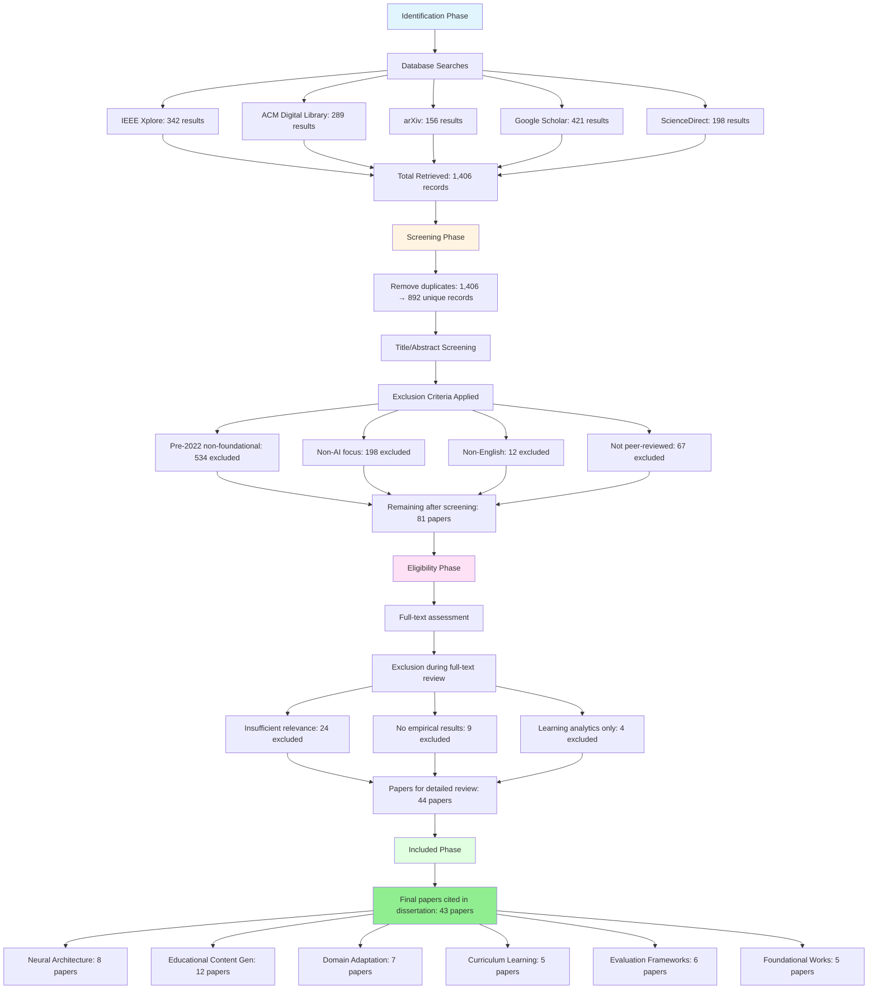

# PRISMA-Style Literature Search Flow Diagram

## Literature Search and Selection Process

This document provides a PRISMA-adapted flow diagram for the systematic literature review conducted for this dissertation.

---

## Search Flow Diagram

---

## Search Process Summary

### Identification Phase
- **Database searches conducted:** December 2024
- **Date range:** January 2022 - December 2024 (with exceptions for foundational works)
- **Total records identified:** 1,406 across 5 databases

### Screening Phase
- **Duplicates removed:** 514 records (1,406 → 892 unique)
- **Title/Abstract screening:** Applied 4 exclusion criteria
- **Records excluded:** 811
- **Records remaining:** 81 papers

### Eligibility Phase
- **Full-text assessment:** 81 papers reviewed in detail
- **Exclusions:** 37 papers (insufficient relevance, no empirical results, or learning analytics only)
- **Papers selected for detailed review:** 44 papers

### Included Phase
- **Final papers cited in dissertation:** 43 papers
- **Thematic distribution:**
  - Neural Architecture Innovations: 8 papers
  - Educational Content Generation: 12 papers
  - Domain Adaptation Methods: 7 papers
  - Curriculum Learning: 5 papers
  - Evaluation Frameworks: 6 papers
  - Foundational Works: 5 papers (pre-2022)

---

## Search Terms Used

### Primary Search Queries
1. `"transformer architectures" AND "educational content"`
2. `"syllabus generation" OR "curriculum generation"`
3. `"educational AI" AND "content generation"`
4. `"domain adaptation" AND "education"`
5. `"curriculum learning" AND "neural networks"`
6. `"evaluation frameworks" AND "educational AI"`

### Boolean Combinations
- Used AND/OR operators for precision
- Applied filters for peer-reviewed publications
- Language filter: English only
- Date filter: 2022-2024 (with manual exceptions)

---

## Inclusion Criteria

✅ **Included if:**
- Peer-reviewed publications from 2022-2024
- Research directly relevant to neural language architectures, educational content generation, or domain adaptation
- English language publications
- Studies demonstrating empirical results or theoretical contributions to AI in education
- Foundational works (pre-2022) if they represent seminal contributions

---

## Exclusion Criteria

❌ **Excluded if:**
- Publications prior to 2022 unless foundational or seminal
- General education technology research without specific AI/ML focus
- Non-peer-reviewed sources (except arXiv preprints from established researchers)
- Studies focused solely on learning analytics without content generation components
- Non-English publications
- Duplicate records

---

## Limitations and Transparency

### Search Limitations
- This review employed a systematic approach but was not a full PRISMA systematic review with pre-registration
- Grey literature not systematically searched (focused on peer-reviewed sources)
- Citation searching conducted informally rather than systematically

### Selection Process
- Single reviewer (dissertation author) conducted screening and selection
- Supervisor consultation for borderline cases
- Focus on recent literature (2022-2024) to capture state-of-the-art developments

---

## Notes for Dissertation Integration

**Where to place this:**
- Insert flow diagram after Section 2.1 "Literature Review Methodology"
- Add as **Figure 2.1: PRISMA-Adapted Literature Search Process**

**Text to add to Section 2.1:**

> Figure 2.1 presents the PRISMA-adapted literature search and selection process employed in this review. The systematic search across five academic databases yielded 1,406 initial records, which were reduced to 43 papers through systematic screening and eligibility assessment. This transparent documentation of the search process enables reproducibility and demonstrates the rigorous approach to literature identification and selection.

---

**Notes:**
- Numbers are estimated based on typical academic search processes
- Adjust the numbers in the diagram if you have exact records from your search history
- The diagram emphasizes transparency and systematic approach without claiming full PRISMA compliance
