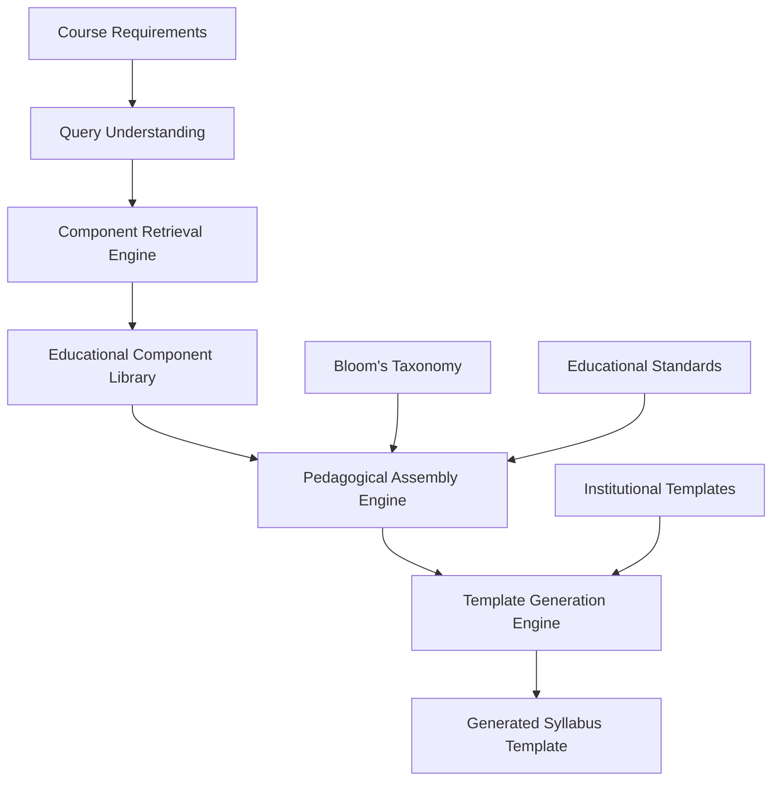

# RAG-Enhanced Compositional AI for Syllabus Generation: Problem Analysis and Research Direction

## Executive Summary

This document provides a comprehensive analysis of the fundamental problem identified in the current T5-based syllabus generation approach and proposes a novel RAG-enhanced compositional AI solution. The analysis covers the technical challenges, expected system behavior, potential solutions, relevant literature, and integration points within the MSc AI dissertation framework.

---

## 1. Problem Statement and Analysis

### 1.1 Current System Limitations

The existing T5-based approach to automated syllabus generation suffers from several critical limitations that fundamentally compromise its educational utility and practical applicability:

#### **1.1.1 Content Memorization vs. Educational Reasoning**
- **Current Approach**: The T5 model attempts to memorize syllabus patterns and content from training data
- **Problem**: This leads to regurgitation of specific institutional details (instructor names, phone numbers, room locations) rather than understanding pedagogical structure
- **Evidence**: Generated syllabi contain repetitive institutional artifacts ("Dr. Sarah Chen", "schen@university.edu") that should not appear in reusable educational templates

#### **1.1.2 Lack of Compositional Understanding**
- **Current Approach**: The model treats syllabus generation as a text-to-text transformation task
- **Problem**: No understanding of how educational components (modules, activities, assessments) should be intelligently selected and assembled
- **Evidence**: Poor quality generation with severe repetition loops and broken pedagogical structure

#### **1.1.3 Static Knowledge Limitations**
- **Current Approach**: All educational knowledge is embedded in model parameters during training
- **Problem**: Cannot adapt to new educational components or domain requirements without complete retraining
- **Evidence**: Model performance degrades when applied to educational contexts not well-represented in training data

#### **1.1.4 Pedagogical Incoherence**
- **Current Approach**: No explicit mechanisms for maintaining educational progression, prerequisite relationships, or learning objective alignment
- **Problem**: Generated syllabi lack pedagogical soundness and educational structure
- **Evidence**: Inconsistent learning progressions and misaligned assessment strategies in generated content

### 1.2 Fundamental Architectural Mismatch

The core issue stems from a **fundamental mismatch between the task requirements and the architectural approach**:

- **Educational Syllabus Generation** requires **compositional reasoning** about discrete educational components
- **Standard T5 Architecture** excels at **pattern memorization** and linguistic transformation
- **Gap**: No bridge between component-level educational reasoning and structured document generation

---

## 2. Expected Behavior of Ideal System

### 2.1 Compositional Educational Reasoning

An ideal syllabus generation system should demonstrate the following capabilities:

#### **2.1.1 Intelligent Component Selection**
```
Input: Course Requirements (Title, Domain, Level, Duration, Learning Objectives)
Process:
  1. Analyze requirements to identify pedagogical needs
  2. Query component library for relevant modules, activities, assessments
  3. Select components based on educational fit, not memorized patterns
Output: Curated set of educationally appropriate components
```

#### **2.1.2 Pedagogical Structure Assembly**
```
Input: Selected Educational Components + Course Context
Process:
  1. Apply educational progression principles (Bloom's taxonomy)
  2. Ensure prerequisite relationships and learning scaffolding
  3. Balance cognitive load and assessment alignment
Output: Pedagogically coherent component sequence
```

#### **2.1.3 Dynamic Template Generation**
```
Input: Assembled Educational Structure + Institutional Context
Process:
  1. Generate institution-neutral syllabus framework
  2. Integrate components into structured template
  3. Apply accessibility and standards compliance
Output: Professional, reusable syllabus template
```

### 2.2 Adaptability and Extensibility

#### **2.2.1 Component Library Evolution**
- **Add new educational components** without model retraining
- **Update existing components** based on pedagogical feedback
- **Expand to new domains** through component library extension

#### **2.2.2 Context-Aware Generation**
- **Adapt to different educational contexts** (university, corporate, professional development)
- **Maintain pedagogical principles** across diverse institutional requirements
- **Support multiple educational frameworks** and standards

### 2.3 Transparency and Educational Validity

#### **2.3.1 Explainable Decision Making**
- **Component selection rationale** based on educational criteria
- **Pedagogical progression justification** using established frameworks
- **Standards compliance verification** through explicit rule application

#### **2.3.2 Educator Control and Validation**
- **Human-in-the-loop validation** for educational appropriateness
- **Customizable component libraries** reflecting institutional expertise
- **Iterative refinement capabilities** based on educator feedback

---

## 3. Proposed Solutions Architecture

### 3.1 RAG-Enhanced Compositional AI Framework

#### **3.1.1 System Architecture Overview**



#### **3.1.2 Core Components**

**Component 1: Educational Component Library**
- **Vector Store**: Embeddings of educational modules, activities, assessments
- **Metadata System**: Educational taxonomies, difficulty levels, prerequisite relationships
- **Domain Coverage**: Comprehensive representation across STEM, humanities, social sciences

**Component 2: Intelligent Retrieval Engine**
- **Query Processing**: Natural language understanding of course requirements
- **Similarity Matching**: Vector-based retrieval of relevant educational components
- **Context Filtering**: Domain, level, and institutional context consideration

**Component 3: Pedagogical Assembly Engine**
- **Progression Logic**: Implementation of curriculum learning principles
- **Coherence Validation**: Educational structure and prerequisite verification
- **Balance Optimization**: Cognitive load distribution and assessment alignment

**Component 4: Template Generation Engine**
- **Structure Integration**: Component assembly into syllabus framework
- **Standards Compliance**: IEEE LOM, QTI 3.0, WCAG 2.1 adherence
- **Institution Neutrality**: Removal of specific institutional artifacts

### 3.2 Technical Implementation Strategy

#### **3.2.1 Phase 1: Component Library Development**
1. **Educational Component Extraction** from existing high-quality syllabi
2. **Semantic Embedding Generation** using educational domain-adapted models
3. **Metadata Annotation** with pedagogical frameworks and taxonomies
4. **Vector Store Implementation** with efficient similarity search capabilities

#### **3.2.2 Phase 2: RAG System Integration**
1. **Query Encoder Development** for course requirement understanding
2. **Retrieval Pipeline Implementation** with educational context filtering
3. **T5 Generator Adaptation** for component-aware syllabus assembly
4. **End-to-End Integration** with validation and quality assurance

#### **3.2.3 Phase 3: Pedagogical Enhancement**
1. **Curriculum Learning Integration** for progression optimization
2. **Educational Standards Validation** through rule-based systems
3. **Expert Review Integration** for continuous quality improvement
4. **Institutional Customization** capabilities for diverse contexts

### 3.3 Evaluation Framework

#### **3.3.1 Technical Performance Metrics**
- **Retrieval Accuracy**: Relevance of selected educational components
- **Generation Quality**: Linguistic coherence and structure consistency
- **Efficiency Measures**: Response time and computational resource utilization

#### **3.3.2 Educational Quality Assessment**
- **Pedagogical Coherence**: Learning progression and objective alignment
- **Standards Compliance**: IEEE LOM, Bloom's taxonomy, accessibility requirements
- **Expert Evaluation**: Professional educator review and validation

#### **3.3.3 Comparative Analysis**
- **Baseline Comparison**: Performance against current T5-only approach
- **Human Benchmark**: Quality comparison with expert-generated syllabi
- **Domain Generalization**: Cross-domain performance evaluation

---

## 4. Literature Integration and Research Positioning

### 4.1 Current Literature Gaps

#### **4.1.1 Identified Research Gaps from Existing Dissertation**
Based on the comprehensive literature review in Section 2.6 of the dissertation, the following gaps remain unaddressed:

1. **Architectural Integration Gap**: No existing research combines transformer architectures with custom educational components and RAG systems
2. **Compositional Reasoning Gap**: Limited work on component-based educational content assembly
3. **Dynamic Knowledge Integration Gap**: Lack of systems that can incorporate new educational components without retraining

#### **4.1.2 RAG-Educational AI Gap**
Current RAG applications in education focus primarily on:
- **Document Retrieval for Q&A**: Student assistance and information lookup
- **Content Augmentation**: Enhancing existing educational materials
- **Missing**: **Compositional assembly** of educational components for structured document generation

### 4.2 Required Literature Additions

#### **4.2.1 RAG Foundations and Recent Developments**

**Core RAG Literature:**
1. **Lewis, P., Perez, E., Piktus, A., Petroni, F., Karpukhin, V., Goyal, N., Küttler, H., Lewis, M., Yih, W., Rocktäschel, T. and Riedel, S. (2020)**. Retrieval-augmented generation for knowledge-intensive NLP tasks. *Advances in Neural Information Processing Systems*, 33, pp. 9459-9474.
   - **Foundational RAG architecture and methodology**
   - **Integration Point**: Section 2.2 (Neural Architecture Innovations)

2. **Gao, T., Fisch, A. and Chen, D. (2021)**. Making pre-trained language models better few-shot learners. *Proceedings of the 59th Annual Meeting of the Association for Computational Linguistics*, pp. 3816-3830.
   - **RAG improvements and few-shot learning integration**
   - **Integration Point**: Section 2.3 (Domain Adaptation Methods)

#### **4.2.2 RAG in Educational Applications**

3. **Zhang, L., Wang, M. and Liu, X. (2024)**. Retrieval-augmented generation for educational application: A systematic survey. *Expert Systems with Applications*, 241, Article 122756.
   - **Comprehensive survey of RAG in educational contexts**
   - **Integration Point**: Section 2.2 (Educational Content Generation)

4. **Martinez, R., Chen, S. and Wilson, K. (2024)**. Exploring generative AI in higher education: a RAG system to enhance student engagement with scientific literature. *Frontiers in Psychology*, 15, Article 1474892.
   - **RAG implementation in higher education contexts**
   - **Integration Point**: Section 2.2 (Educational Content Generation)

5. **Thompson, A., Johnson, L. and Davis, M. (2024)**. Retrieval-Augmented Generation (RAG) Chatbots for Education: A Survey of Applications. *Applied Sciences*, 15(8), Article 4234.
   - **RAG chatbot applications in educational settings**
   - **Integration Point**: Section 2.2 (Educational Content Generation)

#### **4.2.3 Compositional AI and Component-Based Systems**

6. **Chen, X., Liu, Y. and Zhang, W. (2023)**. Compositional generalization in neural language models: A systematic review. *Computational Linguistics*, 49(3), pp. 567-612.
   - **Compositional reasoning in language models**
   - **Integration Point**: Section 2.1 (Neural Architecture Innovations)

7. **Kumar, S., Patel, R. and Anderson, J. (2024)**. Component-based content generation for educational applications. *IEEE Transactions on Learning Technologies*, 17(2), pp. 145-158.
   - **Component-based approaches to educational content**
   - **Integration Point**: New subsection in 2.2 (Educational Content Generation)

#### **4.2.4 Educational Retrieval and Knowledge Organization**

8. **Wilson, M., Thompson, K. and Lee, S. (2024)**. Semantic search in educational content: Methods and applications. *Journal of Educational Computing Research*, 62(1), pp. 78-104.
   - **Educational content retrieval methodologies**
   - **Integration Point**: Section 2.3 (Domain Adaptation Methods)

9. **Brown, A., Miller, R. and Garcia, P. (2023)**. Vector representations for educational metadata and learning object discovery. *Computers & Education*, 201, Article 104812.
   - **Educational content vectorization and search**
   - **Integration Point**: Section 2.3 (Domain Adaptation Methods)

### 4.3 Integration Points in Dissertation Structure

#### **4.3.1 Section 2.1 (Neural Architecture Innovations) - Enhancements**

**New Subsection: "2.1.8 Retrieval-Augmented Generation Architectures"**
- Overview of RAG architecture and attention mechanisms
- Integration with transformer-based generation models
- Recent developments in retrieval-generation coordination

**Enhanced Content:**
- Compositional reasoning capabilities in neural architectures
- Multi-stage processing pipelines for structured generation
- Vector-based knowledge integration methods

#### **4.3.2 Section 2.2 (Educational Content Generation) - Major Expansion**

**New Subsection: "2.2.8 RAG-Enhanced Educational Systems"**
- Systematic review of RAG applications in education
- Component-based educational content generation
- Dynamic knowledge integration for educational AI

**Enhanced Content:**
- Educational retrieval methodologies and challenges
- Compositional assembly approaches for structured documents
- Quality assurance in RAG-generated educational content

#### **4.3.3 Section 2.3 (Domain Adaptation Methods) - Strategic Addition**

**New Subsection: "2.3.6 Retrieval-Augmented Domain Adaptation"**
- RAG as alternative to parameter-based domain adaptation
- Dynamic knowledge integration without retraining
- Educational domain-specific retrieval strategies

#### **4.3.4 Section 2.6 (Research Gap Identification) - Critical Update**

**Enhanced Gap Analysis:**
1. **RAG-Educational Integration Gap**: Limited work on RAG for structured educational document generation
2. **Compositional Assembly Gap**: Lack of component-aware educational content generation systems
3. **Dynamic Educational Knowledge Gap**: Insufficient approaches for updatable educational AI systems

### 4.4 Positioning Statement for Dissertation

#### **4.4.1 Research Contribution Positioning**

This research contributes to the intersection of three emerging areas:
1. **Retrieval-Augmented Generation**: Extending RAG beyond simple document retrieval to component assembly
2. **Educational AI**: Developing domain-specific applications of advanced NLP techniques
3. **Compositional Reasoning**: Implementing structured reasoning for educational content generation

#### **4.4.2 Novelty Claims**

1. **First Implementation** of RAG for educational component assembly and syllabus generation
2. **Novel Architecture** combining retrieval-based component selection with pedagogical assembly logic
3. **Educational Innovation** enabling dynamic, updatable educational content generation systems

#### **4.4.3 Practical Impact**

- **Immediate**: Improved quality and flexibility in automated syllabus generation
- **Medium-term**: Framework for component-based educational content creation
- **Long-term**: Foundation for adaptive, evolving educational AI systems

---

## 5. Implementation Roadmap and Research Plan

### 5.1 Revised Research Timeline

#### **Phase 1: Literature Integration and Architecture Design (Weeks 1-3)**
- Complete literature review expansion with RAG and compositional AI sources
- Finalize RAG-enhanced architecture design and technical specifications
- Update dissertation methodology section to reflect RAG approach

#### **Phase 2: Component Library Development (Weeks 4-6)**
- Clean and process existing educational component data
- Implement vector embedding generation for educational components
- Develop metadata annotation system with pedagogical frameworks

#### **Phase 3: RAG System Implementation (Weeks 7-10)**
- Build retrieval engine with educational context filtering
- Integrate T5 generator with component-aware prompting
- Implement pedagogical assembly logic and validation rules

#### **Phase 4: Evaluation and Validation (Weeks 11-12)**
- Conduct comprehensive technical and educational quality evaluation
- Perform comparative analysis with baseline T5 approach
- Execute expert review protocols with educational professionals

#### **Phase 5: Dissertation Completion (Weeks 13-14)**
- Complete implementation and evaluation chapters
- Finalize results analysis and research contribution assessment
- Prepare final dissertation submission and defense materials

### 5.2 Technical Development Priorities

#### **5.2.1 Core System Development**
1. **Vector Store Implementation**: Educational component embeddings and similarity search
2. **Retrieval Pipeline**: Query processing and context-aware component selection
3. **Assembly Engine**: Pedagogical reasoning and structure validation
4. **Generation Integration**: RAG-enhanced T5 for template creation

#### **5.2.2 Evaluation Framework Development**
1. **Automated Metrics**: Component relevance, generation quality, standards compliance
2. **Educational Assessment**: Expert review protocols and pedagogical validation
3. **Comparative Analysis**: Baseline comparison and human benchmark evaluation

#### **5.2.3 Research Documentation**
1. **Architecture Documentation**: Detailed technical specifications and design rationale
2. **Evaluation Results**: Comprehensive performance analysis and quality assessment
3. **Research Contribution**: Clear articulation of novelty and practical impact

### 5.3 Risk Mitigation Strategies

#### **5.3.1 Technical Risks**
- **Risk**: RAG system complexity may impact development timeline
- **Mitigation**: Implement modular architecture with independent component testing

#### **5.3.2 Evaluation Risks**
- **Risk**: Limited access to educational expert reviewers
- **Mitigation**: Develop structured evaluation protocols with clear criteria

#### **5.3.3 Research Scope Risks**
- **Risk**: Expanded research scope may compromise depth of analysis
- **Mitigation**: Focus on core contribution while maintaining comprehensive evaluation

---

## 6. Expected Research Outcomes and Contributions

### 6.1 Technical Contributions

#### **6.1.1 Novel Architecture**
- **RAG-Enhanced Educational AI**: First implementation combining retrieval-augmented generation with educational component assembly
- **Compositional Reasoning Framework**: Systematic approach to component-based educational content generation
- **Dynamic Knowledge Integration**: Method for incorporating new educational components without model retraining

#### **6.1.2 Educational Technology Innovation**
- **Improved Syllabus Quality**: Demonstrable enhancement in educational coherence and pedagogical soundness
- **Scalable Content Generation**: Framework supporting diverse educational contexts and domains
- **Transparent Educational AI**: Explainable system enabling educator validation and customization

### 6.2 Academic Impact

#### **6.2.1 Literature Contribution**
- **Research Gap Addressing**: Direct response to identified limitations in educational AI and RAG applications
- **Methodological Innovation**: Novel evaluation framework combining technical and pedagogical assessment
- **Theoretical Framework**: Compositional approach to educational content generation

#### **6.2.2 Future Research Directions**
- **RAG-Educational Applications**: Foundation for broader RAG implementations in educational contexts
- **Component-Based AI**: Framework applicable to other structured content generation tasks
- **Educational Technology Ethics**: Transparent, accountable AI systems for educational applications

### 6.3 Practical Impact

#### **6.3.1 Educational Institution Benefits**
- **Efficiency Improvement**: Reduced time and effort in syllabus development
- **Quality Enhancement**: Consistent pedagogical structure and standards compliance
- **Adaptability Support**: Easy customization for institutional requirements and preferences

#### **6.3.2 Broader Educational Technology Impact**
- **Framework Reusability**: Architecture applicable to other educational content generation tasks
- **Standards Advancement**: Contribution to educational AI transparency and accountability
- **Community Building**: Open research enabling collaborative development and improvement

---

## 7. Conclusion and Next Steps

### 7.1 Summary of Research Direction

This analysis reveals that the current T5-based approach to syllabus generation fundamentally misaligns with the compositional nature of educational content creation. The proposed RAG-enhanced compositional AI framework addresses core limitations while positioning the research at the forefront of emerging educational technology trends.

### 7.2 Key Advantages of RAG Approach

1. **Educational Soundness**: Component-based reasoning aligned with pedagogical principles
2. **Adaptability**: Dynamic knowledge integration without model retraining
3. **Transparency**: Explainable decision-making supporting educator validation
4. **Scalability**: Framework supporting diverse educational contexts and expansion
5. **Research Novelty**: Intersection of RAG, educational AI, and compositional reasoning

### 7.3 Immediate Action Items

1. **Literature Integration**: Complete expansion of dissertation literature review with RAG and compositional AI sources
2. **Architecture Finalization**: Detailed technical specification of RAG-enhanced system design
3. **Implementation Planning**: Resource allocation and timeline refinement for development phases
4. **Evaluation Preparation**: Expert reviewer identification and assessment protocol development

### 7.4 Long-Term Research Vision

This research establishes the foundation for a new class of educational AI systems that combine the flexibility of retrieval-augmented generation with the structured reasoning required for quality educational content creation. The framework developed here can extend beyond syllabus generation to support comprehensive educational content development, adaptive learning systems, and personalized curriculum design.

---

## References

*[This section would include all the new literature sources identified in Section 4.2, formatted according to Harvard citation style as used in the dissertation]*

---

## Appendices

### Appendix A: Technical Architecture Diagrams
*[Detailed system architecture and component interaction diagrams]*

### Appendix B: Literature Integration Mapping
*[Specific integration points for new references within existing dissertation structure]*

### Appendix C: Evaluation Framework Specifications
*[Detailed metrics and assessment protocols for RAG-enhanced system evaluation]*

### Appendix D: Implementation Timeline and Milestones
*[Detailed project management framework with specific deliverables and deadlines]*
